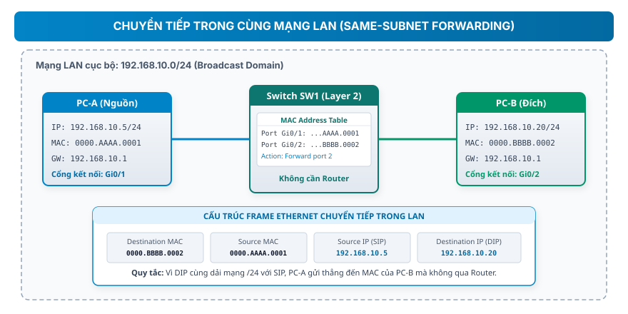
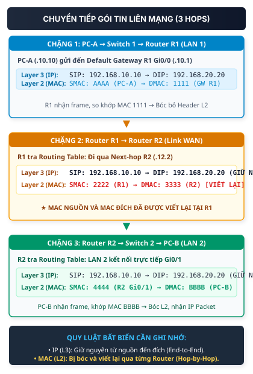

## 1. Map — cần nắm gì?

- **Thiết bị đầu cuối (End Device)** sinh ra và tiêu thụ dữ liệu; **Thiết bị mạng trung gian (Network / Intermediate Device)** nhận, xử lý và chuyển tiếp dữ liệu qua môi trường truyền dẫn.
- **Switch (Layer 2)** chuyển tiếp **Frame** dựa vào địa chỉ **MAC đích (Destination MAC)** và bảng địa chỉ MAC (**MAC Address Table / CAM Table**) trong cùng một mạng LAN cục bộ.
- **Router (Layer 3)** chuyển tiếp **Packet** giữa các mạng khác nhau dựa vào địa chỉ **IP đích (Destination IP)** và bảng định tuyến (**Routing Table**), có vai trò phân tách vùng quảng bá (**Broadcast Domain**).
- **Quy luật bất biến trong chuyển tiếp dữ liệu**:
  - Địa chỉ **IP** là thông tin định danh hai đầu cuối (**End-to-End**), được giữ nguyên suốt hành trình truyền dẫn (trong điều kiện không có NAT).
  - Địa chỉ **MAC** là thông tin phân phát cục bộ trên từng đoạn cáp (**Hop-by-Hop**), liên tục được bóc ra và thay đổi ở mỗi chặng qua Router.

---

## 2. Bài toán nó giải quyết

Hãy hình dung quá trình kết nối máy tính trong thực tế:

1. **Nếu nối trực tiếp từng cặp máy tính bằng dây cáp (Point-to-Point)**:
   Để kết nối $N$ máy tính, ta cần $\frac{N(N-1)}{2}$ sợi cáp. Khi có 100 máy, hệ thống cần gần 5.000 sợi cáp và mỗi máy phải gắn 99 card mạng. Mô hình này không thể mở rộng.
2. **Nếu gom tất cả máy tính vào một bộ chia cổng đơn giản (Hub)**:
   Mọi tín hiệu điện từ một máy gửi đi sẽ bị nhân bản tràn ngập khắp tất cả các máy khác, gây xung đột tín hiệu (**Collision**) và tắc nghẽn toàn bộ đường truyền.
3. **Giải pháp phân tầng của hạ tầng mạng**:
   - **Switch** ra đời ở Tầng 2 (Data Link) để tạo mạng cục bộ (**LAN**). Switch chuyển khung tin (Frame) đến đúng cổng kết nối thiết bị nhận dựa vào MAC đích, tạo ra các miền xung đột độc lập (**Collision Domain**).
   - **Router** ra đời ở Tầng 3 (Network) để kết nối nhiều mạng LAN lại với nhau (**Inter-networking**). Router ngăn chặn các bản tin quảng bá tràn lan giữa các văn phòng, đồng thời tính toán chọn đường đi đến các mạng ở xa.

---

## 3. Bản chất / cơ chế

### 3.1. Phân loại thành phần trong hạ tầng mạng

```text
+-------------------------------------------------------------------------+
|                           HẠ TẦNG MẠNG DOANH NGHIỆP                      |
+-------------------------------------------------------------------------+
|  End Devices: Máy tính, Laptop, Máy chủ (Server), Máy in, Điện thoại IP  |
|  Network Devices: Switch (L2), Router (L3), Access Point (AP), Firewall |
|  Media (Môi trường): Cáp đồng xoắn đôi (UTP), Cáp quang, Sóng vô tuyến  |
|  Services (Dịch vụ): Web (HTTP/HTTPS), Email, DNS, DHCP                 |
+-------------------------------------------------------------------------+
```

1. **Thiết bị đầu cuối (End Devices)** _(Nguồn bài giảng)_:
   Điểm xuất phát hoặc điểm kết thúc của dữ liệu trong mạng. Mỗi thiết bị đầu cuối sở hữu ít nhất một card giao tiếp mạng (**NIC — Network Interface Card**) có chứa địa chỉ MAC vật lý và được gán một địa chỉ IP logic.
2. **Thiết bị mạng trung gian (Intermediate / Network Devices)** _(Nguồn bài giảng)_:
   - **Switch**: Thiết bị trung tâm của mạng LAN, lưu trữ bảng ánh xạ giữa cổng vật lý và địa chỉ MAC của thiết bị gắn vào cổng đó.
   - **Router**: Thiết bị biên phân định ranh giới giữa các mạng con, chịu trách nhiệm tìm đường và chuyển tiếp gói tin qua các mạng khác nhau.
3. **Môi trường truyền dẫn (Network Media) & Dịch vụ (Network Services)** _(Nguồn bài giảng)_:
   - Kênh truyền tải tín hiệu vật lý: cáp đồng xoắn đôi (Twisted Pair), cáp quang (Fiber Optic), sóng vô tuyến (Wireless RF).
   - Dịch vụ ứng dụng mạng: Web, Email, DNS, DHCP.

---

### 3.2. Switch — Cơ chế chuyển tiếp khung tin ở Tầng 2

Switch hoạt động tại **Layer 2 (Data Link Layer)**, đơn vị dữ liệu là **Frame**.

Switch duy trì **Bảng địa chỉ MAC (MAC Address Table)**, trong tài liệu kỹ thuật Cisco thường gọi là **CAM Table**, lưu trữ thông tin: `[Cổng kết nối (Interface/Port) <--> Địa chỉ MAC]`.

Khi một Frame đến một cổng, Switch thực hiện 3 hành vi cơ chế:

1. **Learning (Học địa chỉ MAC nguồn)** _(Nguồn bài giảng)_:
   Switch đọc trường **Source MAC** trong Frame và ghi nhận: _"Địa chỉ MAC này đang cắm ở cổng nhận vào"_. _(Bổ trợ Cisco: mục này được duy trì kèm bộ đếm thời gian aging timer, mặc định 300 giây trên Cisco IOS)_.
2. **Forwarding / Filtering (Chuyển tiếp hoặc Lọc)** _(Nguồn bài giảng)_:
   Switch đọc trường **Destination MAC** và tra trong MAC Address Table:
   - Nếu tìm thấy MAC đích nằm ở cổng $X$ (khác cổng nhận): Switch chuyển tiếp Frame duy nhất ra cổng $X$ (**Forwarding**) và lọc bỏ không gửi ra các cổng khác (**Filtering**).
3. **Flooding (Tràn khung tin)** _(Nguồn bài giảng & Chuẩn Ethernet)_:
   Nếu Destination MAC là địa chỉ quảng bá (**Broadcast** `FF:FF:FF:FF:FF:FF`) hoặc là địa chỉ Unicast mà Switch **chưa học được** (**Unknown Unicast**), Switch sẽ gửi bản sao của Frame ra **tất cả các cổng khác**, ngoại trừ cổng vừa nhận vào.

> [!NOTE]
> **Miền xung đột vs Miền quảng bá** _(Tài liệu bổ trợ)_:
>
> - Mỗi cổng trên Switch là một **Collision Domain** riêng biệt (hoạt động Full Duplex).
> - Toàn bộ các cổng trên cùng một Switch thông thường mặc định thuộc về một **Broadcast Domain** duy nhất.

---

### 3.3. Router — Trái tim định tuyến ở Tầng 3

Router hoạt động tại **Layer 3 (Network Layer)**, đơn vị dữ liệu là **Packet**.

#### Vai trò cốt lõi của Router _(Nguồn bài giảng)_

1. **Phân tách miền quảng bá (LAN Segmentation)**:
   Router không tự động chuyển tiếp broadcast Layer 2 giữa các cổng. Mỗi cổng (Interface) của Router tạo thành một Broadcast Domain độc lập và đại diện cho một dải mạng con (**Subnet**) riêng biệt.
2. **Định tuyến (Routing)**:
   Xác định con đường tối ưu để gửi gói tin đến mạng đích dựa trên **Bảng định tuyến (Routing Table)**.
3. **Chuyển tiếp (Forwarding)**:
   Bóc bỏ L2 Frame Header ở cổng vào, kiểm tra IP đích, tra bảng định tuyến tìm cổng ra (**Exit Interface**) hoặc Router kế tiếp (**Next Hop**), sau đó đóng gói lại thành L2 Frame mới phù hợp với môi trường truyền dẫn của cổng ra.

#### Các thành phần phần cứng chính của Router _(Nguồn bài giảng)_

| Thành phần         | Đặc điểm & Chức năng                                                                 | Lưu trữ khi mất nguồn          |
| :----------------- | :----------------------------------------------------------------------------------- | :----------------------------- |
| **CPU**            | Bộ vi xử lý thực thi lệnh hệ điều hành, tính toán định tuyến và chuyển tiếp packet.  | Không áp dụng                  |
| **RAM**            | Chứa cấu hình đang chạy (`running-config`), Routing Table, ARP cache, bộ đệm packet. | **Mất dữ liệu** (Volatile)     |
| **Flash**          | Bộ nhớ lưu trữ file hệ điều hành Cisco IOS image.                                    | **Còn dữ liệu** (Non-volatile) |
| **NVRAM**          | Lưu trữ cấu hình khởi động của thiết bị (`startup-config`).                          | **Còn dữ liệu** (Non-volatile) |
| **ROM** _(Bổ trợ)_ | Chứa vi mã Bootstrap phục vụ quá trình khởi động ban đầu.                            | **Còn dữ liệu** (Read-Only)    |

#### Các loại Interface trên Router _(Nguồn bài giảng)_

- **LAN Interface (GigabitEthernet, FastEthernet)**: Dùng để kết nối Router vào Switch của mạng nội bộ, làm cổng ngõ mặc định (**Default Gateway**) cho toàn bộ host trong LAN đó.
- **WAN Interface (Serial)**: Dùng để kết nối đường truyền xa giữa các Router với nhau.
- **Management Interface (Console, Mini-USB, AUX)**: Cổng quản trị chuyên dụng, dùng để cắm cáp cấu hình trực tiếp ban đầu khi thiết bị chưa có địa chỉ IP mạng.

---

## 4. Luồng hoạt động (Concrete Packet Traces)

### 4.1. Trace A — Truyền thông trong cùng mạng LAN (Same-Subnet Forwarding)

> **Mục tiêu**: Máy `PC-A` (`192.168.10.5`) gửi dữ liệu cho máy `PC-B` (`192.168.10.20`) cùng kết nối vào `Switch SW1`.



#### Phân tích quá trình ra quyết định của PC-A:

1. `PC-A` thực hiện phép toán logic `AND` giữa IP đích (`192.168.10.20`) và Subnet Mask của chính nó (`255.255.255.0`):
   $$\text{Destination Network} = 192.168.10.20 \text{ AND } 255.255.255.0 = 192.168.10.0$$
2. Kết quả trùng khớp với mạng nội bộ của `PC-A` ($192.168.10.0/24$). `PC-A` kết luận: **Đích đến nằm cùng mạng LAN**.
3. Do nằm cùng mạng LAN, `PC-A` **không gửi đến Default Gateway** mà đóng gói gửi thẳng tới địa chỉ MAC của `PC-B`.

> [!NOTE]
> **Ngữ cảnh hỗ trợ ARP (RFC 826 — Tài liệu bổ trợ)**:
> Nếu `PC-A` chưa lưu địa chỉ MAC của `PC-B` trong ARP Cache, `PC-A` sẽ phát một bản tin **ARP Request** (Broadcast). `PC-B` phản hồi **ARP Reply** (Unicast). Sau đó `PC-A` nạp vào bảng ARP và tiến hành gửi khung tin dữ liệu.

#### Bảng theo dõi chi tiết khung tin trong LAN:

| Bước | Thiết bị xử lý | Source IP      | Destination IP  | Source MAC | Destination MAC | Hành vi & Tra cứu bảng                                                                                                               |
| :--- | :------------- | :------------- | :-------------- | :--------- | :-------------- | :----------------------------------------------------------------------------------------------------------------------------------- |
| 1    | **PC-A**       | `192.168.10.5` | `192.168.10.20` | `AAAA`     | `BBBB`          | Đóng gói IP Packet vào Ethernet Frame, đẩy ra card mạng nối vào Port 1 của Switch.                                                   |
| 2    | **Switch SW1** | `192.168.10.5` | `192.168.10.20` | `AAAA`     | `BBBB`          | 1. Học Source MAC `AAAA` $\rightarrow$ Port 1.<br>2. Tra Dest MAC `BBBB` thấy nằm ở Port 2 $\rightarrow$ Forward ra duy nhất Port 2. |
| 3    | **PC-B**       | `192.168.10.5` | `192.168.10.20` | `AAAA`     | `BBBB`          | Nhận thấy Dest MAC khớp card mạng của mình $\rightarrow$ bóc L2 Header, nhận IP Packet lên Layer 3.                                  |

**Kết luận Trace A**: Giao tiếp trong cùng mạng LAN diễn ra hoàn toàn ở Layer 2 thông qua Switch. Không có sự tham gia của Router.

---

### 4.2. Trace B — Truyền thông qua các mạng khác nhau (Cross-Network Forwarding)

> **Mục tiêu**: `PC-A` (`192.168.10.10/24`) thuộc LAN 1 gửi dữ liệu đến `PC-B` (`192.168.20.20/24`) thuộc LAN 2, đi qua 2 Router `R1` và `R2`.



#### Sơ đồ địa chỉ Topology:

- **LAN 1 (`192.168.10.0/24`)**:
  - `PC-A`: IP `192.168.10.10`, MAC `AAAA`, Default Gateway: `192.168.10.1`
  - `R1 Gi0/0`: IP `192.168.10.1`, MAC `1111`
- **Link kết nối giữa R1 và R2 (`192.168.12.0/30`)**:
  - `R1 Gi0/1`: IP `192.168.12.1`, MAC `2222`
  - `R2 Gi0/0`: IP `192.168.12.2`, MAC `3333`
- **LAN 2 (`192.168.20.0/24`)**:
  - `R2 Gi0/1`: IP `192.168.20.1`, MAC `4444`
  - `PC-B`: IP `192.168.20.20`, MAC `BBBB`, Default Gateway: `192.168.20.1`

#### Bảng theo dõi từng chặng (Hop-by-Hop Trace):

| Chặng (Hop) | Vị trí gói tin                                | Source IP       | Destination IP  | Source MAC         | Destination MAC    | Quyết định xử lý của thiết bị                                                                                                                                                                                                                           |
| :---------- | :-------------------------------------------- | :-------------- | :-------------- | :----------------- | :----------------- | :------------------------------------------------------------------------------------------------------------------------------------------------------------------------------------------------------------------------------------------------------ |
| **Hop 1**   | `PC-A` $\rightarrow$ `SW1` $\rightarrow$ `R1` | `192.168.10.10` | `192.168.20.20` | `AAAA` (PC-A)      | `1111` (GW R1)     | `PC-A` phát hiện IP đích khác subnet $\rightarrow$ Gửi Frame đến MAC của **Default Gateway** (`R1 Gi0/0`). Switch chuyển tiếp frame đến R1.                                                                                                             |
| **Tại R1**  | Xử lý nội bộ tại `R1`                         | `192.168.10.10` | `192.168.20.20` | _Bóc bỏ L2 Header_ | _Bóc bỏ L2 Header_ | 1. `R1` nhận frame, kiểm tra Dest MAC `1111` khớp cổng mình $\rightarrow$ bóc bỏ L2 Header.<br>2. `R1` đọc IP đích `192.168.20.20`.<br>3. `R1` tra Routing Table thấy mạng `192.168.20.0/24` đi qua Next-hop `192.168.12.2` tại Exit Interface `Gi0/1`. |
| **Hop 2**   | `R1` $\rightarrow$ `R2`                       | `192.168.10.10` | `192.168.20.20` | `2222` (R1 Gi0/1)  | `3333` (R2 Gi0/0)  | `R1` đóng gói Frame L2 mới: Source MAC là cổng ra của `R1`, Dest MAC là cổng nhận của `R2` (Next-hop). Đẩy frame ra link WAN.                                                                                                                           |
| **Tại R2**  | Xử lý nội bộ tại `R2`                         | `192.168.10.10` | `192.168.20.20` | _Bóc bỏ L2 Header_ | _Bóc bỏ L2 Header_ | 1. `R2` nhận frame, kiểm tra Dest MAC `3333` $\rightarrow$ bóc bỏ L2 Header.<br>2. `R2` đọc IP đích `192.168.20.20`.<br>3. `R2` tra Routing Table thấy mạng `192.168.20.0/24` là mạng kết nối trực tiếp (**Connected**) trên cổng `Gi0/1`.              |
| **Hop 3**   | `R2` $\rightarrow$ `SW2` $\rightarrow$ `PC-B` | `192.168.10.10` | `192.168.20.20` | `4444` (R2 Gi0/1)  | `BBBB` (PC-B)      | `R2` đóng gói Frame L2 mới: Source MAC là `R2 Gi0/1`, Dest MAC là MAC của `PC-B`. Switch 2 chuyển tiếp frame đến đúng `PC-B`.                                                                                                                           |

```text
+-----------------------------------------------------------------------------------------------+
|                                    QUY TẮC CỐT LÕI CẦN NHỚ                                    |
|                                                                                               |
|   1. Source IP & Destination IP: ĐƯỢC GIỮ NGUYÊN trên toàn bộ hành trình (End-to-End).       |
|   2. Source MAC & Destination MAC: BỊ THAY ĐỔI liên tục ở mỗi chặng qua Router (Hop-by-Hop).   |
+-----------------------------------------------------------------------------------------------+
```

---

## 5. Cấu hình / command quan trọng _(Tài liệu bổ trợ Cisco IOS)_

Dưới đây là các câu lệnh kiểm tra trạng thái thiết bị và giải thích ý nghĩa đầu ra:

### 5.1. Trên Switch — Kiểm tra bảng MAC

```text
Switch# show mac address-table
          Mac Address Table
-------------------------------------------
Vlan    Mac Address       Type        Ports
----    -----------       --------    -----
   1    0000.aaaa.0001    DYNAMIC     Gi0/1
   1    0000.bbbb.0002    DYNAMIC     Gi0/2
Total Mac Addresses for this module: 2
```

- **Ý nghĩa**: Switch đã học động (`DYNAMIC`) hai địa chỉ MAC tương ứng tại hai cổng `Gi0/1` và `Gi0/2`.

### 5.2. Trên Router — Kiểm tra trạng thái Interface

```text
Router# show ip interface brief
Interface              IP-Address      OK? Method Status                Protocol
GigabitEthernet0/0     192.168.10.1    YES manual up                    up
GigabitEthernet0/1     192.168.12.1    YES manual up                    up
```

- **Status = up**: Tín hiệu vật lý (Layer 1) kết nối thành công.
- **Protocol = up**: Giao thức đường truyền dữ liệu (Layer 2) hoạt động bình thường. Giao diện chỉ có thể chuyển tiếp gói tin khi ở trạng thái `up / up`.

### 5.3. Trên Router — Kiểm tra bảng định tuyến (Routing Table)

```text
Router# show ip route
Codes: L - local, C - connected, S - static, R - RIP, O - OSPF

Gateway of last resort is not set

C        192.168.10.0/24 is directly connected, GigabitEthernet0/0
L        192.168.10.1/32 is directly connected, GigabitEthernet0/0
C        192.168.12.0/30 is directly connected, GigabitEthernet0/1
L        192.168.12.1/32 is directly connected, GigabitEthernet0/1
S     192.168.20.0/24 [1/0] via 192.168.12.2
```

- **C (Connected)**: Mạng nối trực tiếp vào interface của router.
- **L (Local)** _(Bổ trợ Cisco IOS 15+)_: Địa chỉ IP cụ thể gán trên chính interface đó (mask `/32`) phục vụ xử lý trực tiếp gói tin gửi tới chính router.
- **S (Static)**: Tuyến đường do người quản trị cấu hình thủ công qua Next-hop `192.168.12.2`.

---

## 6. Sai lầm thường gặp

| Hiện tượng / Quan niệm sai                                  | Bản chất lỗi                                                                                                                          | Cách chẩn đoán & Khắc phục                                                                                    |
| :---------------------------------------------------------- | :------------------------------------------------------------------------------------------------------------------------------------ | :------------------------------------------------------------------------------------------------------------ |
| **Nghĩ rằng Switch chuẩn đọc IP để chuyển tiếp**            | Switch chuẩn (Layer 2) chỉ đọc Ethernet Header (Destination MAC) để tra bảng CAM, không can thiệp vào IP Header.                      | Nhớ rõ: Switch L2 xử lý MAC; Router L3 xử lý IP.                                                              |
| **Quên cấu hình Default Gateway trên Host**                 | Host chỉ có thể giao tiếp trong cùng mạng LAN. Khi gửi dữ liệu ra subnet khác, Host không biết gửi Frame tới MAC của ai và hủy gói.   | Kiểm tra `ipconfig` hoặc `ip route`. Đảm bảo Default Gateway trỏ đúng IP cổng Router kết nối vào LAN đó.      |
| **Nghĩ rằng MAC nguồn của PC gửi sẽ đến tận máy nhận ở xa** | Qua mỗi Router, Header L2 cũ bị bóc bỏ hoàn toàn và Header L2 mới được tạo lập. Địa chỉ MAC chỉ có giá trị trên từng liên kết cục bộ. | Kiểm tra bảng ARP trên máy nhận: chỉ thấy MAC của Router gần nó nhất, không bao giờ thấy MAC của PC gửi ở xa. |
| **Cấu hình xong không lưu vào NVRAM**                       | Cấu hình mới chỉ lưu trên RAM (`running-config`). Khi router mất điện, cấu hình sẽ bị mất hoàn toàn.                                  | Thực hiện lệnh `copy running-config startup-config` sau khi cấu hình.                                         |

---

## 7. Recall — đóng tài liệu lại

1. **Tại sao Switch không thể thay thế hoàn toàn Router trong mạng doanh nghiệp quy mô lớn?**
2. **Khi một gói tin đi qua 3 router từ nguồn đến đích, những thông tin nào trong Header bị thay đổi và những thông tin nào được giữ nguyên?**
3. **Nếu một máy tính gửi gói tin tới IP `172.16.5.10` nhưng máy tính đó chưa được cấu hình Default Gateway, điều gì sẽ xảy ra trong 2 trường hợp: (a) IP đích nằm cùng subnet; (b) IP đích nằm khác subnet?**

---

## 8. Apply — vận dụng thực tế

### Bài tập 1: Phân tích đường đi của Frame (Packet Trace Analysis)

Cho sơ đồ:

- `PC1` (`10.0.1.5/24`, MAC `AAAA`) nối vào `Switch 1`.
- `Router R1` có cổng `Gi0/0` (`10.0.1.1/24`, MAC `1111`) nối `Switch 1` và cổng `Gi0/1` (`10.0.2.1/24`, MAC `2222`) nối `Switch 2`.
- `Server 1` (`10.0.2.100/24`, MAC `CCCC`) nối vào `Switch 2`.

`PC1` gửi một HTTP Request tới `Server 1`.

**Yêu cầu**:

1. Điền thông tin Source IP, Destination IP, Source MAC, Destination MAC của khung tin khi nó đang di chuyển trên đoạn dây giữa `PC1` và `Switch 1`.
2. Điền thông tin Source IP, Destination IP, Source MAC, Destination MAC của khung tin khi nó đang di chuyển trên đoạn dây giữa `Switch 2` và `Server 1`.

> **Đáp án phân tích**:
>
> 1. Trên đoạn `PC1` $\rightarrow$ `Switch 1`:
>    - SIP: `10.0.1.5` | DIP: `10.0.2.100`
>    - SMAC: `AAAA` | DMAC: `1111` (MAC của Default Gateway R1 Gi0/0 vì khác subnet).
> 2. Trên đoạn `Switch 2` $\rightarrow$ `Server 1`:
>    - SIP: `10.0.1.5` | DIP: `10.0.2.100` (IP giữ nguyên!)
>    - SMAC: `2222` (MAC của R1 Gi0/1) | DMAC: `CCCC` (MAC của Server 1).

---

### Bài tập 2: Chẩn đoán sự cố mạng thực tế (Troubleshooting)

Một nhân viên văn phòng báo cáo: _"Tôi vẫn in được qua máy in nội bộ trong phòng (IP `192.168.1.50`), nhưng không thể mở được trang web trường `uit.edu.vn` (IP `118.69.123.10`)"_.
Máy tính nhân viên có IP `192.168.1.25/24`.

**Phân tích nguyên nhân**:

- In được nội bộ chứng tỏ kết nối Layer 2 trong cùng mạng LAN (`192.168.1.0/24`) hoạt động bình thường.
- Không ra được địa chỉ ngoài mạng (`118.69.123.10` — khác dải mạng) cho thấy sự cố tại ranh giới Layer 3:
  1. Máy tính bị thiếu hoặc sai cấu hình **Default Gateway**.
  2. Cổng Default Gateway trên Router bị `down` hoặc Router chưa có đường định tuyến ra ngoài.

---

## 9. Ôn nhanh (60-Second Recap)

- **End Device**: Điểm đầu/cuối của dữ liệu (PC, Server).
- **Switch (L2)**: Chuyển Frame trong mạng LAN dựa vào **Destination MAC** và bảng **CAM Table**.
- **Router (L3)**: Chuyển Packet giữa các mạng khác nhau dựa vào **Destination IP** và **Routing Table**, chia cắt Broadcast Domain.
- **Default Gateway**: Địa chỉ IP cổng Router nối vào LAN, nơi host gửi tất cả gói tin muốn đi ra ngoài mạng cục bộ.
- **Quy tắc vàng**: **IP giữ nguyên End-to-End; MAC đổi liên tục Hop-by-Hop**.

---

## 10. Liên kết

- **Bài học trước**: Nền tảng môn học NT132.
- **Bài học tiếp theo**: [Static Routing — Định tuyến tĩnh](../02-routing/static-routing/) (Hướng dẫn cách cấu hình bảng định tuyến cho Router bằng phương pháp thủ công).
- **Chủ đề liên quan**: [Switching và VLAN](../../ly-thuyet/03-switching-vlan/).

---

## 11. Nguồn & Xuất xứ kiến thức

### A. Nguồn bài giảng chính (Class B — Reference Only)

- `1.1 Chương 1 Thiết bị mạng và hạ tầng mạng.pdf` (Khoa Mạng máy tính & Truyền thông — Trường Đại học Công nghệ Thông tin, ĐHQG-HCM): Khái niệm End/Network devices, môi trường truyền dẫn, dịch vụ mạng, vai trò Router/Switch, các thành phần phần cứng Router (CPU, RAM, Flash, NVRAM, Interfaces), mô hình chuyển tiếp trong LAN và qua các LAN.

### B. Tài liệu chuẩn & tham khảo bổ trợ (Class C — Standards / Vendor Docs)

- **RFC 826** — _An Ethernet Address Resolution Protocol (ARP)_: Cơ chế phân giải địa chỉ IP sang MAC trong môi trường LAN.
- **RFC 791 / RFC 1812** — _Requirements for IP Version 4 Routers_: Nguyên tắc xử lý và chuyển tiếp gói tin IP.
- **Cisco IOS Configuration Fundamentals Command Reference**: Cú pháp và ý nghĩa các lệnh chẩn đoán `show mac address-table`, `show ip interface brief`, `show ip route`.

### C. Nội dung & sơ đồ do tác giả biên soạn độc lập

- Toàn bộ sơ đồ trực quan định dạng SVG (`lan-forwarding-same-subnet.svg`, `cross-network-forwarding.svg`), bảng phân tích trace dữ liệu chi tiết và các bài tập vận dụng được thiết kế và biên soạn riêng cho môn học NT132.
