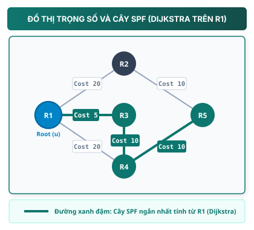

## 1. Map — cần nắm gì?

- **Triết lý Link-State (Trạng thái liên kết)**: Khác với Distance Vector, mỗi router thu thập thông tin về trạng thái các cổng kết nối (**Link-State**) của tất cả router trong cùng một vùng mạng (Area), lưu trữ vào cơ sở dữ liệu **Link-State Database (LSDB)** để tái hiện một **bản đồ toàn cảnh (Topology Graph)** đồng nhất.
- **Thuật toán Dijkstra (SPF — Shortest Path First)**: Từ bản đồ LSDB, mỗi router tự đặt mình làm gốc cây (Root) và chạy thuật toán Dijkstra để tính toán **Cây đường đi ngắn nhất (Shortest Path Tree)** đến mọi nút mạng, từ đó sinh ra bảng chuyển tiếp (**Forwarding Table / Routing Table**).
- **Thước đo Cost (Chi phí băng thông)**: Trong OSPF, Cost là metric cấu hình hoặc được tính toán dựa trên băng thông đường truyền:
  $$\text{Cost} = \frac{\text{Reference Bandwidth}}{\text{Interface Bandwidth}}$$
  _(trên Cisco IOS mặc định Reference Bandwidth là $10^8\text{ bps} = 100\text{ Mbps}$)_, khắc phục hạn chế chọn đường chỉ dựa vào số hop của RIP.
- **6 thuật ngữ nền tảng**:
  1. **Link**: Cổng giao tiếp và mạng kết nối với nó.
  2. **Link-State**: Trạng thái của link (IP, subnet mask, loại link, trạng thái hoạt động, Cost).
  3. **Neighbor**: Router láng giềng kề sát trên cùng một link, phát hiện qua gói tin **Hello**.
  4. **Cost**: Trọng số chi phí của link.
  5. **LSP (Link-State Packet)**: Khái niệm gói tin trạng thái liên kết tổng quát. _(Trong OSPF cụ thể, thông tin liên kết được định dạng thành các **LSA — Link-State Advertisement** và được vận chuyển trong các gói tin **LSU — Link State Update**)_.
  6. **LSDB (Link-State Database)**: Cơ sở dữ liệu chứa toàn bộ thông tin trạng thái liên kết, tạo nên bản đồ cấu trúc mạng.

---

## 2. Bài toán nó giải quyết: Tại sao cần Link-State sau RIP?

Hãy so sánh sự khác biệt triết lý giữa hai họ giao thức định tuyến:

```text
+---------------------------------------------------------------------------------------------------+
| RIP (Distance Vector):                                                                            |
|   "Nói cho tôi biết bạn biết những mạng nào và khoảng cách từ bạn đến đó là bao nhiêu hops."      |
|   --> Router chỉ biết thông tin từ láng giềng kề sát, không xây dựng bản đồ toàn cảnh.            |
+---------------------------------------------------------------------------------------------------+
| OSPF / Link-State:                                                                                |
|   "Hãy mô tả chi tiết tất cả các link của bạn để tôi tự vẽ ra bản đồ toàn cảnh của cả mạng."      |
|   --> Các router trong Area đồng bộ cơ sở dữ liệu LSDB và độc lập tính toán đường đi tối ưu.      |
+---------------------------------------------------------------------------------------------------+
```

### Hạn chế của thước đo Hop Count trong RIP

Xét sơ đồ giữa Router A và Router B:

- **Đường 1**: Đi trực tiếp qua 1 liên kết cáp đồng tốc độ **64 kbps** ($\text{Hop} = 1$).
- **Đường 2**: Đi vòng qua Router C bằng 2 liên kết cáp quang tốc độ **10 Gbps** ($\text{Hop} = 2$).

```text
       +------------------ 64 kbps (Hop = 1) ------------------+
       |                                                       |
     [ R1 ]                                                  [ R2 ]
       |                                                       |
       +--- 10 Gbps (Hop = 1) ---> [ R3 ] --- 10 Gbps (Hop = 2)-+
```

- **RIP chọn Đường 1** vì $\text{Hop} = 1 < 2$, dẫn đến lưu lượng bị đẩy vào đường truyền băng thông thấp.
- **OSPF tính toán dựa trên Cost (băng thông)**: đường cáp quang có Cost cực nhỏ trong khi đường 64 kbps có Cost rất lớn, giúp OSPF chọn Đường 2 qua $R_3$.

---

## 3. Bản chất / cơ chế: Quy trình hoạt động của Link-State _(Nguồn bài giảng)_

Một giao thức định tuyến Link-State hoạt động theo quy trình tuần tự các bước:

```text
[1. Phát hiện Link] ---> [2. Gửi Hello kết bạn] ---> [3. Tạo LSP] ---> [4. Flood LSP & Tạo LSDB] ---> [5. Chạy Dijkstra & Cài Route]
```

### Bước 1: Phát hiện các link kết nối trực tiếp (Directly Connected Links)

Khi router khởi động, nó kiểm tra các interface đang cấu hình. Nếu interface ở trạng thái `up/up`, router ghi nhận: địa chỉ IP, subnet mask, loại kết nối mạng, và xác định giá trị **Cost** tương ứng cho cổng đó.

### Bước 2: Gửi gói tin "Hello" để tìm láng giềng (Discover Neighbors)

Router định kỳ phát các gói tin **Hello** ra các interface đang bật giao thức:

- Hai router cắm chung một đoạn dây nhận được Hello của nhau sẽ trao đổi các tham số cơ bản.
- Nếu các tham số tương thích, hai router thiết lập quan hệ láng giềng (**Neighbor**).

### Bước 3: Tạo gói tin trạng thái liên kết (Build LSP)

Router đóng gói thông tin về các link của mình thành một gói tin trạng thái liên kết (**LSP — Link-State Packet**).
Nội dung cơ bản gồm:

- Định danh Router tạo ra gói tin.
- Danh sách các mạng kết nối trực tiếp kèm Subnet Mask.
- Địa chỉ IP của các láng giềng kề sát.
- Chi phí (Cost) của từng liên kết.

### Bước 4: Tràn ngập LSP (Flooding) và xây dựng LSDB

- Router gửi LSP của mình cho các láng giềng.
- Khi nhận được LSP từ láng giềng, router lưu vào cơ sở dữ liệu **LSDB** của mình và tiếp tục chuyển tiếp (**Flood**) gói tin đó ra các interface khác.
- Nhờ cơ chế flooding đồng bộ, **các router trong cùng một vùng mạng (Area) xây dựng được bảng cơ sở dữ liệu LSDB đồng nhất**.

### Bước 5: Chạy thuật toán Dijkstra (SPF) và xây dựng Routing Table

- Từ bảng LSDB (bản đồ toàn cảnh), mỗi router **đặt chính mình làm nút gốc (Root)**.
- Router thực thi thuật toán **Dijkstra** để tìm đường đi có tổng Cost nhỏ nhất đến từng mạng đích.
- Kết quả tạo thành **Cây đường đi ngắn nhất (Shortest Path Tree — SPT)** và được nạp vào **Bảng chuyển tiếp / Bảng định tuyến (Forwarding / Routing Table)**.

> [!NOTE]
> **Cập nhật khi có sự cố (Triggered Update & Periodic Refresh)**:
> Khi topology thay đổi, router phát hiện sẽ khởi tạo hoặc cập nhật **LSA (Link-State Advertisement)** liên quan. Các LSA này được flood đến những router OSPF khác bên trong các gói **LSU (Link State Update)**. Course slide tóm tắt bước này là một LSU update; ở cấp giao thức OSPF (RFC 2328), thông tin topology nằm trong LSA và được vận chuyển/flood trong LSU. Ngoài ra, OSPF cũng có cơ chế refresh LSA định kỳ (mặc định 30 phút theo chuẩn RFC 2328) để đảm bảo tính toàn vẹn của cơ sở dữ liệu.

---

## 4. Thuật toán Dijkstra — Thực thi chi tiết từng bước (Trace)

Dưới đây là tiến trình thực thi thuật toán Dijkstra tìm đường đi ngắn nhất từ nút nguồn $R_1$ trên một đồ thị 5 router mẫu.



### 4.1. Ký hiệu toán học

- $u$: Nút nguồn đặt làm gốc (Router $R_1$).
- $N'$: Tập hợp các đỉnh đã xác định chắc chắn đường đi ngắn nhất.
- $D(v)$: Chi phí đường đi hiện tại từ nguồn $u$ đến đỉnh $v$.
- $p(v)$: Đỉnh đi trước liền kề của $v$ trên con đường ngắn nhất hiện tại từ $u$.
- $c(i, j)$: Trọng số (Cost) của liên kết trực tiếp giữa nút $i$ và nút $j$. Nếu không nối trực tiếp thì $c(i, j) = \infty$.

---

### 4.2. Bảng diễn tiến thuật toán Dijkstra từ nút nguồn $R_1$

Đồ thị mạng gồm 5 Router với các trọng số liên kết:

- $c(R_1, R_2) = 20$, $c(R_1, R_3) = 5$, $c(R_1, R_4) = 20$
- $c(R_2, R_5) = 10$
- $c(R_3, R_4) = 10$
- $c(R_4, R_5) = 10$
- Mỗi Router có một mạng LAN kết nối nội bộ với $\text{Cost} = 2$.

| Bước  | Tập $N'$ (Đỉnh đã chốt)       | $D(R_2), p(R_2)$ | $D(R_3), p(R_3)$ | $D(R_4), p(R_4)$ | $D(R_5), p(R_5)$ | Quyết định chọn đỉnh tiếp theo                                                                                                                            |
| :---: | :---------------------------- | :--------------- | :--------------- | :--------------- | :--------------- | :-------------------------------------------------------------------------------------------------------------------------------------------------------- |
| **0** | $\{R_1\}$                     | $20, R_1$        | **$5, R_1$**     | $20, R_1$        | $\infty$         | Chọn $R_3$ có $D(R_3) = 5$ nhỏ nhất. Nạp $R_3$ vào $N'$.                                                                                                  |
| **1** | $\{R_1, R_3\}$                | $20, R_1$        | —                | **$15, R_3$**    | $\infty$         | Xét láng giềng của $R_3$: $D(R_4) = \min(20, 5 + 10) = 15$ qua $R_3$. Chọn $R_4$ vì $15 < 20$. Nạp $R_4$ vào $N'$.                                        |
| **2** | $\{R_1, R_3, R_4\}$           | **$20, R_1$**    | —                | —                | $25, R_4$        | Xét láng giềng của $R_4$: $D(R_5) = \min(\infty, 15 + 10) = 25$ qua $R_4$. So sánh $D(R_2)=20$ và $D(R_5)=25 \rightarrow$ Chọn $R_2$. Nạp $R_2$ vào $N'$. |
| **3** | $\{R_1, R_3, R_4, R_2\}$      | —                | —                | —                | **$25, R_4$**    | Xét láng giềng của $R_2$: $D(R_5) = \min(25, 20 + 10) = 25$. Chọn $R_5$ với $D(R_5) = 25$ qua $R_4$. Nạp $R_5$ vào $N'$.                                  |
| **4** | $\{R_1, R_3, R_4, R_2, R_5\}$ | —                | —                | —                | —                | **Hoàn tất!** Tất cả các đỉnh đã được chốt vào Cây đường đi ngắn nhất.                                                                                    |

---

### 4.3. Kết quả Forwarding Table trên Router R1

Từ Cây đường đi ngắn nhất vừa dựng được, Router $R_1$ xây dựng bảng chuyển tiếp:

| Mạng đích | Đường đi ngắn nhất (Shortest Path)                    | Cổng thoát (Exit Interface) | Next-Hop Router | Tổng Cost đến mạng LAN đích |
| :-------- | :---------------------------------------------------- | :-------------------------- | :-------------- | :-------------------------: |
| **LAN 1** | Trực tiếp tại $R_1$                                   | `GigabitEthernet0/0`        | Connected       |            **2**            |
| **LAN 2** | $R_1 \rightarrow R_2$                                 | `GigabitEthernet0/1`        | $R_2$           |      **22** ($20 + 2$)      |
| **LAN 3** | $R_1 \rightarrow R_3$                                 | `GigabitEthernet0/2`        | $R_3$           |       **7** ($5 + 2$)       |
| **LAN 4** | $R_1 \rightarrow R_3 \rightarrow R_4$                 | `GigabitEthernet0/2`        | $R_3$           |    **17** ($5 + 10 + 2$)    |
| **LAN 5** | $R_1 \rightarrow R_3 \rightarrow R_4 \rightarrow R_5$ | `GigabitEthernet0/2`        | $R_3$           | **27** ($5 + 10 + 10 + 2$)  |

> [!TIP]
> **Điểm mấu chốt quan sát được**:
>
> - Đến $R_4$, $R_1$ có đường nối trực tiếp với Cost = 20.
> - Tuy nhiên thuật toán Dijkstra phát hiện: Đi qua $R_3$ ($5 + 10 = 15$) có tổng Cost thấp hơn đi trực tiếp. Do đó, $R_1$ chuyển toàn bộ gói tin gửi tới $R_4$ qua cổng `GigabitEthernet0/2` (hướng $R_3$).

---

## 5. Mở rộng & Lệnh kiểm tra quan trọng _(Tài liệu bổ trợ Cisco IOS)_

> [!NOTE]
> _Nội dung cốt lõi của môn học tập trung vào nguyên lý Link-State và thuật toán Dijkstra. Phần lệnh cấu hình và kiểm tra dưới đây là tài liệu tham khảo bổ trợ._

### 5.1. Cấu hình cơ bản OSPF đơn vùng (Single-Area OSPF)

```text
Router(config)# router ospf 1
Router(config-router)# router-id 1.1.1.1
Router(config-router)# network 192.168.1.0 0.0.0.255 area 0
Router(config-router)# network 10.1.1.0 0.0.0.3 area 0
Router(config-router)# passive-interface GigabitEthernet0/0
```

### 5.2. Các câu lệnh kiểm tra (Verification Commands)

```text
! 1. Kiểm tra danh sách láng giềng OSPF
Router# show ip ospf neighbor

! 2. Xem cơ sở dữ liệu trạng thái liên kết (LSDB)
Router# show ip ospf database

! 3. Xem các tuyến đường OSPF trong bảng định tuyến (ký hiệu 'O')
Router# show ip route ospf
O     192.168.4.0/24 [110/17] via 192.168.13.2, 00:15:22, GigabitEthernet0/2
```

- `O`: Route được học qua **OSPF**.
- `[110/17]`: **110** là Administrative Distance của OSPF; **17** là tổng Metric Cost.

---

## 6. Bảng so sánh tổng kết: Distance Vector (RIP) vs Link-State (OSPF)

| Tiêu chí               | RIP (Distance Vector)                                   | OSPF (Link-State)                                                          |
| :--------------------- | :------------------------------------------------------ | :------------------------------------------------------------------------- |
| **Mô hình tri thức**   | Trao đổi bảng định tuyến với láng giềng kề sát.         | Đồng bộ bản đồ cấu trúc liên kết (LSDB) trong Area.                        |
| **Thuật toán cốt lõi** | **Bellman-Ford**.                                       | **Dijkstra (SPF — Shortest Path First)**.                                  |
| **Thước đo (Metric)**  | **Hop Count** (tối đa 15 hops).                         | **Cost** (thường tỷ lệ nghịch với băng thông).                             |
| **Cơ chế cập nhật**    | Gửi định kỳ xấp xỉ **30 giây** toàn bộ bảng định tuyến. | Gửi bản tin cập nhật khi có biến động (**Triggered**) kèm refresh định kỳ. |
| **Tài nguyên CPU/RAM** | Thấp.                                                   | Yêu cầu bộ nhớ lưu LSDB và CPU tính toán đồ thị.                           |

---

## 7. Sai lầm thường gặp

| Sai lầm phổ biến                                                      | Bản chất hiểu sai                                             | Cách hiểu đúng                                                                                                                                                            |
| :-------------------------------------------------------------------- | :------------------------------------------------------------ | :------------------------------------------------------------------------------------------------------------------------------------------------------------------------ |
| **Nghĩ rằng OSPF trao đổi bảng định tuyến như RIP**                   | Nhầm lẫn giữa _Routing Table_ và _Link-State Advertisements_. | OSPF gửi thông tin trạng thái liên kết. Bảng định tuyến do từng router **tự mình tính toán độc lập** bằng Dijkstra.                                                       |
| **Nghĩ rằng Cost càng lớn thì đường càng nhanh**                      | Nhầm lẫn giữa Băng thông và Chi phí.                          | Băng thông càng lớn thì Cost càng nhỏ. Router luôn chọn đường có **tổng Cost thấp nhất**.                                                                                 |
| **Thắc mắc vì sao LSDB giống nhau nhưng Routing Table lại khác nhau** | Chưa hiểu vai trò vị trí nút gốc trong cây SPF.               | Các router trong cùng Area có cùng bản đồ LSDB, nhưng mỗi router đứng ở vị trí khác nhau để làm gốc cây $\rightarrow$ Cây đường đi ngắn nhất của mỗi router là khác nhau. |

---

## 8. Recall — đóng tài liệu lại

1. **Trình bày các bước trong quy trình hoạt động cơ bản của một giao thức định tuyến Link-State.**
2. **Tại sao hai router chạy OSPF trong cùng một Area có cơ sở dữ liệu LSDB đồng nhất nhưng bảng định tuyến (Routing Table) của chúng lại khác nhau?**
3. **Trong đồ thị có trọng số, nếu Router A nối trực tiếp Router B với Cost = 50, và nối qua Router C với Cost(A-C) = 10, Cost(C-B) = 20. Thuật toán Dijkstra trên Router A sẽ chọn chuyển tiếp gói tin đến B theo hướng nào?**

---

## 9. Apply — vận dụng thực tế

### Bài tập 1: Tính toán Dijkstra từ nút nguồn khác

Sử dụng lại đồ thị 5 router trong bài học (Mục 4.2):

- $c(R_1, R_2) = 20, c(R_1, R_3) = 5, c(R_1, R_4) = 20$
- $c(R_2, R_5) = 10, c(R_3, R_4) = 10, c(R_4, R_5) = 10$

Hãy đặt **Router $R_2$ làm nút gốc** và tìm đường đi ngắn nhất từ $R_2$ đến Router $R_4$.

> **Hướng dẫn giải**:
>
> - Các đường đi khả dĩ từ $R_2$ đến $R_4$:
>   1. Đường qua $R_5$: $R_2 \rightarrow R_5 \rightarrow R_4 \implies \text{Cost} = 10 + 10 = \mathbf{20}$.
>   2. Đường qua $R_1$: $R_2 \rightarrow R_1 \rightarrow R_3 \rightarrow R_4 \implies \text{Cost} = 20 + 5 + 10 = 35$.
> - **Kết luận**: Dijkstra trên $R_2$ chọn đường $R_2 \rightarrow R_5 \rightarrow R_4$ với tổng Cost tối ưu là **20**.

---

### Bài tập 2: Phân tích phản ứng khi liên kết thay đổi

Giả sử liên kết giữa $R_1$ và $R_3$ bị đứt:

1. Mô tả quá trình OSPF xử lý sự cố.
2. So sánh tính chất cập nhật này so với cập nhật định kỳ của RIP.

> **Hướng dẫn giải**:
>
> 1. Router phát hiện cổng `down` sẽ khởi tạo hoặc cập nhật LSA mô tả trạng thái liên kết mới. LSA đó được flood ngay lập tức bên trong các gói LSU cho các router trong Area; các router cập nhật LSDB và thực hiện lại thuật toán Dijkstra để tìm đường đi mới.
> 2. Khác với việc phải chờ chu kỳ định kỳ trong RIP, cơ chế cập nhật theo sự kiện (**Triggered Update**) của Link-State giúp thông tin thay đổi được lan truyền nhanh chóng trong mạng.

---

## 10. Ôn nhanh (60-Second Recap)

- **Link-State**: Mỗi router thu thập thông tin để xây dựng bản đồ cấu trúc liên kết toàn mạng (**LSDB**).
- **Dijkstra (SPF)**: Thuật toán tìm cây đường đi có tổng Cost nhỏ nhất từ gốc tới mọi đích.
- **Metric Cost**: Thường tỷ lệ nghịch với băng thông ($\frac{\text{Reference Bandwidth}}{\text{Interface Bandwidth}}$).
- **Quy trình hoạt động**: Phát hiện link $\rightarrow$ Gửi Hello $\rightarrow$ Tạo LSP (mô hình tổng quát) / LSA (OSPF) $\rightarrow$ Flood LSA trong LSU và cập nhật LSDB $\rightarrow$ Chạy Dijkstra.

---

## 11. Liên kết

- **Bài học trước**: [RIP — Distance Vector Routing Protocol](./rip/) (Tìm hiểu hạn chế của Hop Count và cơ chế định tuyến theo lời đồn).
- **Bài học tiếp theo**: [Switching và VLAN](../../ly-thuyet/03-switching-vlan/) (Đi sâu vào kiến trúc chuyển mạch Layer 2 và phân đoạn mạng ảo VLAN).
- **Chủ đề liên quan**: [Thiết bị mạng và Hạ tầng mạng](../01-ha-tang-mang/thiet-bi-va-ha-tang/).

---

## 12. Nguồn & Xuất xứ kiến thức

### A. Nguồn bài giảng chính (Class B — Reference Only)

- `2.3 Routing protocol - OSPF.pdf` (Khoa Mạng máy tính & Truyền thông — Trường Đại học Công nghệ Thông tin, ĐHQG-HCM): Ôn tập thuật toán Dijkstra trên đồ thị có trọng số, tổng quan Link-State, các thuật ngữ Link, Link-State, Neighbor, Cost, LSP, LSDB, quy trình hoạt động của giao thức Link-State và cách slide tóm tắt cập nhật khi có thay đổi liên kết bằng Link-State Update (LSU).

> **Làm rõ thuật ngữ OSPF:** Slide dùng cách nói “LSU update” để mô tả bước cập nhật. Ở cấp giao thức theo RFC 2328, thông tin trạng thái/topology được biểu diễn bằng LSA; LSU là gói dùng để vận chuyển và flood một hoặc nhiều LSA.

### B. Tài liệu chuẩn & tham khảo bổ trợ (Class C — Standards / Vendor Docs)

- **RFC 2328** — _OSPF Version 2_: Chuẩn giao thức OSPFv2, cơ chế hình thành neighbor qua Hello packet, cấu trúc LSA/LSU, phân chia vùng Area và thuật toán SPF.
- **Cisco IP Routing: OSPF Configuration Guide**: Công thức tính OSPF Cost mặc định dựa trên Reference Bandwidth $100\text{ Mbps}$ và các lệnh kiểm tra `show ip ospf neighbor`, `show ip ospf database`, `show ip route ospf`.

### C. Nội dung & sơ đồ do tác giả biên soạn độc lập

- Sơ đồ trực quan định dạng SVG (`ospf-dijkstra-graph.svg`), bảng diễn giải từng bước thuật toán Dijkstra và bài tập vận dụng.
