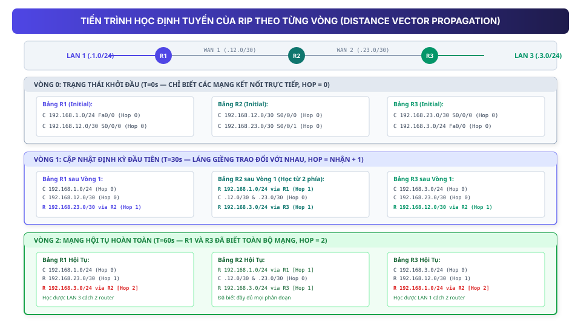

## 1. Map — cần nắm gì?

- **Triết lý Distance Vector (Định tuyến theo vectơ khoảng cách)**: Được ví như _"Routing by rumor"_ (định tuyến theo lời đồn). Mỗi router chỉ trao đổi danh sách mạng và khoảng cách (**Vector**) với các router láng giềng kết nối trực tiếp, không cần xây dựng toàn cảnh sơ đồ mạng.
- **Thuật toán Bellman-Ford**: Là nền tảng toán học của Distance Vector, tính toán đường đi ngắn nhất đến các mạng dựa trên thông tin cập nhật nhận được từ các nút láng giềng liền kề.
- **Giao thức RIP (Routing Information Protocol)**:
  - **Metric (Thước đo)**: **Hop Count** (Số lượng Router trung gian phải đi qua). Giới hạn tối đa là **15 hops**; giá trị **16 hops** được coi là vô cực (**Infinity / Unreachable** per RFC 1058/2453).
  - **Chu kỳ cập nhật**: Gửi toàn bộ bảng định tuyến định kỳ xấp xỉ mỗi **30 giây** qua giao thức tầng giao vận **UDP port 520**.
- **Sự khác biệt cốt tử giữa RIPv1 và RIPv2**:
  - **RIPv1**: Giao thức theo lớp địa chỉ (**Classful**), không gửi kèm Subnet Mask, gửi broadcast `255.255.255.255`, không hỗ trợ VLSM/CIDR hay xác thực.
  - **RIPv2**: Giao thức phi lớp (**Classless**), gửi kèm Subnet Mask, gửi multicast `224.0.0.9`, hỗ trợ đầy đủ VLSM, CIDR và xác thực (Authentication).
- **Các lệnh cấu hình thiết yếu**: `router rip`, `version 2`, `no auto-summary`, `network`, `passive-interface`, `default-information originate`.

---

## 2. Bài toán nó giải quyết

Ở chương trước, ta thấy Static Routing phù hợp với mạng quy mô nhỏ. Nhưng khi hệ thống phát triển:

- Có nhiều Router kết nối đan xen lẫn nhau.
- Các liên kết viễn thông có thể thay đổi trạng thái hoạt động.
- Người quản trị không thể cấu hình thủ công lại từng dòng lệnh mỗi khi có sự cố.

**Câu hỏi cốt lõi của Dynamic Routing**:

> _"Làm thế nào để các Router có thể tự động học được mạng ở xa từ các Router khác mà không cần phải nắm rõ toàn bộ sơ đồ cấu trúc mạng?"_

**Giải pháp của Distance Vector**: Router chỉ cần trao đổi thông tin với các láng giềng kề sát mình: _"Tôi biết những mạng này và khoảng cách từ tôi đến đó là bấy nhiêu hops"_. Nhận được thông tin đó, láng giềng cộng thêm 1 hop và lưu vào bảng định tuyến. Thông tin lan truyền dần qua từng chặng cho đến khi toàn mạng đồng nhất.

---

## 3. Bản chất / cơ chế

### 3.1. Nguyên lý Distance Vector & Thuật toán Bellman-Ford _(Nguồn bài giảng)_

Thuật ngữ **Distance Vector** bao gồm 2 thành phần:

- **Distance (Khoảng cách)**: Đo lường mức độ xa gần để đến được mạng đích. Trong RIP, khoảng cách được đo bằng số lượng Router (Hop Count).
- **Vector (Hướng đi)**: Cổng thoát vật lý (**Exit Interface**) hoặc địa chỉ IP của Router kế tiếp (**Next-Hop IP**) cần chuyển tiếp gói tin tới.

```text
Thông điệp định tuyến của Distance Vector:
"Gửi láng giềng: Để đến mạng Net X, hướng đi là qua tôi, khoảng cách là d hops."
```

#### Quy tắc cộng dồn Hop Count (Hop Increment Rule) _(Nguồn bài giảng)_:

1. Router quảng bá mạng kết nối trực tiếp của mình với khoảng cách `Hop = 0`.
2. Router láng giềng nhận bản tin, tự động cộng thêm `1` vào Metric:
   $$\text{Hop}_{\text{new}} = \text{Hop}_{\text{received}} + 1$$
3. Nếu nhận được thông tin về cùng một mạng đích từ nhiều láng giềng, Router sẽ so sánh và **chọn đường đi có Hop Count nhỏ nhất** để cài vào bảng định tuyến.
4. Nếu Hop Count đạt giá trị **16** _(Bổ trợ RFC 2453)_, mạng đó bị coi là không thể chạm tới (**Unreachable / Infinite Metric**) và sẽ bị loại bỏ sau khi hết thời gian chờ.

---

### 3.2. So sánh toàn diện: RIPv1 vs RIPv2 _(Nguồn bài giảng)_

Bảng đối chiếu kỹ thuật giữa hai thế hệ của giao thức RIP:

| Đặc tính kỹ thuật                  | RIP Version 1 (RIPv1)             | RIP Version 2 (RIPv2)                     | Ý nghĩa thực tế                                                                                                                          |
| :--------------------------------- | :-------------------------------- | :---------------------------------------- | :--------------------------------------------------------------------------------------------------------------------------------------- |
| **Loại giao thức**                 | **Classful** (Theo lớp A, B, C)   | **Classless** (Phi lớp)                   | RIPv1 không mang subnet mask trong bản tin update và dựa vào diễn giải classful, nên không hỗ trợ hành vi VLSM/CIDR classless như RIPv2. |
| **Gửi kèm Subnet Mask**            | **Không**                         | **Có**                                    | Không có Subnet Mask thì không thể chạy các mạng chia nhỏ theo VLSM.                                                                     |
| **Địa chỉ gửi cập nhật**           | **Broadcast** (`255.255.255.255`) | **Multicast** (`224.0.0.9`)               | Broadcast làm phiền tất cả máy tính trong LAN; Multicast chỉ các router chạy RIPv2 mới lắng nghe.                                        |
| **Hỗ trợ VLSM & CIDR**             | **Không**                         | **Có**                                    | Tiết kiệm không gian địa chỉ IPv4 hiện đại.                                                                                              |
| **Xác thực (Authentication)**      | **Không**                         | **Có** (Plain text / MD5)                 | Ngăn chặn thiết bị lạ gửi thông tin định tuyến giả mạo.                                                                                  |
| **Tự động tóm tắt (Auto-Summary)** | Bắt buộc                          | Mặc định bật (tắt bằng `no auto-summary`) | Cần tắt trên RIPv2 khi có các dải mạng con phân mảnh.                                                                                    |

---

## 4. Luồng hoạt động: Mô hình lan truyền định tuyến theo từng vòng

Để thấy rõ cách thức Router học hỏi và hội tụ theo mô hình Distance Vector, ta theo dõi tiến trình qua từng vòng cập nhật lý thuyết trên sơ đồ 3 Router `R1 - R2 - R3`.

> [!NOTE]
> _Các "Vòng" dưới đây là mô hình diễn giải tuần tự nhằm giúp người học hình dung quá trình lan truyền thông tin qua từng hop. Trong thực tế mạng, RIP gửi bản tin cập nhật định kỳ xấp xỉ 30 giây/lần kèm cơ chế Triggered Updates khi có thay đổi._



### Sơ đồ Topology:

- **LAN 1 (`192.168.1.0/24`)** cắm cổng `Fa0/0` của `R1`.
- **Link WAN 1 (`192.168.12.0/30`)** nối `R1 (S0/0/0)` với `R2 (S0/0/0)`.
- **Link WAN 2 (`192.168.23.0/30`)** nối `R2 (S0/0/1)` với `R3 (S0/0/0)`.
- **LAN 3 (`192.168.3.0/24`)** cắm cổng `Fa0/0` của `R3`.

---

### Vòng 0 (Mô hình lý thuyết): Trạng thái khởi đầu

Khi vừa kích hoạt RIP trên các cổng, các Router chỉ mới biết các mạng kết nối trực tiếp (**Connected**):

```text
Bảng định tuyến ban đầu:
+------------------------------------+------------------------------------+------------------------------------+
| Router R1                          | Router R2                          | Router R3                          |
+------------------------------------+------------------------------------+------------------------------------+
| C 192.168.1.0/24  Fa0/0  (Hop 0)   | C 192.168.12.0/30 S0/0/0 (Hop 0)   | C 192.168.23.0/30 S0/0/0 (Hop 0)   |
| C 192.168.12.0/30 S0/0/0 (Hop 0)   | C 192.168.23.0/30 S0/0/1 (Hop 0)   | C 192.168.3.0/24  Fa0/0  (Hop 0)   |
+------------------------------------+------------------------------------+------------------------------------+
```

---

### Vòng 1 (Mô hình lý thuyết): Láng giềng kề sát trao đổi

Các Router gửi bảng định tuyến của mình ra các interface đang bật RIP:

- `R1` gửi cho `R2`: `192.168.1.0/24 (Hop 0)` $\rightarrow$ `R2` nhận, cộng 1 hop thành **Hop = 1**.
- `R3` gửi cho `R2`: `192.168.3.0/24 (Hop 0)` $\rightarrow$ `R2` nhận, cộng 1 hop thành **Hop = 1**.
- `R2` gửi cho `R1`: `192.168.23.0/30 (Hop 0)` $\rightarrow$ `R1` nhận, cộng 1 hop thành **Hop = 1**.
- `R2` gửi cho `R3`: `192.168.12.0/30 (Hop 0)` $\rightarrow$ `R3` nhận, cộng 1 hop thành **Hop = 1**.

```text
Bảng định tuyến sau Vòng 1:
+------------------------------------+------------------------------------+------------------------------------+
| Router R1                          | Router R2                          | Router R3                          |
+------------------------------------+------------------------------------+------------------------------------+
| C 192.168.1.0/24  Fa0/0  (Hop 0)   | C 192.168.12.0/30 S0/0/0 (Hop 0)   | C 192.168.23.0/30 S0/0/0 (Hop 0)   |
| C 192.168.12.0/30 S0/0/0 (Hop 0)   | C 192.168.23.0/30 S0/0/1 (Hop 0)   | C 192.168.3.0/24  Fa0/0  (Hop 0)   |
| R 192.168.23.0/30 via R2 (Hop 1)   | R 192.168.1.0/24  via R1 (Hop 1)   | R 192.168.12.0/30 via R2 (Hop 1)   |
|                                    | R 192.168.3.0/24  via R3 (Hop 1)   |                                    |
+------------------------------------+------------------------------------+------------------------------------+
* Quan sát: Lúc này R1 vẫn CHƯA BIẾT LAN 3, và R3 vẫn CHƯA BIẾT LAN 1!
```

---

### Vòng 2 (Mô hình lý thuyết): Mạng hội tụ hoàn toàn

Ở chu kỳ tiếp theo:

- `R2` gửi cho `R1` bảng định tuyến đã cập nhật của nó, bao gồm cả tuyến đường `192.168.3.0/24 (Hop 1)`.
- `R1` nhận bản tin, cộng thêm 1 hop $\rightarrow$ `R1` cài đặt tuyến đường `192.168.3.0/24 via R2` với **Hop = 2**.
- Tương tự, `R2` gửi cho `R3` tuyến đường `192.168.1.0/24 (Hop 1)` $\rightarrow$ `R3` cài đặt tuyến đường `192.168.1.0/24 via R2` với **Hop = 2**.

```text
Bảng định tuyến sau Vòng 2 — TRẠNG THÁI HỘI TỤ (CONVERGED):
+------------------------------------+------------------------------------+------------------------------------+
| Router R1                          | Router R2                          | Router R3                          |
+------------------------------------+------------------------------------+------------------------------------+
| C 192.168.1.0/24  (Hop 0)          | C 192.168.12.0/30 (Hop 0)          | C 192.168.3.0/24  (Hop 0)          |
| C 192.168.12.0/30 (Hop 0)          | C 192.168.23.0/30 (Hop 0)          | C 192.168.23.0/30 (Hop 0)          |
| R 192.168.23.0/30 via R2 (Hop 1)   | R 192.168.1.0/24  via R1 (Hop 1)   | R 192.168.12.0/30 via R2 (Hop 1)   |
| R 192.168.3.0/24  via R2 [Hop 2]   | R 192.168.3.0/24  via R3 (Hop 1)   | R 192.168.1.0/24  via R2 [Hop 2]   |
+------------------------------------+------------------------------------+------------------------------------+
```

---

## 5. Cấu hình / command quan trọng _(Nguồn bài giảng & Bổ trợ Cisco)_

### 5.1. Quy trình cấu hình chuẩn RIPv2 trên Cisco IOS

```text
R1(config)# router rip
R1(config-router)# version 2
R1(config-router)# no auto-summary
R1(config-router)# network 192.168.1.0
R1(config-router)# network 192.168.12.0
R1(config-router)# passive-interface GigabitEthernet0/0
R1(config-router)# default-information originate
```

### 5.2. Giải thích cơ chế từng câu lệnh:

1. `router rip` _(Nguồn bài giảng)_: Kích hoạt tiến trình định tuyến RIP.
2. `version 2` _(Nguồn bài giảng)_: Chuyển sang RIPv2 hỗ trợ Subnet Mask (VLSM) và gửi Multicast `224.0.0.9`.
3. `no auto-summary` _(Bổ trợ Cisco)_: Tắt tính năng tự động gộp dải mạng về classful boundary.
4. `network <classful-network-address>` _(Nguồn bài giảng)_:
   - Xác định interface nào trên router có địa chỉ IP thuộc mạng này để bật gửi/nhận RIP và quảng bá mạng của interface đó cho láng giềng.
5. `passive-interface <interface>` _(Nguồn bài giảng)_:
   - Ngăn router phát bản tin cập nhật ra cổng nối xuống LAN (tiết kiệm băng thông, tăng an toàn), nhưng **vẫn quảng bá mạng LAN đó** cho các router khác.
6. `default-information originate` _(Nguồn bài giảng)_:
   - Quảng bá Default Route (nếu có) vào miền định tuyến RIP.

---

### 5.3. Các lệnh kiểm tra và chẩn đoán _(Tài liệu bổ trợ Cisco IOS)_

```text
Router# show ip route rip
R     192.168.3.0/24 [120/2] via 192.168.12.2, 00:00:18, Serial0/0/0
```

**Cách đọc dòng định tuyến RIP**:

- `R`: Tuyến đường học qua **RIP**.
- `192.168.3.0/24`: Mạng đích.
- `[120/2]`: `120` là Administrative Distance (AD) của RIP; `2` là Metric (**2 hops**).
- `via 192.168.12.2`: Địa chỉ IP của Next-hop láng giềng.
- `00:00:18`: **Thời gian đã trôi qua kể từ lần cuối nhận được gói tin cập nhật** (elapsed time, không phải đồng hồ đếm ngược).

---

## 6. So sánh: Static Routing vs RIP

| Tiêu chí so sánh           | Static Routing (Định tuyến tĩnh)            | RIPv2 (Distance Vector)                                |
| :------------------------- | :------------------------------------------ | :----------------------------------------------------- |
| **Cách học đường đi**      | Người quản trị gõ lệnh thủ công từng dòng.  | Tự động trao đổi qua bản tin định tuyến.               |
| **Công sức quản trị**      | Tăng theo số lượng router khi mạng mở rộng. | Thấp, cấu hình mạng ban đầu và tự thích ứng.           |
| **Phản ứng khi đổi sơ đồ** | Không tự đổi đường khi đứt cáp ở xa.        | Tự động lan truyền thông tin thay đổi trạng thái link. |
| **Khả năng mở rộng**       | Phù hợp mạng nhỏ hoặc mạng Stub.            | Giới hạn tối đa **15 hops**.                           |
| **Băng thông trao đổi**    | Không gửi bản tin trao đổi định kỳ.         | Định kỳ gửi bản tin cập nhật mỗi ~30 giây.             |

---

## 7. Sai lầm thường gặp

| Lỗi phổ biến                                 | Hậu quả                                                                                                                   | Cách phòng tránh & Khắc phục                                                                                                         |
| :------------------------------------------- | :------------------------------------------------------------------------------------------------------------------------ | :----------------------------------------------------------------------------------------------------------------------------------- |
| **Quên gõ lệnh `version 2`**                 | Router chạy RIPv1, không hiểu Subnet Mask $\rightarrow$ các mạng VLSM bị lỗi.                                             | Gõ `version 2` trong chế độ `router rip`.                                                                                            |
| **Quên gõ `no auto-summary`**                | Khi có 2 dải mạng con thuộc cùng mạng chính nằm ở 2 phía xa nhau, router tự động tóm tắt về classful, gây định tuyến sai. | Kiểm tra `show ip protocols` đảm bảo đã tắt auto-summary.                                                                            |
| **Nhầm lẫn vai trò của `passive-interface`** | Tưởng rằng `passive-interface` là dừng quảng bá mạng LAN đó.                                                              | `passive-interface` chỉ chặn việc phát gói tin update ra cổng LAN, router **vẫn tiếp tục quảng bá dải mạng đó** cho các router khác. |
| **Thiết kế mạng vượt quá 15 hops**           | Các router cách nguồn từ 16 hops trở lên coi mạng đích là Unreachable.                                                    | Không dùng RIP cho các mạng có đường kính vượt quá 15 routers.                                                                       |

---

## 8. Recall — đóng tài liệu lại

1. **Một Router chạy RIP nhận được thông tin về mạng `10.0.0.0/24` từ Router A với metric là 2 hops, và từ Router B với metric là 4 hops. Router sẽ chọn đường nào? Quyết định này phản ánh đặc điểm gì của RIP?**
2. **Tại sao lệnh `no auto-summary` lại cần thiết trong hầu hết các mô hình mạng hiện đại sử dụng RIPv2?**
3. **Nếu cấu hình `passive-interface GigabitEthernet0/0` trên cổng nối mạng LAN của R1, các máy tính trong LAN có còn gửi được dữ liệu ra các mạng ở xa không? Tại sao?**

---

## 9. Apply — vận dụng thực tế

### Bài tập 1: Phân tích đường đi và Metric của RIP

Cho mạng dạng vòng gồm 4 Router: `R1 - R2 - R3 - R4 - R1`. Mỗi liên kết giữa các router liền kề là 1 hop. Mạng `LAN A` nối trực tiếp vào `R1`.

1. Hỏi `R3` sẽ nhận được thông tin về `LAN A` qua những hướng nào và với metric bao nhiêu?
2. Bảng định tuyến của `R3` sẽ xử lý trường hợp này như thế nào?

> **Hướng dẫn giải**:
>
> 1. `R3` nhận thông tin về `LAN A`:
>    - Qua hướng `R2`: `LAN A (0h)` $\rightarrow$ `R1` $\rightarrow$ `R2 (1h)` $\rightarrow$ `R3` nhận được với **Hop = 2**.
>    - Qua hướng `R4`: `LAN A (0h)` $\rightarrow$ `R1` $\rightarrow$ `R4 (1h)` $\rightarrow$ `R3` nhận được với **Hop = 2**.
> 2. Cả hai hướng đều có Metric bằng nhau (Hop = 2). Vì vậy, trong bài toán này `R3` có hai tuyến thay thế cùng chi phí; bài tập chỉ tập trung vào việc so sánh metric, không mở rộng sang cơ chế cài đặt hoặc cân bằng tải cụ thể của từng nền tảng.

---

### Bài tập 2: Chẩn đoán sự cố mạng chạy RIPv2 (Troubleshooting)

Một hệ thống gồm 2 router `R1` và `R2`. `R1` quản lý mạng `172.16.10.0/24`, `R2` quản lý mạng `172.16.20.0/24`.
Sau khi cấu hình RIP trên cả 2 router, PC tại `R1` không ping được tới PC tại `R2`.
Kiểm tra `show ip route` trên `R2` thấy xuất hiện dòng:

```text
R   172.16.0.0/16 [120/1] via 192.168.12.1
```

**Hãy xác định nguyên nhân và câu lệnh sửa lỗi trên R1**.

> **Hướng dẫn giải**:
>
> - **Nguyên nhân**: Dòng định tuyến hiển thị `172.16.0.0/16` thay vì `/24` cho thấy `R1` đã tự động tóm tắt mạng về lớp B chuẩn (Classful Auto-summary) do chưa tắt tính năng auto-summary.
> - **Cách sửa trên R1**:
>   ```text
>   R1(config)# router rip
>   R1(config-router)# version 2
>   R1(config-router)# no auto-summary
>   ```

---

## 10. Ôn nhanh (60-Second Recap)

- **Distance Vector**: Router trao đổi danh sách mạng và khoảng cách với láng giềng kề sát.
- **RIP Metric**: **Hop count** (tối đa 15 hops; 16 = Unreachable).
- **RIP Updates**: Gửi định kỳ xấp xỉ **30 giây / lần** qua **UDP port 520**.
- **RIPv1 vs RIPv2**: RIPv1 (Classful, Broadcast); RIPv2 (Classless, Multicast `224.0.0.9`, hỗ trợ VLSM và xác thực).
- **Hạn chế lớn nhất**: Thước đo Hop Count không phản ánh băng thông đường truyền $\rightarrow$ Mở đường cho Link-State (OSPF).

---

## 11. Liên kết

- **Bài học trước**: [Static Routing — Định tuyến tĩnh](./static-routing/) (So sánh giữa cấu hình tay và giao thức động).
- **Bài học tiếp theo**: [OSPF — Link-State Routing Protocol](./ospf/) (Khắc phục hạn chế của Hop Count bằng Băng thông và Thuật toán Dijkstra).
- **Chủ đề liên quan**: [Thiết bị mạng và Hạ tầng mạng](../01-ha-tang-mang/thiet-bi-va-ha-tang/).

---

## 12. Nguồn & Xuất xứ kiến thức

### A. Nguồn bài giảng chính (Class B — Reference Only)

- `2.2 Routing protocol - RIP.pdf` (Khoa Mạng máy tính & Truyền thông — Trường Đại học Công nghệ Thông tin, ĐHQG-HCM): Tổng quan Distance Vector, thuật toán Bellman-Ford, chu kỳ 30s UDP 520, so sánh RIPv1 vs RIPv2, tiến trình tăng hop count khi chuyển tiếp bản tin, lệnh cấu hình `router rip`, `version 2`, `network`, `passive-interface`, `default-information originate`.

### B. Tài liệu chuẩn & tham khảo bổ trợ (Class C — Standards / Vendor Docs)

- **RFC 1058** — _Routing Information Protocol_: Đặc tả chuẩn ban đầu của giao thức RIPv1, giới hạn 15 hops và định nghĩa metric vô cực (16).
- **RFC 2453** — _RIP Version 2_: Đặc tả chuẩn RIPv2 hỗ trợ subnet mask, địa chỉ multicast `224.0.0.9`, cơ chế triggered updates và xác thực.
- **Cisco IP Routing: RIP Configuration Guide**: Cú pháp lệnh `no auto-summary` và cách thức giải thích trường thời gian elapsed timer trong `show ip route`.

### C. Nội dung & sơ đồ do tác giả biên soạn độc lập

- Sơ đồ trực quan định dạng SVG (`rip-propagation-rounds.svg`), mô hình diễn giải tiến trình lan truyền theo từng vòng và các bài tập vận dụng.
