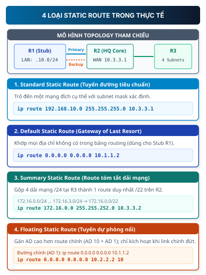

# Static Routing — Định tuyến tĩnh

## 1. Map — cần nắm gì?

- **Định tuyến tĩnh (Static Routing)** là phương pháp người quản trị cấu hình thủ công từng dòng đường đi vào bảng định tuyến (**Routing Table**) của Router.
- **4 loại Static Route bắt buộc phải phân biệt**:
  1. **Standard Static Route**: Trỏ đến một mạng đích cụ thể với prefix/subnet mask xác định.
  2. **Default Static Route (`0.0.0.0/0`)**: Tuyến đường mặc định ("Gateway of Last Resort") khớp với mọi địa chỉ không có trong bảng định tuyến.
  3. **Summary Static Route**: Gộp nhiều dải mạng liên tiếp có chung tiền tố thành một route duy nhất để thu gọn bảng định tuyến.
  4. **Floating Static Route**: Tuyến đường dự phòng có **Administrative Distance (AD)** cao hơn route chính (AD > 1), chỉ tự động kích hoạt khi đường truyền chính gặp sự cố.
- **3 cách chỉ định lối ra trong câu lệnh `ip route`**: Next-hop IP (gây ra _Recursive Lookup_), Exit Interface (Directly attached), hoặc Fully Specified (kết hợp cả hai).
- **Quy tắc hai chiều (Two-way Rule)**: Mọi kết nối mạng TCP/IP đều là tương tác hai chiều; có đường đi nhưng **thiếu đường về** là lỗi kinh điển nhất khiến mạng tê liệt.

---

## 2. Bài toán nó giải quyết

Ở chương trước, ta thấy Router dựa vào bảng định tuyến (**Routing Table**) để chuyển tiếp gói tin. Tuy nhiên:

- Mặc định sau khi bật nguồn và đặt IP cho các interface, Router **chỉ biết các mạng kết nối trực tiếp (Directly Connected Networks)**.
- Khi một máy tính trong mạng nội bộ gửi gói tin đến một mạng ở xa (**Remote Network**), Router tra bảng định tuyến không thấy $\rightarrow$ **Router lập tức hủy gói tin (Drop)** và gửi thông báo lỗi `Destination Host Unreachable` về máy gửi.

Để Router biết cách đưa gói tin đến các mạng ở xa, người quản trị có 2 cách tiếp cận:

1. **Định tuyến tĩnh (Static Routing)**: Tự tay nhập từng đường đi cho Router.
2. **Định tuyến động (Dynamic Routing)**: Cài đặt giao thức (như RIP, OSPF) để các Router tự nói chuyện và trao đổi bảng định tuyến với nhau.

```text
So sánh tổng quan:
+-------------------+---------------------------------------------------+----------------------------------------------------+
| Tiêu chí          | Định tuyến tĩnh (Static Routing)                 | Định tuyến động (Dynamic Routing: RIP, OSPF)       |
+-------------------+---------------------------------------------------+----------------------------------------------------+
| Cơ chế            | Người quản trị cấu hình thủ công từng dòng.       | Các Router tự động trao đổi và cập nhật đường đi.  |
| Tài nguyên (CPU)  | Không tốn CPU/RAM tính toán, không tốn băng thông.| Tốn CPU/RAM chạy thuật toán, tốn băng thông update.|
| Tính bảo mật      | Rất cao (không quảng bá thông tin mạng ra ngoài). | Thấp hơn (phát tán thông tin mạng sang router khác)|
| Khả năng mở rộng  | Kém (mạng hàng chục router sẽ cấu hình rất cực).  | Rất tốt (tự động thích ứng mạng quy mô lớn).       |
| Khi có sự cố đứt  | Không tự đổi đường (trừ khi dùng Floating Route). | Tự động tính toán và chọn đường vòng dự phòng.     |
+-------------------+---------------------------------------------------+----------------------------------------------------+
```

### Khi nào nên dùng Static Routing?

1. **Mạng quy mô nhỏ**: Hệ thống chỉ gồm 2–3 Router, sơ đồ mạng cố định ít khi thay đổi.
2. **Mạng Stub (Stub Network)**: Mạng chi nhánh chỉ có **duy nhất một đường ra** kết nối về trụ sở chính hoặc nối ra nhà cung cấp dịch vụ Internet (ISP). Router của mạng này gọi là **Stub Router**.
3. **Định tuyến mặc định ra Internet (Default Route)**: Dùng 1 dòng lệnh duy nhất để chuyển toàn bộ lưu lượng truy cập Internet cho Router biên của ISP.

---

## 3. Bản chất / cơ chế — 4 loại Static Route



### 3.1. Standard Static Route (Route tiêu chuẩn)

- **Bài toán**: Router $R_1$ cần gửi dữ liệu đến một mạng con cụ thể ở xa (ví dụ mạng LAN $192.168.3.0/24$ nằm sau Router $R_3$).
- **Mục trong Routing Table**: Trỏ chính xác địa chỉ mạng đích và Subnet Mask của mạng đó.
- **Cú pháp**:
  ```text
  Router(config)# ip route <destination-network> <subnet-mask> <next-hop-ip | exit-interface>
  ```
- **Tại sao Router chọn nó?**: Router luôn áp dụng nguyên tắc **Longest Prefix Match** (ưu tiên khớp tiền tố dài nhất). Một route chi tiết $/24$ luôn được ưu tiên hơn một route chung $/16$ hoặc route mặc định $/0$.

### 3.2. Default Static Route (Route mặc định — Gateway of Last Resort)

- **Bài toán**: Trên Internet có hàng trăm ngàn dải mạng khác nhau. Một Router chi nhánh không thể nào chứa hết từng dòng định tuyến cho mọi trang web trên thế giới.
- **Mục trong Routing Table**: Sử dụng địa chỉ mạng `0.0.0.0` và Subnet Mask `0.0.0.0` (thường viết tắt là `0.0.0.0/0` hoặc `::/0` trong IPv6).
- **Cú pháp**:
  ```text
  Router(config)# ip route 0.0.0.0 0.0.0.0 <next-hop-ip | exit-interface>
  ```
- **Cách thức hoạt động**: Khi gói tin đến, Router so sánh IP đích với tất cả các dòng trong bảng định tuyến. Nếu **không tìm thấy bất kỳ dòng nào khớp**, Router sẽ dùng Default Route để đẩy gói tin ra ngoài. Vì vậy Default Route còn được gọi là **Gateway of Last Resort** (Lối thoát cuối cùng).

### 3.3. Summary Static Route (Route tóm tắt / Siêu mạng - Supernetting)

- **Bài toán**: Chi nhánh B có 4 mạng LAN liên tiếp: `172.16.0.0/24`, `172.16.1.0/24`, `172.16.2.0/24`, `172.16.3.0/24`. Nếu cấu hình 4 dòng `ip route` riêng biệt trên Router trung tâm HQ, bảng định tuyến sẽ phình to và tốn thời gian tra cứu.
- **Mục trong Routing Table**: Tìm tiền tố nhị phân chung (**Common Prefix Bits**) của cả 4 dải mạng để gộp thành một dải mạng lớn hơn:
  ```text
  172.16.0.0/24:  10101100 . 00010000 . 000000 00 . 00000000
  172.16.1.0/24:  10101100 . 00010000 . 000000 01 . 00000000
  172.16.2.0/24:  10101100 . 00010000 . 000000 10 . 00000000
  172.16.3.0/24:  10101100 . 00010000 . 000000 11 . 00000000
                  ----------------------------
  Chung 22 bits:  10101100 . 00010000 . 000000 00 . 00000000
  Network gộp:    172.16.0.0
  Subnet Mask:    255.255.252.0 (/22)
  ```
- **Cú pháp**:
  ```text
  HQ(config)# ip route 172.16.0.0 255.255.252.0 10.3.3.2
  ```
- **Lợi ích**: Thay thế 4 dòng lệnh bằng đúng 1 dòng duy nhất, tiết kiệm bộ nhớ RAM và tăng tốc độ xử lý gói tin của Router.

### 3.4. Floating Static Route (Route dự phòng nổi)

- **Bài toán**: Doanh nghiệp thuê một đường truyền chính tốc độ cao (Leased Line cáp quang) và một đường dự phòng phụ (4G/5G hoặc ADSL). Làm sao để bình thường Router luôn chạy đường chính, nhưng khi đường chính bị đứt thì Router tự động chuyển sang đường phụ mà không cần kỹ sư can thiệp?
- **Bản chất**: Sử dụng khái niệm **Administrative Distance (AD)** — độ tin cậy của nguồn thông tin định tuyến:
  - Càng nhỏ càng ưu tiên: Directly Connected (AD = 0), Static Route mặc định (AD = 1), OSPF (AD = 110), RIP (AD = 120).
- **Cơ chế hoạt động**:
  - Ta cấu hình route chính với AD mặc định là 1.
  - Ta cấu hình route dự phòng trỏ qua đường phụ nhưng gán giá trị **AD lớn hơn (ví dụ AD = 10 hoặc 200)**.
  - _Bình thường_: Router chỉ cài route chính (AD = 1) vào Routing Table. Route dự phòng nằm "chìm" trong cấu hình (`running-config`).
  - _Khi đường chính đứt_: Interface chính chuyển sang trạng thái `down`, route chính biến mất khỏi Routing Table. Ngay lập tức, route dự phòng "nổi lên" (**Float**) và được cài vào Routing Table để duy trì kết nối.
- **Cú pháp**:
  ```text
  Router(config)# ip route 0.0.0.0 0.0.0.0 10.1.1.2       ! Đường chính (AD mặc định = 1)
  Router(config)# ip route 0.0.0.0 0.0.0.0 10.2.2.2 10    ! Đường phụ (AD = 10)
  ```

---

## 4. Phân loại cấu hình: 3 cách chỉ định Next-Hop và Exit-Interface

Khi viết lệnh `ip route`, ta có 3 tùy chọn chỉ định lối ra:

### 4.1. Next-Hop Static Route (Chỉ định IP Router kế tiếp)

```text
Router(config)# ip route 192.168.2.0 255.255.255.0 172.16.2.2
```

- **Cơ chế tra cứu đệ quy (Recursive Lookup)**:
  1. Khi nhận gói tin tới `192.168.2.10`, Router tra bảng định tuyến lần 1 thấy route chỉ định Next-hop IP là `172.16.2.2`.
  2. Router chưa biết cổng vật lý nào nối tới `172.16.2.2`, nên phải tra bảng định tuyến lần 2 (đệ quy) tìm dải mạng `172.16.2.0/24` để xác định cổng thoát (ví dụ `Serial0/0/0`).
  3. Sau 2 lần tra bảng, gói tin mới được đẩy ra ngoài.

### 4.2. Directly Attached Static Route (Chỉ định cổng thoát — Exit Interface)

```text
Router(config)# ip route 192.168.2.0 255.255.255.0 Serial0/0/0
```

- **Ưu điểm**: Router chỉ cần tra bảng 1 lần duy nhất, biết ngay cổng ra `Serial0/0/0`.
- **Cảnh báo trên cổng Ethernet**: Trên môi trường mạng Ethernet (đa truy cập - Multiaccess Broadcast), nếu chỉ chỉ định Exit Interface (`GigabitEthernet0/1`), Router sẽ hiểu nhầm mọi host trên mạng đích đều cắm trực tiếp vào cổng đó và gửi gói tin ARP Request hỏi MAC cho từng IP đích. Điều này làm tràn bảng ARP cache (**ARP table exhaustion**).

### 4.3. Fully Specified Static Route (Chỉ định cả Cổng thoát và IP kế tiếp)

```text
Router(config)# ip route 192.168.2.0 255.255.255.0 GigabitEthernet0/1 172.16.2.2
```

- **Đặc điểm**: Vừa triệt tiêu hoàn toàn hiện tượng tra cứu đệ quy (Recursive Lookup), vừa xác định chính xác địa chỉ IP của thiết bị nhận để phân giải địa chỉ MAC qua ARP. Đây là phương pháp **tối ưu nhất** trên các giao tiếp Ethernet.

---

## 5. Luồng hoạt động & Kịch bản bắt lỗi kinh điển

### Sơ đồ mạng ví dụ (Topology):

- **Router R1 (Chi nhánh 1)**: LAN 1 (`192.168.1.0/24`) nối cổng `Gi0/0` (`.1.1`). Cổng `S0/0/0` (`10.0.0.1/30`) nối sang R2.
- **Router R2 (Chi nhánh 2)**: Cổng `S0/0/0` (`10.0.0.2/30`) nối sang R1. Cổng `Gi0/0` (`192.168.2.1/24`) nối LAN 2 (`192.168.2.0/24`).

### Kịch bản lỗi: "Sự cố thiếu đường về" (Missing Return Route Trap)

```text
[PC-1: 192.168.1.10] ---> [R1] ===================> [R2] ---> [PC-2: 192.168.2.10]
   (LAN 1: .1.0/24)        (Cấu hình: ip route        (R2 CHƯA cấu hình route về LAN 1)
                            192.168.2.0 qua R2)

   Chiều đi (ICMP Request):  PC-1 ---> R1 ---> R2 ---> PC-2  (THÀNH CÔNG!)
   Chiều về (ICMP Reply):    PC-2 ---> R2 ---> X (DROP vì R2 không biết đường về 192.168.1.0/24)
```

1. **Hiện tượng**:
   - Kỹ sư trên PC-1 gõ lệnh `ping 192.168.2.10` $\rightarrow$ Kết quả nhận được là `Request timed out`.
   - Kỹ sư kiểm tra R1 thấy đã cấu hình: `ip route 192.168.2.0 255.255.255.0 10.0.0.2`.
2. **Nguyên nhân cốt lõi**:
   - Gói tin `ICMP Echo Request` đã đi từ PC-1 đến tận PC-2 thành công vì R1 biết đường đến LAN 2.
   - Khi PC-2 nhận được, nó tạo gói tin trả lời `ICMP Echo Reply` với Source IP = `192.168.2.10` và Destination IP = `192.168.1.10`.
   - PC-2 gửi gói tin này cho Default Gateway của nó là **R2**.
   - Router **R2** tra bảng định tuyến của mình: Không có dòng nào cho mạng `192.168.1.0/24`!
   - **R2 lập tức Drop gói tin trả lời**.
3. **Cách khắc phục**:
   Bổ sung dòng định tuyến chiều về trên Router R2:
   ```text
   R2(config)# ip route 192.168.1.0 255.255.255.0 10.0.0.1
   ```
   Sau khi gõ lệnh trên, lệnh `ping` giữa hai máy lập tức phản hồi thành công `Reply from 192.168.2.10: bytes=32 time=2ms TTL=126`.

---

## 6. Cấu hình / command quan trọng

### 6.1. Cấu hình các dạng Route trên Cisco IOS

```text
! 1. Cấu hình Standard Static Route
Router(config)# ip route 192.168.2.0 255.255.255.0 10.0.0.2

! 2. Cấu hình Default Static Route
Router(config)# ip route 0.0.0.0 0.0.0.0 10.0.0.2

! 3. Cấu hình Floating Static Route (Backup qua cổng Serial với AD = 10)
Router(config)# ip route 0.0.0.0 0.0.0.0 Serial0/0/1 10
```

### 6.2. Kiểm tra và xác minh (Verification)

```text
Router# show ip route static
Codes: L - local, C - connected, S - static, R - RIP, O - OSPF
       * - candidate default

Gateway of last resort is 10.0.0.2 to network 0.0.0.0

S*    0.0.0.0/0 [1/0] via 10.0.0.2
S     192.168.2.0/24 [1/0] via 10.0.0.2
```

**Cách đọc từng thành phần của dòng định tuyến**:

- `S`: Mã giao thức (**Static Route**).
- `*`: Tuyến đường ứng viên mặc định (**Candidate Default**).
- `192.168.2.0/24`: Mạng đích kèm độ dài Subnet Mask.
- `[1/0]`:
  - Số thứ nhất `1` = **Administrative Distance (AD)** của Static Route.
  - Số thứ hai `0` = **Metric** (chi phí đường đi, với static route mặc định là 0).
- `via 10.0.0.2`: Địa chỉ IP của Router kế tiếp (Next-Hop) chịu trách nhiệm nhận gói tin.

---

## 7. Sai lầm thường gặp

| Lỗi thường gặp                                      | Hậu quả                                                                                          | Cách xử lý                                                                                |
| :-------------------------------------------------- | :----------------------------------------------------------------------------------------------- | :---------------------------------------------------------------------------------------- |
| **Gõ nhầm Next-Hop IP là IP của chính router mình** | Gói tin bị lặp hoặc Router không thể forward vì tự gửi cho chính mình.                           | Next-hop IP **phải luôn là địa chỉ IP của Router đối diện** trên đoạn link kết nối.       |
| **Chỉ cấu hình chiều đi, quên chiều về**            | Ping báo `Request timed out`, dịch vụ mạng không thể thiết lập kết nối TCP.                      | Luôn kiểm tra bảng định tuyến trên tất cả các Router nằm giữa 2 đầu kết nối.              |
| **Tính sai Subnet Mask khi Summary Route**          | Tuyến đường tóm tắt quá rộng bao trùm cả các dải IP của mạng khác, dẫn đến định tuyến sai hướng. | Đổi địa chỉ các mạng con ra nhị phân, chỉ lấy các bit chung giống nhau 100% để tính mask. |
| **Đặt AD cho Floating Route nhỏ hơn hoặc bằng 1**   | Route phụ sẽ chạy song song với route chính hoặc đè route chính thay vì ở trạng thái dự phòng.   | Luôn gán AD cho Floating Route lớn hơn AD của đường chính (ví dụ AD = 10, 50 hoặc 200).   |

---

## 8. Recall — đóng tài liệu lại

1. **Giải thích sự khác biệt giữa Standard Static Route và Default Static Route. Khi nào một router bắt buộc phải dùng Default Route?**
2. **Một router nhận gói tin có IP đích `192.168.1.50`. Trong bảng định tuyến có 2 dòng: `192.168.1.0/24 [1/0]` và `0.0.0.0/0 [1/0]`. Router sẽ chọn dòng nào để chuyển tiếp? Giải thích nguyên lý.**
3. **Tại sao việc cấu hình Directly Attached Static Route trên cổng Ethernet (`ip route ... GigabitEthernet0/0`) lại có thể làm tăng đột biến số lượng bản tin ARP trên mạng?**

---

## 9. Apply — vận dụng thực tế

### Bài tập 1: Tính toán Route Summarization

Một doanh nghiệp quản lý 4 mạng con tại chi nhánh văn phòng:

- `10.10.16.0/24`
- `10.10.17.0/24`
- `10.10.18.0/24`
- `10.10.19.0/24`

Hãy tìm câu lệnh `ip route` tóm tắt duy nhất trên Router trung tâm (Next-Hop IP là `192.168.50.2`).

> **Hướng dẫn giải**:
>
> - Octet thứ 3 của 4 mạng:
>   - $16 = 00010000_2$
>   - $17 = 00010001_2$
>   - $18 = 00010010_2$
>   - $19 = 00010011_2$
> - 6 bit đầu giống nhau: `000100` $\rightarrow$ Độ dài Prefix = $8 + 8 + 6 = 22$ bits (Subnet mask: `255.255.252.0`).
> - Câu lệnh cấu hình:
>   ```text
>   Router(config)# ip route 10.10.16.0 255.255.252.0 192.168.50.2
>   ```

---

### Bài tập 2: Thiết kế Floating Static Route cho đường dự phòng

Công ty có đường truyền chính leased line kết nối trụ sở chính qua IP `192.168.1.2` và đường cáp quang phụ qua IP `192.168.2.2`.
Hãy viết bộ lệnh cấu hình trên Router chi nhánh để mọi lưu lượng ra ngoài đều qua đường chính, và tự động chuyển qua đường phụ khi đường chính gặp sự cố.

> **Hướng dẫn giải**:
>
> ```text
> Branch(config)# ip route 0.0.0.0 0.0.0.0 192.168.1.2
> Branch(config)# ip route 0.0.0.0 0.0.0.0 192.168.2.2 10
> ```

---

## 10. Ôn nhanh (60-Second Recap)

- **Static Route**: Người quản trị cấu hình tay, bảo mật cao, không tốn tài nguyên, nhưng khó mở rộng.
- **4 dạng route**: Standard (mạng cụ thể), Default (`0.0.0.0/0` — mọi mạng), Summary (gộp dải mạng), Floating (dự phòng với AD > 1).
- **Longest Prefix Match**: Router luôn ưu tiên route có subnet mask dài nhất (cụ thể nhất).
- **Administrative Distance (AD)**: Độ ưu tiên nguồn route (Connected = 0, Static = 1).
- **Nguyên lý 2 chiều**: Cấu hình mạng luôn phải bảo đảm cả đường đi (Request) và đường về (Reply).

---

## 11. Liên kết

- **Bài học trước**: [Thiết bị mạng và Hạ tầng mạng](../01-ha-tang-mang/thiet-bi-va-ha-tang/) (Hiểu về Router, Switch và bảng định tuyến cơ bản).
- **Bài học tiếp theo**: [RIP — Distance Vector Routing Protocol](./rip/) (Tìm hiểu cách router tự động trao đổi thông tin định tuyến theo khoảng cách).
- **Chủ đề liên quan**: [OSPF — Link State Routing Protocol](./ospf/).

---

## Nguồn

- Nguồn tài liệu chính: `2.1 Static Routing.pdf` (Khoa Mạng máy tính & Truyền thông — ĐH Công nghệ Thông tin ĐHQG-HCM).
- Phân loại bản quyền: Nguồn tham khảo học liệu (Class B). Toàn bộ ví dụ, phân tích mã lệnh và sơ đồ topo được biên soạn độc lập.
- Sơ đồ trực quan: Bản vẽ SVG nguyên gốc `static-routing-topology.svg` được thiết kế riêng cho NT132.
