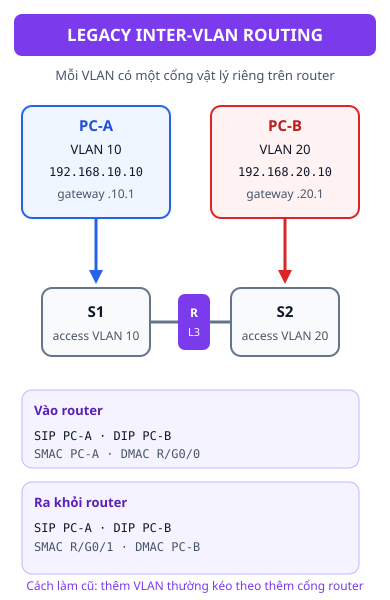
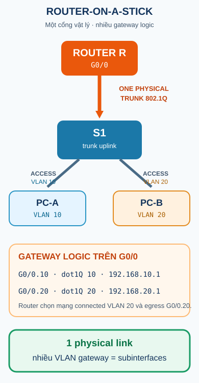
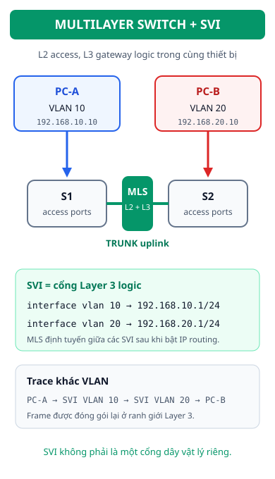

## 1. Map - câu hỏi của bài

- Vì sao một switch Layer 2 có thể chuyển frame trong cùng VLAN nhưng không tự chuyển frame từ VLAN 10 sang VLAN 20?
- Ba cách course slides giới thiệu là **Legacy Inter-VLAN Routing**, **Router-on-a-stick** và **Multilayer Switch**.
- Cùng một luồng `PC-A VLAN 10 -> PC-B VLAN 20` sẽ đổi frame ở đâu, gateway nào trả lời ARP, và SIP/DIP có đổi không?
- Subinterface và SVI trong phần cấu hình chi tiết được đánh dấu **SUPPLEMENTARY - Cisco IOS** vì slide tập trung vào topology và trace, không cung cấp toàn bộ CLI.

## 2. Nối tiếp từ Switch và VLAN

Ở bài [Switch và VLAN](./switch-va-vlan/), ta đã thấy access port đưa endpoint vào một broadcast domain và trunk vận chuyển nhiều VLAN giữa các switch. Hãy giữ nguyên điều đó khi đọc bài này:

```text
PC-A -- access/VLAN 10 -- switch -- trunk -- switch -- access/VLAN 20 -- PC-B
```

Trunk chỉ mang ngữ cảnh VLAN. Nó không tự làm cho hai subnet trở thành một mạng và cũng không tự chọn đường Layer 3. Muốn đi từ VLAN 10 đến VLAN 20, phải có một interface Layer 3 nhận frame, tra route hoặc mạng connected, rồi tạo frame mới ở phía còn lại.

## 3. Bài toán: cùng switch không có nghĩa là cùng mạng

Giả sử:

- `PC-A`: VLAN 10, `192.168.10.10/24`;
- `PC-B`: VLAN 20, `192.168.20.10/24`;
- gateway dự kiến lần lượt là `192.168.10.1` và `192.168.20.1`.

PC-A thấy `192.168.20.10` không nằm trong subnet `/24` của mình. Vì vậy PC-A không ARP tìm MAC của PC-B trực tiếp; nó cần gửi frame cho default gateway của VLAN 10. Một switch Layer 2 có thể flood/forward trong VLAN 10 hoặc VLAN 20, nhưng không phải là nơi quyết định route giữa hai mạng đó.



> **Kết luận:** VLAN tạo ranh giới Layer 2; inter-VLAN routing tạo điểm Layer 3 nối các ranh giới đó. Cấu hình trunk đúng vẫn chưa đủ nếu chưa có gateway và chức năng routing.

## 4. Ba mô hình, một hành trình khái niệm

| Mô hình           | Điểm đặt interface Layer 3                      | Liên kết switch-router                             | Ý nghĩa khi thêm VLAN                                          |
| ----------------- | ----------------------------------------------- | -------------------------------------------------- | -------------------------------------------------------------- |
| Legacy            | Mỗi VLAN dùng một cổng vật lý riêng trên router | Các cổng router nối bằng các access VLAN tương ứng | Thường cần thêm cổng vật lý và dây                             |
| Router-on-a-stick | Một cổng vật lý router có nhiều subinterface    | Uplink switch-router là trunk 802.1Q               | Một uplink phục vụ nhiều VLAN; cần subinterface/tag khớp       |
| Multilayer Switch | SVI của từng VLAN trên switch Layer 3           | Access switch có thể trunk về switch đa lớp        | Routing nằm trong thiết bị chuyển mạch đa lớp; cần bật routing |

Ba dòng trên là cách phân loại trong course slides. “Legacy” không có nghĩa là sai; nó dễ nhìn khi học trace nhưng kém linh hoạt hơn khi số VLAN tăng. Router-on-a-stick và Multilayer Switch giải quyết bài toán mở rộng theo hai vị trí khác nhau của chức năng Layer 3.

## 5. Legacy Inter-VLAN Routing

Trong mô hình Legacy, VLAN 10 đi vào một cổng router và VLAN 20 đi vào cổng router khác. Router có một địa chỉ gateway trong mỗi mạng. Khi nhận gói từ VLAN 10, router tra mạng đích VLAN 20 rồi gửi ra interface vật lý của VLAN 20.

### Trace SIP / DIP / SMAC / DMAC

| Vị trí         | VLAN context | SIP                        | DIP                        | SMAC                  | DMAC                  | Điều đang xảy ra                                 |
| -------------- | ------------ | -------------------------- | -------------------------- | --------------------- | --------------------- | ------------------------------------------------ |
| PC-A -> router | VLAN 10      | `192.168.10.10`            | `192.168.20.10`            | MAC PC-A              | MAC `G0/0` của router | PC-A gửi tới default gateway vì đích khác subnet |
| router -> PC-B | VLAN 20      | giữ nguyên `192.168.10.10` | giữ nguyên `192.168.20.10` | MAC `G0/1` của router | MAC PC-B              | Router tạo frame mới trên interface VLAN 20      |

SIP/DIP mô tả IP endpoint và giữ nguyên qua router trong ví dụ không NAT này. Với gói IPv4 được router thực sự chuyển tiếp, router decrements IPv4 TTL và tạo một frame Layer 2 mới cho mạng egress. Vì SMAC/DMAC thuộc frame từng đoạn, cặp MAC thay đổi khi router chuyển từ cổng của VLAN 10 sang cổng của VLAN 20. Đây là đúng tinh thần trace của course slides.

Legacy cho thấy bản chất rõ nhất: **khác VLAN -> đến gateway -> route -> đóng gói frame mới**. Nhược điểm chính là mỗi VLAN cần một kết nối vật lý riêng đến router, nên việc thêm VLAN có thể kéo theo thêm cổng và dây.

## 6. Router-on-a-stick

Router-on-a-stick gom nhiều gateway logic vào các subinterface của một cổng router. Uplink giữa switch và router phải là trunk để phân biệt VLAN 10 và VLAN 20 bằng ngữ cảnh 802.1Q.



### 6.1. Trace từng chặng

| Chặng                  | VLAN/tag                         | SIP                 | DIP                 | SMAC / DMAC                     | Quyết định                                                                                    |
| ---------------------- | -------------------------------- | ------------------- | ------------------- | ------------------------------- | --------------------------------------------------------------------------------------------- |
| PC-A -> cổng access S1 | VLAN 10 nội bộ trên S1           | `192.168.10.10`     | `192.168.20.10`     | SMAC PC-A, DMAC gateway VLAN 10 | PC-A gửi đến default gateway, frame vào access VLAN 10                                        |
| S1 -> router G0/0      | tag VLAN 10 trên trunk           | giữ nguyên          | giữ nguyên          | frame được mang theo VLAN 10    | S1 chọn uplink trunk; router nhận đúng `G0/0.10`                                              |
| router xử lý L3        | interface `G0/0.10` -> `G0/0.20` | giữ nguyên endpoint | giữ nguyên endpoint | tra route connected VLAN 20     | Router tách ngữ cảnh VLAN 10, chọn mạng VLAN 20 đã connected và subinterface egress `G0/0.20` |
| router -> S1           | tag VLAN 20 trên trunk           | giữ nguyên          | giữ nguyên          | SMAC router VLAN 20, DMAC PC-B  | Router gửi frame mới qua `G0/0.20`; S1 bỏ tag khi ra access                                   |
| S1 -> PC-B             | VLAN 20 trên access              | `192.168.10.10`     | `192.168.20.10`     | SMAC gateway VLAN 20, DMAC PC-B | PC-B nhận frame trong VLAN 20                                                                 |

Ở ranh giới Layer 3, router không “đổi SIP thành gateway”. Gateway là DMAC của frame cục bộ phía vào; IP source/destination vẫn là hai host đang giao tiếp. Sau khi route xong, frame phía ra có cặp MAC khác và VLAN context khác.

### 6.2. Cấu hình minh họa - SUPPLEMENTARY - Cisco IOS

Các slide Class B có topology subinterface, trunk và access port nhưng không trình bày trọn bộ CLI dưới đây. Đây là ví dụ bổ trợ để nối topology với trạng thái thiết bị; tên cổng và cú pháp có thể khác theo nền tảng/version.

Trên router:

```text
Router# configure terminal
Router(config)# interface gigabitEthernet 0/0
Router(config-if)# no shutdown
Router(config-if)# exit
Router(config)# interface gigabitEthernet 0/0.10
Router(config-subif)# encapsulation dot1q 10
Router(config-subif)# ip address 192.168.10.1 255.255.255.0
Router(config-subif)# exit
Router(config)# interface gigabitEthernet 0/0.20
Router(config-subif)# encapsulation dot1q 20
Router(config-subif)# ip address 192.168.20.1 255.255.255.0
Router(config-subif)# end
Router# show ip interface brief
Router# show ip route connected
```

Trên switch, uplink về router cần ở trunk và port nối PC cần ở access VLAN tương ứng:

```text
Switch(config)# vlan 10
Switch(config-vlan)# name ENGINEERING
Switch(config-vlan)# exit
Switch(config)# vlan 20
Switch(config-vlan)# name SALES
Switch(config-vlan)# exit
Switch(config)# interface gigabitEthernet 0/1
Switch(config-if)# switchport mode trunk
Switch(config-if)# switchport trunk allowed vlan 10,20
Switch(config-if)# exit
Switch(config)# interface fastEthernet 0/10
Switch(config-if)# switchport mode access
Switch(config-if)# switchport access vlan 10
Switch(config-if)# exit
Switch(config)# interface fastEthernet 0/20
Switch(config-if)# switchport mode access
Switch(config-if)# switchport access vlan 20
Switch(config-if)# end
Switch# show interfaces trunk
Switch# show vlan brief
```

`encapsulation dot1q 10` gắn subinterface với ngữ cảnh VLAN 10; địa chỉ `192.168.10.1` trở thành gateway của subnet đó. Nếu trunk không mang VLAN 20, subinterface có thể tồn tại nhưng frame không đến đúng nơi.

Tham khảo cú pháp và semantics ở [Cisco - Configure Inter-VLAN Routing with an External Router](https://www.cisco.com/c/en/us/support/docs/lan-switching/inter-vlan-routing/14976-50.html) và [Cisco IEEE 802.1Q VLAN configuration](https://www.cisco.com/c/en/us/td/docs/routers/ios/config/17-x/lan-wan/b-lan-wan/m_lnsw-conf-vlan-ieee.html).

## 7. Multilayer Switch và SVI

Multilayer Switch giữ switching Layer 2 ở access/trunk port và cung cấp gateway Layer 3 bằng **Switch Virtual Interface (SVI)**. SVI là interface logic gắn với một VLAN, không phải một cổng dây vật lý riêng. Khi có SVI cho VLAN 10 và VLAN 20 và chức năng routing được bật, switch đa lớp có thể route giữa hai mạng ngay trong thiết bị.



### Trace khác VLAN qua SVI

| Vị trí              | VLAN context       | SIP             | DIP             | SMAC                              | DMAC                                     | Ý nghĩa                                        |
| ------------------- | ------------------ | --------------- | --------------- | --------------------------------- | ---------------------------------------- | ---------------------------------------------- |
| PC-A -> SVI VLAN 10 | VLAN 10            | `192.168.10.10` | `192.168.20.10` | MAC PC-A                          | MAC SVI VLAN 10                          | PC-A gửi frame cho gateway logic của mạng mình |
| MLS route           | ranh giới L3 logic | giữ nguyên      | giữ nguyên      | không còn là một frame end-to-end | không áp dụng cho một cặp frame duy nhất | MLS tra route giữa các mạng connected          |
| SVI VLAN 20 -> PC-B | VLAN 20            | `192.168.10.10` | `192.168.20.10` | MAC SVI VLAN 20                   | MAC PC-B                                 | MLS đóng gói frame mới và gửi vào VLAN 20      |

Một số sơ đồ lớp học viết “SMAC/DMAC là Interface VLAN 10/20” để làm nổi bật điểm gateway. Cách đọc chính xác hơn là: SVI là interface Layer 3 logic; mỗi đoạn Layer 2 có cặp MAC cục bộ riêng. IP endpoint không đổi chỉ vì MLS route giữa hai VLAN.

### 7.1. Cấu hình minh họa - SUPPLEMENTARY - Cisco IOS

```text
Switch# configure terminal
Switch(config)# ip routing
Switch(config)# vlan 10
Switch(config-vlan)# name USERS
Switch(config-vlan)# exit
Switch(config)# vlan 20
Switch(config-vlan)# name SERVERS
Switch(config-vlan)# exit
Switch(config)# interface vlan 10
Switch(config-if)# ip address 192.168.10.1 255.255.255.0
Switch(config-if)# no shutdown
Switch(config-if)# exit
Switch(config)# interface vlan 20
Switch(config-if)# ip address 192.168.20.1 255.255.255.0
Switch(config-if)# no shutdown
Switch(config-if)# end
Switch# show ip route connected
Switch# show interfaces vlan 10
Switch# show interfaces vlan 20
```

Trên access switch, uplink mang các VLAN cần thiết:

```text
Access(config)# interface gigabitEthernet 0/1
Access(config-if)# switchport mode trunk
Access(config-if)# switchport trunk allowed vlan 10,20
Access(config-if)# end
Access# show interfaces trunk
```

`ip routing` cho phép thiết bị thực hiện routing giữa các interface Layer 3. SVI chỉ lên đầy đủ khi VLAN tồn tại và có điều kiện Layer 2/link phù hợp trên nền tảng đang dùng; nếu `show interfaces vlan 10` báo down, đừng chỉ kiểm tra địa chỉ IP. Đối chiếu [Cisco - Inter-VLAN Routing with Catalyst Switches](https://www.cisco.com/c/en/us/support/docs/lan-switching/inter-vlan-routing/41260-189.html) và [Cisco - Switch Virtual Interface](https://www.cisco.com/c/en/us/td/docs/switches/lan/c9000/infra/interface-characteristics/interface-characteristics-configuration-guide.html).

## 8. Troubleshooting theo giả thuyết

| Hiện tượng                                          | Hypothesis đầu tiên                                                              | Lệnh/chứng cứ                                                                                    | Hướng sửa                                                                                    |
| --------------------------------------------------- | -------------------------------------------------------------------------------- | ------------------------------------------------------------------------------------------------ | -------------------------------------------------------------------------------------------- |
| Cùng VLAN qua hai switch không hoạt động            | VLAN/access membership sai, trunk down hoặc VLAN bị loại khỏi allowed/forwarding | `show vlan brief`, `show interfaces trunk`, `show interfaces <port> switchport`                  | Sửa membership, trunk hai đầu và allowed list; xác nhận VLAN forwarding                      |
| Cùng VLAN hoạt động nhưng VLAN 10 không đến VLAN 20 | Host chưa có gateway đúng hoặc chưa có interface Layer 3/routing giữa hai VLAN   | `ipconfig`, `show ip interface brief`, `show ip route connected`, ping gateway trước             | Đặt default gateway đúng; tạo/kiểm tra Legacy, subinterface hoặc SVI và bật routing khi cần  |
| Router-on-a-stick: VLAN 10 được, VLAN 20 hỏng       | VLAN 20 thiếu ở access/trunk, tag `20` không khớp, subinterface hoặc gateway sai | `show vlan brief`, `show interfaces trunk`, `show ip interface brief`, `show ip route connected` | Đồng bộ VLAN ID, `encapsulation dot1q 20`, IP gateway, allowed list và trạng thái interface  |
| SVI có IP nhưng báo down                            | VLAN chưa active hoặc chưa có điều kiện Layer 2/link phù hợp                     | `show interfaces vlan 10`, `show vlan brief`, `show interfaces trunk`                            | Khôi phục VLAN/link/access-trunk rồi kiểm tra lại SVI; đừng chữa bằng cách đổi IP ngẫu nhiên |

### Hai bài chẩn đoán ngắn

1. Nếu PC-A và PC-B cùng VLAN nhưng ở hai switch không ping được, hãy chứng minh Layer 2 trước: VLAN membership, trunk operational và VLAN có forwarding trên uplink. Chưa có bằng chứng đó thì kiểm tra routing sẽ đi sai tầng.
2. Nếu cùng VLAN ping được nhưng VLAN 10 không ping VLAN 20, hãy ping gateway từng VLAN rồi xem connected route. Kết quả tách bài toán thành access/trunk ở phía host và gateway/routing ở ranh giới Layer 3.

## 9. Recall - đóng tài liệu lại

1. Vì sao switch Layer 2 không tự route frame từ VLAN 10 sang VLAN 20?
2. Trong Legacy Inter-VLAN Routing, vì sao mỗi VLAN thường cần một cổng router riêng?
3. Router-on-a-stick dùng trunk và subinterface để phân biệt nhiều VLAN trên một cổng vật lý như thế nào?
4. SVI là gì, và vì sao gọi nó là interface logic thay vì một port vật lý?
5. Với trace `PC-A 192.168.10.10 -> PC-B 192.168.20.10`, trường nào giữ nguyên ở hai phía router và cặp MAC nào thay đổi?

## 10. Reasoning - vận dụng

1. Một trunk cho phép VLAN 10 và VLAN 20 nhưng hai host khác VLAN vẫn không liên lạc. Hãy chỉ ra chính xác trunk đã hoàn thành phần nào và gateway Layer 3 còn thiếu phần nào.
2. So sánh chi phí thay đổi khi thêm VLAN mới trong Legacy và Router-on-a-stick. Cấu hình nào thay đổi ở router, switch và đường vật lý?
3. Nếu SVI VLAN 10 và VLAN 20 đều up, nhưng host vẫn gửi frame đến gateway cũ, hãy lần theo default gateway, connected route và cổng access để tìm điểm sai.

## 11. Ôn nhanh

```text
Khác VLAN = cần một điểm Layer 3.
Legacy = mỗi VLAN một cổng router vật lý.
Router-on-a-stick = một trunk + nhiều subinterface.
Multilayer Switch = routing trong switch + SVI làm gateway.
Router tạo frame mới; SIP/DIP của host thường giữ nguyên.
```

## 12. Liên kết

- **Bài trước:** [Switch và VLAN](./switch-va-vlan/).
- **Nền tảng trước đó:** [Routing - Định tuyến](../02-routing/).
- **Cổng kiến thức kế tiếp:** [Network Services](../04-network-services/).

## 13. Nguồn & xuất xứ kiến thức

### A. Nguồn bài giảng chính - Class B, reference only

- `3.1 Switch and VLAN.pdf`: switch ở Data Link, VLAN/port-based VLAN, membership, access/trunk và verification.
- `3. InterVLAN routing.pdf`: lý do Layer 2 không đi xuyên VLAN, ba mô hình Legacy/Router-on-a-stick/Multilayer, topology subinterface/SVI và các trace SIP/DIP/SMAC/DMAC.

### B. Tài liệu bổ trợ - Class C

- [Cisco - Configure Inter-VLAN Routing with an External Router](https://www.cisco.com/c/en/us/support/docs/lan-switching/inter-vlan-routing/14976-50.html): access/trunk và mô hình router ngoài.
- [Cisco IEEE 802.1Q VLAN configuration](https://www.cisco.com/c/en/us/td/docs/routers/ios/config/17-x/lan-wan/b-lan-wan/m_lnsw-conf-vlan-ieee.html): subinterface, encapsulation và VLAN context.
- [Cisco - Inter-VLAN Routing with Catalyst Switches](https://www.cisco.com/c/en/us/support/docs/lan-switching/inter-vlan-routing/41260-189.html): cấu hình routing giữa VLAN trên Catalyst.
- [Cisco - Switch Virtual Interface](https://www.cisco.com/c/en/us/td/docs/switches/lan/c9000/infra/interface-characteristics/interface-characteristics-configuration-guide.html): SVI là interface logic gắn với VLAN.

### C. Nội dung & sơ đồ do tác giả biên soạn độc lập

- `legacy-inter-vlan.svg`, `router-on-a-stick.svg`, `multilayer-svi.svg` là các topology nguyên bản; không dùng screenshot từ slide.
- Các trace, bảng lệnh và câu hỏi luyện tập được viết lại độc lập; phần CLI subinterface/SVI được gắn nhãn bổ trợ vì không phải toàn bộ nội dung đó xuất hiện trong slide.
