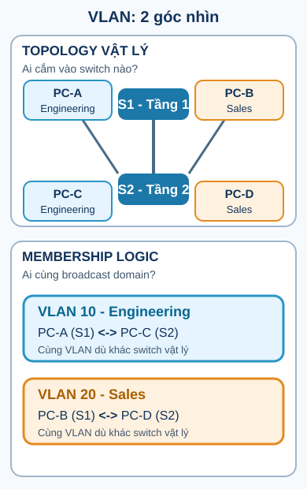
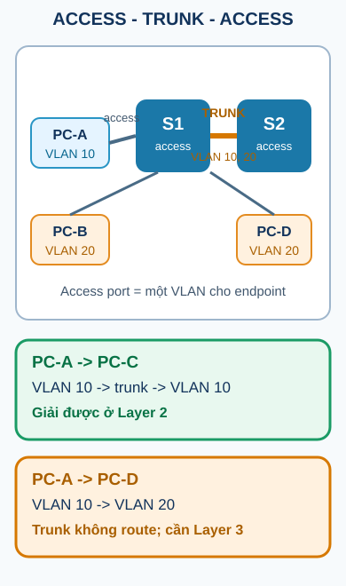

## 1. Map - cần nắm gì?

- Switch Layer 2 chuyển tiếp **frame** bằng địa chỉ MAC và bảng MAC, trong phạm vi một miền Layer 2.
- VLAN là một nhóm logic của các cổng, tạo ra một broadcast domain riêng; VLAN không đồng nghĩa với subnet IP.
- Access port đưa một endpoint vào một VLAN; trunk vận chuyển nhiều VLAN giữa các thiết bị mạng.
- Hai host cùng VLAN có thể đi qua nhiều switch chỉ bằng switching. Hai host khác VLAN cần một chức năng Layer 3 ở giữa.

## 2. Routing đã dạy gì, và phần này thêm gì?

Ở các bài trước, ta theo dõi router chọn **mạng Layer 3** và thay frame ở mỗi chặng qua router. Bây giờ ta quan sát đoạn đường trước router:

```text
host -> access port -> VLAN -> switch forwarding -> trunk (nếu cần) -> Layer 3 gateway
```

Switch đang giải quyết bài toán **frame phải đi ra cổng nào trong miền Layer 2**. VLAN thêm một câu hỏi khác: **cổng/frame này thuộc broadcast domain nào?** Hai câu hỏi liên quan nhưng không phải một.

## 3. Bài toán nó giải quyết

Một LAN phẳng có thể đặt thiết bị của nhiều nhóm vào cùng broadcast domain. Khi một host phát broadcast, nhiều host không liên quan vẫn phải nhận và xử lý nó. Việc đổi vị trí vật lý cũng dễ kéo theo thay đổi dây nối và cấu hình.

VLAN cho phép nhóm logic không bị khóa vào một tầng hoặc một switch vật lý. Một nhóm Engineering ở tầng 1 và một nhóm Engineering ở tầng 2 vẫn có thể cùng thuộc VLAN 10 nếu các switch vận chuyển VLAN đó. Ngược lại, hai máy cắm cạnh nhau vẫn có thể bị tách ở Layer 2 nếu chúng thuộc VLAN khác nhau.



> **Kết luận bản đồ:** topology vật lý nói thiết bị nối với switch nào; membership logic nói cổng/host thuộc broadcast domain nào. Hai bản đồ có thể khác nhau.

## 4. Bản chất / cơ chế

### 4.1. Switch forwarding và VLAN membership

Trong switching Layer 2 thông thường, switch học Source MAC ở cổng ingress, tra Destination MAC trong bảng MAC, rồi forward hoặc flood frame theo miền Layer 2 phù hợp.

VLAN đặt thêm ranh giới cho quá trình đó:

| Thành phần      | Câu hỏi cần trả lời                     | Ví dụ               |
| --------------- | --------------------------------------- | ------------------- |
| MAC forwarding  | Frame unicast đã biết phải ra cổng nào? | `BBBB -> Fa0/24`    |
| VLAN membership | Cổng/frame đang ở broadcast domain nào? | `Fa0/10 -> VLAN 10` |
| IP subnet       | Đích có nằm cùng mạng Layer 3 không?    | `192.168.10.0/24`   |

Một switch Layer 2 thông thường đang được mô tả ở đây không cần đọc IP để quyết định forward frame. Không nên biến điều đó thành mệnh đề tuyệt đối về mọi phần cứng có khả năng Layer 3.

### 4.2. VLAN và port-based VLAN

**VLAN (Virtual LAN)** là cách chia một hạ tầng LAN vật lý thành các miền logic. Với **port-based VLAN**, cổng switch được gán vào VLAN; frame từ endpoint đi vào cổng đó được xử lý trong ngữ cảnh VLAN tương ứng.

VLAN thường đi cùng một subnet trong thiết kế IP, nhưng hai khái niệm nằm ở hai lớp khác nhau:

- VLAN là ranh giới logic ở Layer 2.
- Subnet là ranh giới địa chỉ/mạng ở Layer 3.
- Thiết kế thường ánh xạ một VLAN với một subnet để default gateway và troubleshooting rõ ràng; đây là quy ước thiết kế, không phải định nghĩa đồng nhất.

### 4.3. Lợi ích và giới hạn

Các slide môn học nêu bốn lợi ích chính:

- mở rộng LAN dễ hơn;
- thay đổi cấu hình dễ hơn;
- theo dõi luồng mạng dễ hơn;
- tăng khả năng phân đoạn và giảm traffic không cần thiết giữa các nhóm.

Diễn đạt cuối cần chính xác: VLAN tạo ranh giới Layer 2 và có thể giảm phạm vi broadcast/traffic phải lộ đến nhóm khác. VLAN **không tự thay thế** ACL, firewall, authentication hay encryption.

## 5. Access port và trunk port

### Access port

Access port thường nối một endpoint vào một VLAN. Endpoint gửi frame không gắn nhãn VLAN; switch xác định membership từ cấu hình của cổng access.

### Trunk port

Trunk là liên kết giữa các thiết bị mạng để vận chuyển nhiều VLAN. Với 802.1Q, VLAN context thường được biểu diễn bằng tag trên đường trunk; native VLAN là VLAN được quy định cho frame untagged trong cấu hình trunk cụ thể. Native VLAN không mặc nhiên đồng nghĩa với default VLAN hay management VLAN.

```text
PC-A VLAN 10 -- access -- S1 ==== trunk ==== S2 -- access -- PC-C VLAN 10
PC-B VLAN 20 -- access -- S1 ==== trunk ==== S2 -- access -- PC-D VLAN 20

VLAN 10 qua hai switch: vẫn là Layer 2.
VLAN 10 sang VLAN 20: cần Layer 3.
```



> **Đừng nhầm:** trunk vận chuyển VLAN traffic; trunk không route giữa các mạng IP.

## 6. Trace cùng VLAN qua hai switch

Topology dùng `PC-A` VLAN 10 ở S1 và `PC-C` VLAN 10 ở S2. Giả sử hai host thuộc cùng subnet `192.168.10.0/24` và đã biết MAC của nhau.

| Bước | VLAN context | SIP             | DIP             | SMAC       | DMAC       | Ingress / quyết định                                                      | Egress                    |
| ---- | ------------ | --------------- | --------------- | ---------- | ---------- | ------------------------------------------------------------------------- | ------------------------- |
| 1    | VLAN 10      | `192.168.10.10` | `192.168.10.30` | `AAAA`     | `CCCC`     | PC-A thấy đích cùng subnet, gửi thẳng tới PC-C, không gửi default gateway | access vào S1             |
| 2    | VLAN 10      | giữ nguyên      | giữ nguyên      | giữ nguyên | giữ nguyên | S1 học `AAAA`, tra `CCCC`, chọn uplink trunk                              | trunk S1-S2, mang VLAN 10 |
| 3    | VLAN 10      | giữ nguyên      | giữ nguyên      | giữ nguyên | giữ nguyên | S2 nhận frame trong VLAN 10, tra `CCCC`, chọn cổng PC-C                   | access ra PC-C            |

Không có router trong đường đi này. IP source/destination giữ nguyên, và switch không rewrite SMAC/DMAC chỉ vì frame đi qua nó. Nếu có ARP trước đó, ARP là bước phân giải `192.168.10.30 -> CCCC`, không phải một lần routing.

## 7. Cấu hình VLAN: command -> state change -> observable result

Các lệnh dưới đây bám vào chuỗi lệnh trong course slides. Tên interface chỉ là ví dụ; hãy thay bằng cổng thật của topology.

### 7.1. Tạo và đặt tên VLAN

```text
Switch# configure terminal
Switch(config)# vlan 20
Switch(config-vlan)# name SALES
Switch(config-vlan)# end
```

| Trước                               | Command                    | Sau                                                                                       |
| ----------------------------------- | -------------------------- | ----------------------------------------------------------------------------------------- |
| VLAN 20 chưa có trong VLAN database | `vlan 20` rồi `name SALES` | `show vlan brief` có VLAN `20 SALES` ở trạng thái active nếu platform tạo VLAN thành công |

### 7.2. Trace bắt buộc: đổi `Fa0/10` từ VLAN 1 sang VLAN 20

Ban đầu, lab giả định `Fa0/10 -> VLAN 1`.

```text
Switch# show vlan brief
! Fa0/10 đang nằm dưới VLAN 1

Switch# configure terminal
Switch(config)# vlan 20
Switch(config-vlan)# name SALES
Switch(config-vlan)# interface fastethernet 0/10
Switch(config-if)# switchport mode access
Switch(config-if)# switchport access vlan 20
Switch(config-if)# end

Switch# show vlan brief
```

Trạng thái sau: `Fa0/10 -> VLAN 20`; cổng này không còn là access member của VLAN 1. Kết quả quan sát được là `Fa0/10` xuất hiện trong dòng VLAN 20 của `show vlan brief`.

### 7.3. Đổi membership và xóa VLAN

```text
Switch# configure terminal
Switch(config)# interface fastethernet 0/10
Switch(config-if)# switchport access vlan 10
Switch(config-if)# end
Switch# show vlan brief
```

Lệnh trên đổi **port membership**, không xóa VLAN 20 khỏi switch. Chỉ sau khi đã kiểm tra không còn cổng cần VLAN 20 mới cân nhắc:

```text
Switch# configure terminal
Switch(config)# no vlan 20
Switch(config)# end
Switch# show vlan brief
```

`no vlan 20` xóa VLAN 20 khỏi VLAN database trên switch; hãy xác nhận dòng VLAN 20 biến mất. Nếu một cổng vẫn có cấu hình access VLAN 20, hành vi trạng thái sau đó phụ thuộc platform/version; không nên coi lệnh xóa VLAN là cách thay đổi membership. Hãy gán cổng sang VLAN hợp lệ trước và kiểm tra lại.

### 7.4. Kiểm tra VLAN và interface VLAN

```text
Switch# show vlan brief
Switch# show vlan name SALES
Switch# show interfaces vlan 20
```

`show vlan brief` trả lời VLAN nào tồn tại và cổng access nào đang được liệt kê. `show vlan name SALES` lọc theo tên. `show interfaces vlan 20` kiểm tra logical VLAN interface nếu platform hỗ trợ SVI; SVI là nội dung Layer 3 sẽ dùng trong bài Inter-VLAN.

## 8. Cấu hình trunk: state và verification

Chuỗi lệnh course slides minh họa:

```text
Switch(config)# interface fastethernet 0/1
Switch(config-if)# switchport mode trunk
Switch(config-if)# switchport trunk native vlan 99
Switch(config-if)# switchport trunk allowed vlan 10,20,30
Switch(config-if)# end
```

| Command                                  | State change                                    | Cách quan sát                                      |
| ---------------------------------------- | ----------------------------------------------- | -------------------------------------------------- |
| `switchport mode trunk`                  | ép cổng vào administrative trunk mode           | `show interfaces Fa0/1 switchport`                 |
| `switchport trunk native vlan 99`        | đặt VLAN context cho traffic untagged của trunk | `show interfaces trunk` hiển thị Native vlan `99`  |
| `switchport trunk allowed vlan 10,20,30` | giới hạn VLAN được phép qua trunk               | `show interfaces trunk` hiển thị danh sách allowed |

Các lệnh trunk và cách trình bày native/allowed ở đây là **SUPPLEMENTARY - Cisco IOS** dựa trên [Cisco IEEE 802.1Q VLAN configuration](https://www.cisco.com/c/en/us/td/docs/routers/ios/config/17-x/lan-wan/b-lan-wan/m_lnsw-conf-vlan-ieee.html). Trên hai đầu trunk, native VLAN và allowed list cần được kiểm tra nhất quán. Đừng kết luận “mọi frame trên trunk luôn có tag”; native VLAN là lý do phải hỏi frame cụ thể đang được xử lý theo ngữ cảnh nào.

Verification tối thiểu:

```text
Switch# show interfaces trunk
Switch# show interfaces fastethernet 0/1 switchport
```

`show interfaces trunk` cho biết trunk có operational hay không, native VLAN và các VLAN được phép/đang forwarding. `show interfaces ... switchport` giúp phân biệt administrative mode với operational mode.

## 9. Sai lầm thường gặp và troubleshooting

| Hiện tượng                                                              | Hypothesis                                                         | Command / diagnosis                                                             | Hướng sửa                                                                                             |
| ----------------------------------------------------------------------- | ------------------------------------------------------------------ | ------------------------------------------------------------------------------- | ----------------------------------------------------------------------------------------------------- |
| Hai host cùng VLAN ở hai switch không ping được                         | VLAN chưa tồn tại, access VLAN sai, trunk down hoặc VLAN bị chặn   | `show vlan brief`, `show interfaces trunk`, `show interfaces <port> switchport` | Tạo VLAN ở nơi cần, sửa membership, đưa cả hai đầu link về trunk và cho phép VLAN cần thiết           |
| Host VLAN 10 ping được trong cùng switch nhưng không qua switch còn lại | Trunk đang up nhưng VLAN 10 không nằm trong allowed/forwarding set | So sánh `Vlans allowed on trunk` và `Vlans in spanning tree forwarding state`   | Đồng bộ allowed list rồi kiểm tra lại hai đầu                                                         |
| Cắm host vào cổng mới nhưng host “biến mất” khỏi nhóm                   | Cổng đang ở VLAN 1 hoặc VLAN khác                                  | `show vlan brief` và `show interfaces <port> switchport`                        | Cấu hình `switchport mode access` và `switchport access vlan <id>` đúng cổng                          |
| Trunk không mang traffic sau khi đổi native VLAN                        | Native VLAN hai đầu không khớp hoặc VLAN native không tồn tại      | `show interfaces trunk`, `show interfaces <port> switchport`                    | Tạo/kiểm tra VLAN và thống nhất native VLAN; không dùng native VLAN như tên gọi thay cho default VLAN |

### Câu hỏi chẩn đoán

1. Nếu `Fa0/10` đã hiện dưới VLAN 20 nhưng PC vẫn không đến được PC-C ở switch kia, bạn sẽ kiểm tra access port, trunk hay routing trước? Vì sao?
2. Nếu cùng VLAN hoạt động tốt nhưng VLAN 10 và VLAN 20 không ping nhau, điều đó cho thấy phần Layer 2 nào đã hoạt động và phần nào còn thiếu?

## 10. Recall - đóng tài liệu lại

1. Switch dùng trường nào của frame để chọn cổng forward, và VLAN membership trả lời câu hỏi nào khác?
2. Vì sao VLAN thường được ánh xạ với subnet trong thiết kế nhưng không phải là cùng một khái niệm?
3. So sánh access port với trunk port bằng trạng thái cổng và loại thiết bị thường nối vào mỗi loại.
4. Trong trace PC-A VLAN 10 -> S1 -> trunk -> S2 -> PC-C VLAN 10, SIP/DIP/SMAC/DMAC thay đổi ở bước nào?
5. `switchport access vlan 20` làm thay đổi điều gì trong bảng membership của cổng?

## 11. Reasoning - vận dụng

1. Hai host VLAN 10 nằm ở hai tầng khác nhau. Hãy giải thích vì sao trunk có thể nối chúng thành một broadcast domain logic mà không cần router.
2. Một trunk cho phép VLAN 10 và VLAN 20, nhưng hai host ở hai VLAN vẫn không ping được. Hãy chỉ ra chính xác điều trunk làm được và điều nó không làm.
3. Một switch có `Fa0/10 -> VLAN 1`, sau đó operator chạy cấu hình chuyển sang VLAN 20. Hãy dự đoán trước/sau trong `show vlan brief` và nêu một kiểm tra để tránh gán nhầm cổng.

## 12. Ôn nhanh

```text
MAC forwarding = đi ra cổng nào?
VLAN membership = thuộc broadcast domain nào?
Access = một VLAN cho endpoint.
Trunk = nhiều VLAN giữa thiết bị mạng.
Cùng VLAN = Layer 2; khác VLAN = cần Layer 3.
```

## 13. Liên kết

- **Bài trước:** [Thiết bị mạng và Hạ tầng mạng](../01-ha-tang-mang/thiet-bi-va-ha-tang/).
- **Bài tiếp theo:** [Inter-VLAN Routing](./inter-vlan-routing/).
- **Cổng kiến thức tiếp theo:** [Network Services](../04-network-services/).

## 14. Nguồn & xuất xứ kiến thức

### A. Nguồn bài giảng chính - Class B, reference only

- `3.1 Switch and VLAN.pdf` (Khoa Mạng máy tính & Truyền thông - Trường Đại học Công nghệ Thông tin, ĐHQG-HCM): tổng quan switch ở Data Link layer, VLAN/Virtual LAN, port-based VLAN, lợi ích VLAN, chuỗi tạo/đặt tên VLAN, gán/đổi/xóa membership, verify VLAN và trunk configuration/verification.

### B. Tài liệu bổ trợ - Class C

- [Cisco IOS XE 17 - Configuring Routing Between VLANs with IEEE 802.1Q Encapsulation](https://www.cisco.com/c/en/us/td/docs/routers/ios/config/17-x/lan-wan/b-lan-wan/m_lnsw-conf-vlan-ieee.html): semantics của subinterface/802.1Q, native VLAN và các lệnh configuration liên quan.
- [Cisco - Configure Inter-VLAN Routing with the Use of an External Router](https://www.cisco.com/c/en/us/support/docs/lan-switching/inter-vlan-routing/14976-50.html): ngữ cảnh Cisco IOS cho access/trunk và routing giữa VLAN.

### C. Nội dung & sơ đồ do tác giả biên soạn độc lập

- `vlan-physical-logical.svg`: topology văn phòng nguyên bản, tách view vật lý và membership logic.
- `access-trunk-bridge.svg`: topology nguyên bản cho cùng VLAN qua trunk và ranh giới cần Layer 3.
- Các trace, bảng state, ví dụ địa chỉ và câu hỏi luyện tập được viết riêng cho NT132; không sao chép slide screenshot hay đoạn văn dài từ PDF.
