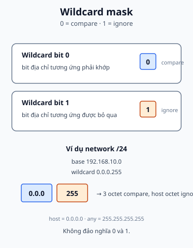

## 1. Map - cần nắm gì?

- Wildcard mask đi cùng địa chỉ trong ACL để mô tả các bit cần kiểm tra.
- Bit `0` nghĩa là bit địa chỉ tương ứng phải match.
- Bit `1` nghĩa là bit địa chỉ tương ứng được ignore.
- `host` là cách viết gọn cho wildcard `0.0.0.0`; `any` là cách viết gọn cho wildcard `255.255.255.255`.



## 2. Vì sao subnet mask chưa đủ?

Subnet mask mô tả phần network/host khi chia địa chỉ IP. ACL cần một cách nói linh hoạt hơn: bit nào phải giống địa chỉ base, bit nào có thể thay đổi. Wildcard mask đảo cách đọc quen thuộc:

| Wildcard bit | ACL làm gì                   | Câu hỏi                  |
| ------------ | ---------------------------- | ------------------------ |
| `0`          | kiểm tra giá trị bit địa chỉ | “bit này có đúng không?” |
| `1`          | bỏ qua giá trị bit địa chỉ   | “bit này có thể là gì?”  |

Với subnet mask liên tục, wildcard thường là phần bù theo octet của subnet mask. Đây là cách tính tiện dụng, nhưng cần đọc theo từng bit khi mask không theo ranh giới octet.

## 3. Ví dụ từ slide: match và not match

### 3.1. Wildcard `0.0.255.255`

Base `192.168.10.0` đi cùng wildcard `0.0.255.255` yêu cầu hai octet đầu `192.168` khớp và bỏ qua hai octet sau. Vì vậy một input như `192.168.3.1` có thể match theo cách trình bày trong slide.

Đây không phải cách viết cho một network /16 thông thường nếu thiết kế của bạn muốn cố định octet thứ ba. Hãy chọn mask theo policy thật sự, không chọn chỉ vì một ví dụ tình cờ match.

### 3.2. Wildcard `0.0.0.255`

Base `192.168.10.0` đi cùng `0.0.0.255` yêu cầu ba octet đầu khớp và bỏ qua octet cuối. Input `192.168.3.1` không match vì octet thứ ba `3` khác `10`.

Với network /24, đây là cách viết quen thuộc:

```text
192.168.10.0 0.0.0.255
```

Phạm vi địa chỉ được match là các host thuộc `192.168.10.0/24` theo ý nghĩa policy ACL.

## 4. Ba mẫu cần nhớ

### Host duy nhất

```text
192.168.10.10 0.0.0.0
```

Mọi bit của `192.168.10.10` phải khớp. Cisco cho phép viết gọn:

```text
host 192.168.10.10
```

### Mọi địa chỉ

```text
0.0.0.0 255.255.255.255
```

Mọi bit được bỏ qua. Cisco cho phép viết gọn:

```text
any
```

### Mọi host trong /24

```text
192.168.10.0 0.0.0.255
```

Ba octet đầu là network context cần match; octet cuối được phép thay đổi.

## 5. Đọc theo binary

Giả sử base là `192.168.10.0` và wildcard là `0.0.0.255`:

| Octet | Base  | Wildcard | Kết luận                |
| ----- | ----- | -------- | ----------------------- |
| 1     | `192` | `0`      | phải khớp toàn bộ octet |
| 2     | `168` | `0`      | phải khớp toàn bộ octet |
| 3     | `10`  | `0`      | phải khớp toàn bộ octet |
| 4     | `0`   | `255`    | bỏ qua toàn bộ octet    |

Nếu wildcard là `0.0.255.255`, hai octet cuối đều được bỏ qua. Nếu wildcard là `0.0.0.0`, cả 32 bit đều phải khớp.

## 6. Bài tập permit/deny của slide

### Ví dụ 1: `/26`

Rule:

```text
access-list 50 permit 192.168.122.128 0.0.0.63
```

Wildcard `0.0.0.63` giữ 26 bit đầu và bỏ qua 6 bit cuối. Vì vậy dải cuối octet được match là `128` đến `191`. Input `192.168.122.195` nằm ngoài dải nên **không match rule permit**; nếu ACL không có rule khác phù hợp, packet rơi vào implicit deny.

### Ví dụ 2: `/28`

Rule:

```text
access-list 50 permit 192.168.233.64 0.0.0.15
```

Wildcard `0.0.0.15` bỏ qua 4 bit cuối, nên dải cuối octet là `64` đến `79`. Input `192.168.233.72` nằm trong dải nên match rule permit.

## 7. Đưa wildcard vào ACL

Ví dụ bổ trợ dưới đây gắn hai rule vào interface. Các rule được đọc từ trên xuống:

```text
Router# configure terminal
Router(config)# access-list 50 permit 192.168.122.128 0.0.0.63
Router(config)# access-list 50 permit 192.168.233.64 0.0.0.15
Router(config)# interface gigabitEthernet 0/0/0
Router(config-if)# ip access-group 50 in
Router(config-if)# end

Router# show access-lists 50
```

`access-list 50` ở đây là standard ACL nên điều kiện địa chỉ là source. Nếu cần lọc destination, protocol hoặc port, hãy chuyển sang tư duy extended ACL ở [ACL](./acl/), không cố nhồi tất cả vào wildcard source.

## 8. Sai lầm thường gặp

| Hiện tượng                          | Sai lầm                                     | Cách sửa                           |
| ----------------------------------- | ------------------------------------------- | ---------------------------------- |
| Match quá rộng                      | dùng `1` ở những bit cần kiểm tra           | đổi bit đó về `0`                  |
| Host duy nhất không match           | dùng wildcard `0.0.0.255` thay vì `0.0.0.0` | dùng `host` hoặc exact mask        |
| Network /24 không match             | viết `0.0.0.0` và vô tình yêu cầu host base | dùng `0.0.0.255`                   |
| Input `.195` bị permit ngoài ý muốn | đọc `/26` như `/24`                         | tính dải 128-191 từ wildcard `.63` |
| ACL đúng nhưng không tác dụng       | quên apply hoặc nhầm in/out                 | kiểm tra interface và hướng        |

### Câu hỏi tự chẩn đoán

1. **Troubleshooting:** rule permit <code>192.168.233.64 0.0.0.15</code> không match một host mà bạn nghĩ nằm trong /28. Hãy kiểm tra base address, dải 64–79, thứ tự rule và interface direction.
2. **Application:** một policy cần match duy nhất <code>192.168.10.7</code> nhưng đang dùng wildcard <code>0.0.0.255</code>. Hãy chỉ ra các bit đang bị ignore và sửa thành cặp host chính xác.

## 9. Recall - đóng tài liệu lại

1. Wildcard bit `0` yêu cầu điều gì?
2. `host 192.168.10.10` tương đương cặp địa chỉ/mask nào?
3. `any` bỏ qua bao nhiêu bit?
4. `0.0.0.255` match dải host nào nếu base là `192.168.10.0`?
5. Vì sao `192.168.122.195` không match `192.168.122.128 0.0.0.63`?

## 10. Reasoning - vận dụng

1. Viết wildcard để match mọi host trong `10.10.10.0/24`, rồi viết wildcard để match duy nhất `10.10.10.7`.
2. Một operator dùng `0.0.255.255` cho policy chỉ muốn một /24. Hãy mô tả hai octet nào đang bị bỏ qua và hậu quả.
3. ACL permit một subnet /28 nhưng một host ngoài dải vẫn đi qua. Hãy kiểm tra wildcard, thứ tự rule và rule permit rộng ở phía trên.

## 11. Nguồn & phạm vi

### A. Nguồn bài giảng chính - Class B, reference only

- `4.4 ACL Overview.pdf`: standard ACL dùng source và wildcard trong syntax, extended ACL dùng thêm destination/protocol/port.
- `4.5 ACL Wildcard mask.pdf`: match/not match theo bit, các ví dụ `0.0.255.255`, `0.0.0.255`, host/any và hai bài tập dải `/26` và `/28`.

### B. Tài liệu bổ trợ - Class C

- [Cisco IP Access List Overview](https://www.cisco.com/c/en/us/td/docs/routers/ios/config/17-x/sec-vpn/b-security-vpn/m_sec-access-list-ov-0.html): semantics bit `0`/`1` và các ví dụ wildcard.
- [Cisco Creating and Applying IP Access Lists](https://www.cisco.com/c/en/us/td/docs/routers/ios-xe/security-vpn/security-vpn/m_sec-create-ip-apply-0.html): wildcard, `host`, `any` và apply ACL.

### C. Nội dung & sơ đồ do tác giả biên soạn độc lập

- `acl-wildcard-match.svg`: sơ đồ original cho match/ignore và ba mẫu host/network/any.
- Các bảng binary, dải địa chỉ và câu hỏi được viết độc lập; PDF không được sao chép hoặc đưa vào public output.

## 12. Liên kết

- **Bài trước:** [ACL](./acl/).
- **Bài thực hành:** [Lab Network Services](../../thuc-hanh/network-services/).
