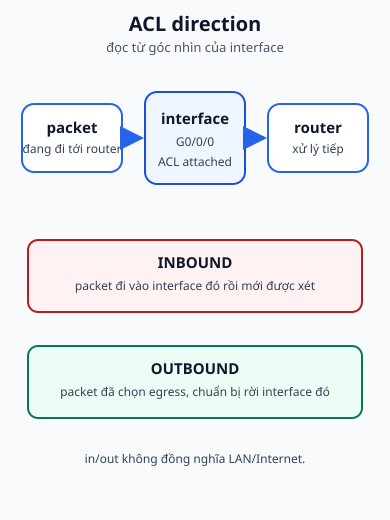
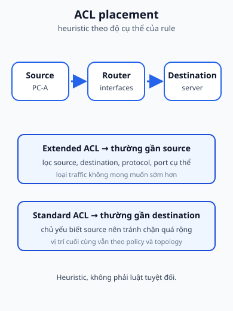

## 1. Map - cần nắm gì?

- ACL là danh sách điều kiện để **permit** hoặc **deny** packet.
- ACL được gắn vào interface theo hướng **inbound** hoặc **outbound**.
- Standard ACL chủ yếu nhìn source; extended ACL có thể nhìn source, destination, protocol và port.
- Rule được đọc từ trên xuống; wildcard mask quyết định địa chỉ nào match.





## 2. ACL giải quyết bài toán gì?

Một router có thể có nhiều đường đi hợp lệ, nhưng không phải mọi packet đều được phép đi qua từng interface. ACL đặt policy gần đường đi: packet vào hoặc chuẩn bị ra interface được so sánh với các điều kiện. Kết quả là một quyết định cho packet đó, không phải một thay đổi địa chỉ như NAT.

Slide minh họa yêu cầu kiểu “cho truy cập server, từ chối PC2”. Từ ví dụ đó, hãy luôn tách ba câu hỏi:

1. Đang lọc protocol/địa chỉ/cổng nào?
2. ACL được gắn ở interface nào và hướng nào?
3. Rule nào nằm trước và match trước?

## 3. Inbound và outbound

| Hướng    | Thời điểm kiểm tra                                   | Câu hỏi trace                                 |
| -------- | ---------------------------------------------------- | --------------------------------------------- |
| inbound  | packet vừa đi vào interface                          | packet có được phép đi tiếp vào router không? |
| outbound | packet đã được chọn egress và chuẩn bị rời interface | packet có được phép ra interface này không?   |

Một ACL gắn ở đúng interface nhưng sai hướng vẫn có thể không chặn được flow mong muốn. Khi đọc topology, hãy đánh dấu mũi tên packet và tên interface trước khi đọc rule.

## 4. Standard và extended ACL

### Standard ACL

Standard ACL chủ yếu lọc theo source IPv4 address. Slide đưa dải số thường gặp `1-99` hoặc `1300-1999`. Với cách đặt heuristic trong slide, standard ACL thường được đặt gần destination vì nếu đặt quá gần source, nó có thể chặn source đó tới nhiều destination hơn dự định.

### Extended ACL

Extended ACL có thể lọc source, destination, protocol như ICMP/IP/TCP/UDP và port number. Slide minh họa deny SSH tới Server 1 nhưng permit HTTP. Theo tài liệu Cisco IOS/IOS XE hiện hành, numbered extended IPv4 ACL dùng các dải `100-199` và `2000-2699`; numbered standard ACL dùng `1-99` và `1300-1999`. Extended ACL thường được đặt gần source để loại traffic không mong muốn sớm, nhưng vị trí cuối cùng vẫn phải dựa trên policy và topology.

“Gần source” và “gần destination” là quy tắc định hướng, không phải luật thay thế việc phân tích flow. Một ACL chỉ có tác dụng khi được apply vào interface hoặc điểm hỗ trợ tương ứng.

## 5. Thứ tự rule và implicit deny

Router kiểm tra entry theo thứ tự từ trên xuống. Khi một entry match, quyết định của entry đó được dùng; các entry phía dưới không được dùng cho packet vừa match. Vì vậy một permit rộng đặt trước deny cụ thể có thể làm deny không bao giờ được chạm tới.

Cisco có implicit deny ở cuối ACL theo semantics supplementary. Khi policy muốn cho phép phần còn lại, hãy viết permit rõ ràng thay vì hy vọng người đọc tự suy ra. Ví dụ `permit tcp any any` chỉ nói về TCP; nếu muốn cho phép mọi IPv4 protocol, cú pháp có thể là `permit ip any any` trong ngữ cảnh phù hợp.

## 6. Standard ACL: source và wildcard

Ví dụ sau bám vào slide: từ chối mạng `192.168.1.0/24`, cho phép các source khác, rồi apply ở hướng outbound của interface tới server:

```text
Router# configure terminal
Router(config)# access-list 1 deny 192.168.1.0 0.0.0.255
Router(config)# access-list 1 permit any
Router(config)# interface gigabitEthernet 0/0/0
Router(config-if)# ip access-group 1 out
Router(config-if)# end

Router# show access-lists 1
Router# show running-config interface gigabitEthernet 0/0/0
```

| Trước                           | Command                    | Sau / observable result                           |
| ------------------------------- | -------------------------- | ------------------------------------------------- |
| Chưa có rule                    | `access-list 1 deny ...`   | source thuộc mạng đó bị đánh dấu deny nếu tới ACL |
| Cần hành vi rõ với phần còn lại | `access-list 1 permit any` | các source không match deny có entry permit       |
| ACL chưa gắn interface          | `ip access-group 1 out`    | packet outbound của interface được đưa qua ACL 1  |
| Cần biết rule nào được dùng     | `show access-lists 1`      | counter/entry giúp nối policy với traffic         |

Thứ tự deny trước permit là chủ ý. Nếu đảo hai entry thành permit rộng trước, packet từ `192.168.1.0/24` có thể được permit trước khi tới deny.

## 7. Extended ACL: source, destination, protocol, port

Ví dụ sau giữ ý định trong slide: deny SSH từ `192.168.1.0/24` tới Server 1, permit HTTP tới Server 1, rồi permit các TCP flow khác:

```text
Router# configure terminal
Router(config)# access-list 100 deny tcp 192.168.1.0 0.0.0.255 host 192.168.10.10 eq 22
Router(config)# access-list 100 permit tcp 192.168.1.0 0.0.0.255 host 192.168.10.10 eq 80
Router(config)# access-list 100 permit tcp any any
Router(config)# interface gigabitEthernet 0/0/0
Router(config-if)# ip access-group 100 in
Router(config-if)# end

Router# show access-lists 100
Router# show running-config interface gigabitEthernet 0/0/0
```

Đọc dòng extended theo thứ tự: số ACL -> action -> protocol -> source/source-wildcard -> destination/destination-wildcard -> port operator/value. `host 192.168.10.10` là cách viết gọn cho một địa chỉ duy nhất. Entry `permit tcp any any` chỉ permit TCP; các protocol khác vẫn có thể rơi vào implicit deny. Đây là điểm cần nói rõ khi biến slide “allow” thành cấu hình có thể chạy.

## 8. Wildcard mask trong ACL

Wildcard không đọc giống subnet mask:

- bit `0`: bit địa chỉ tương ứng phải khớp;
- bit `1`: bỏ qua bit đó khi so sánh.

Ví dụ `192.168.10.0 0.0.0.255` khớp các host trong network /24 vì ba octet đầu được kiểm tra và octet cuối được bỏ qua. `host 192.168.10.10` tương đương địa chỉ với wildcard `0.0.0.0`; `any` tương đương `0.0.0.0 255.255.255.255`.

Học chi tiết bit và bài tập ở [Wildcard mask](./acl-wildcard-mask/).

## 9. ACL configuration checklist

Trước khi kết luận ACL “đã cấu hình đúng”, hãy ghi lại:

1. ACL number/name và từng rule theo thứ tự.
2. Source, destination, protocol và port mà rule thật sự match.
3. Interface gắn ACL.
4. Hướng in/out nhìn từ interface đó.
5. Rule đầu tiên có thể match flow.
6. Counter và trạng thái sau một lần thử.

Đây là checklist đọc state. Nó không thay cho kiểm tra policy với chủ sở hữu hệ thống.

## 10. Sai lầm thường gặp

| Hiện tượng                       | Giả thuyết                             | Cách kiểm tra                                 |
| -------------------------------- | -------------------------------------- | --------------------------------------------- |
| ACL không có tác dụng            | chưa apply hoặc sai hướng              | `show running-config` interface               |
| Host bị chặn dù có permit        | deny rộng nằm trước permit cụ thể      | đọc entry từ trên xuống                       |
| HTTP chạy nhưng ping không chạy  | rule chỉ permit TCP/80                 | xem protocol và port                          |
| Nhiều mạng bị chặn ngoài dự kiến | wildcard có bit ignore quá rộng        | chuyển wildcard sang binary/đối chiếu network |
| Rule counter không tăng          | packet không đi qua interface/hướng đó | trace route, interface và direction           |

### Câu hỏi tự chẩn đoán

1. **Troubleshooting:** một HTTP request bị deny dù rule permit HTTP tồn tại. Hãy kiểm tra thứ tự ACE, interface, hướng và protocol/port theo đúng thứ tự chẩn đoán.
2. **Application:** với packet từ PC-A VLAN 10 tới Web Server, hãy chọn một interface để apply ACL và mô tả chính xác packet đang đi vào hay rời interface đó; không dùng LAN/Internet làm định nghĩa cho in/out.

## 11. Recall - đóng tài liệu lại

1. Inbound ACL kiểm tra packet ở thời điểm nào?
2. Standard và extended ACL khác nhau ở trường nào được lọc?
3. Vì sao rule order có thể làm một deny không bao giờ được xét?
4. `ip access-group 1 out` gắn ACL vào đâu và theo hướng nào?
5. Wildcard bit `0` và `1` tương ứng với match/ignore ra sao?

## 12. Reasoning - vận dụng

1. Một rule deny SSH đặt sau `permit tcp any any`. Hãy dự đoán counter của hai dòng khi có SSH và giải thích.
2. ACL extended ở inbound interface A không chặn được reply đi ra interface B. Hãy phân biệt sai hướng, sai interface và sai chiều flow.
3. Một standard ACL cần match mọi host trong `192.168.10.0/24` nhưng lại dùng `0.0.0.0`. Hãy chỉ ra host nào sẽ bị match và vì sao.

## 13. Nguồn & phạm vi

### A. Nguồn bài giảng chính - Class B, reference only

- `4.1 Network Services.pdf`: ACL overview về allow/deny traffic.
- `4.4 ACL Overview.pdf`: ACL operation, inbound/outbound, types/placement, standard/extended fields, số ACL, rule syntax, apply interface và các ví dụ SSH/HTTP.
- `4.5 ACL Wildcard mask.pdf`: wildcard matching, host/any, network wildcard và bài tập permit/deny.

### B. Tài liệu bổ trợ - Class C

- [Cisco IP Access List Overview](https://www.cisco.com/c/en/us/td/docs/routers/ios/config/17-x/sec-vpn/b-security-vpn/m_sec-access-list-ov-0.html): wildcard semantics và extended ACL fields.
- [Cisco Creating and Applying IP Access Lists](https://www.cisco.com/c/en/us/td/docs/routers/ios-xe/security-vpn/security-vpn/m_sec-create-ip-apply-0.html): cấu hình, thứ tự và apply ACL.

### C. Nội dung & sơ đồ do tác giả biên soạn độc lập

- `acl-inbound-outbound.svg` và `acl-standard-extended-placement.svg`: hai sơ đồ original tách direction khỏi placement heuristic.
- Các trace, bảng state và câu hỏi được viết độc lập; PDF không được sao chép hoặc đưa vào public output.

## 14. Liên kết

- **Bài trước:** [NAT và PAT](./nat/).
- **Bài tiếp theo:** [Wildcard mask](./acl-wildcard-mask/).
- **Bài thực hành:** [Lab Network Services](../../thuc-hanh/network-services/).
