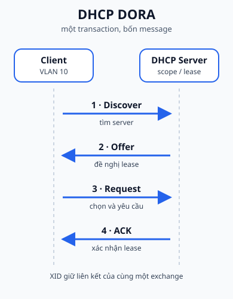
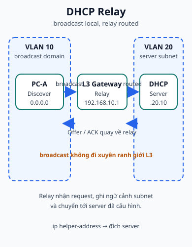

## 1. Map - cần nắm gì?

- Client chưa có cấu hình bắt đầu bằng **DHCP Discover**.
- Bốn message chính tạo thành chuỗi **DORA**: Discover, Offer, Request, ACK.
- DHCP server đề nghị một lease và các option như subnet mask, default gateway, DNS.
- DHCP relay giúp request đi từ broadcast domain của client tới server ở mạng khác.



## 2. Bài toán nó giải quyết

Một host mới không nên phải biết trước địa chỉ IP, gateway và DNS của mạng đang cắm vào. DHCP biến việc cấp tham số thành một cuộc trao đổi có transaction và thời gian thuê. Host có thể khởi động, tìm dịch vụ cấp phát trên LAN, nhận đề nghị, xác nhận lựa chọn và bắt đầu dùng cấu hình.

Các slide dùng client/server và minh họa một DHCP server trên modem/AP. Đây là các vị trí triển khai thường gặp trong bài học, không phải yêu cầu mọi mạng phải dùng modem/AP. Router cũng có thể làm DHCP server, hoặc chỉ làm relay tới server chuyên dụng.

## 3. DORA: đọc message theo state

### 3.1. Discover

Client chưa có IP hợp lệ gửi Discover. Trace trong slide minh họa:

- source `0.0.0.0`, UDP port 68;
- destination broadcast `255.255.255.255`, UDP port 67;
- `yiaddr` ban đầu là `0.0.0.0`;
- transaction ID giúp server và client ghép message với cùng cuộc trao đổi.

Discover là broadcast trong phạm vi LAN. Router Layer 3 không tự chuyển broadcast này sang interface khác.

### 3.2. Offer

Server trả lời bằng Offer, đề nghị một địa chỉ (`yiaddr`) cùng lifetime và các option. Slide dùng địa chỉ minh họa `223.1.2.5` cho server và `223.1.2.4` cho địa chỉ được đề nghị. Không đưa các giá trị đó thành cấu hình mặc định; scope thực tế quyết định địa chỉ và option.

### 3.3. Request

Client gửi Request để nói rằng nó chọn offer nào. Request cũng giúp các DHCP server khác biết rằng client đã chọn một đề nghị. Khi đọc capture, hãy ghép transaction ID và địa chỉ được yêu cầu thay vì chỉ nhìn thứ tự gói.

### 3.4. ACK

Server gửi ACK để xác nhận lease. Sau ACK, client có thể cài IP, mask, gateway và DNS theo option đã nhận. Lease có lifetime; khi hết hạn, client phải gia hạn hoặc ngừng dùng địa chỉ theo quy tắc của DHCP.

Trong slide, một số transaction ID giữa các message được trình bày như ví dụ minh họa. Ý cần giữ là **các message của một cuộc trao đổi phải được liên hệ bằng transaction/client state**, không phải coi mọi con số trong slide là giá trị cố định của mọi client.

### 3.5. Một transaction nhất quán

Bảng dưới đây là trace original với cùng một transaction ID <code>0xA1327C4E</code> từ Discover đến ACK. Các dòng Offer/ACK ghi IP của leg server → relay; relay sau đó phân phối message ở phía client VLAN. Vì vậy SIP/DIP có thể khác giữa hai leg, nhưng transaction ID và client state vẫn nối cùng một cuộc trao đổi.

| Bước | Message  | SIP                        | DIP                               | UDP source | UDP destination | Transaction ID          | Offered / assigned address          | Lease / client state                                    |
| ---- | -------- | -------------------------- | --------------------------------- | ---------- | --------------- | ----------------------- | ----------------------------------- | ------------------------------------------------------- |
| 1    | Discover | <code>0.0.0.0</code>       | <code>255.255.255.255</code>      | 68         | 67              | <code>0xA1327C4E</code> | chưa có                             | INIT / SELECTING                                        |
| 2    | Offer    | <code>192.168.20.10</code> | <code>192.168.10.1</code> (relay) | 67         | 67              | <code>0xA1327C4E</code> | <code>192.168.10.10</code>          | relay received; client still awaiting delivery          |
| 3    | Request  | <code>0.0.0.0</code>       | <code>255.255.255.255</code>      | 68         | 67              | <code>0xA1327C4E</code> | yêu cầu <code>192.168.10.10</code>  | REQUESTING                                              |
| 4    | ACK      | <code>192.168.20.10</code> | <code>192.168.10.1</code> (relay) | 67         | 67              | <code>0xA1327C4E</code> | xác nhận <code>192.168.10.10</code> | relay received ACK; client becomes BOUND after delivery |

Sau khi relay nhận Offer hoặc ACK, leg phía VLAN 10 có thể là broadcast hoặc unicast tùy cờ và trạng thái client. <code>giaddr=192.168.10.1</code> giúp server nhận diện subnet cần chọn pool; nó không biến relay thành DHCP server. [RFC 2131](https://www.rfc-editor.org/rfc/rfc2131.html) là tài liệu bổ trợ để đối chiếu transaction matching và các state của DHCP; bảng trên vẫn giữ DORA theo cách trình bày của Class B.

## 4. DHCP server, modem/AP và relay



### DHCP server trên modem/AP

Modem hoặc access point gia đình thường có thể cấp địa chỉ cho các client trong LAN. Khi dùng mô hình này, kiểm tra pool, lease time và gateway mà thiết bị quảng bá. Nếu có một DHCP server khác cùng broadcast domain, hai nguồn trả lời có thể làm kết quả không đoán được.

### Router làm DHCP server

Đây là ví dụ bổ trợ Cisco để nối DORA với cấu hình pool. Các địa chỉ chỉ là lab values:

```text
Router# configure terminal
Router(config)# ip dhcp excluded-address 192.168.10.1 192.168.10.20
Router(config)# ip dhcp pool USERS
Router(dhcp-config)# network 192.168.10.0 255.255.255.0
Router(dhcp-config)# default-router 192.168.10.1
Router(dhcp-config)# dns-server 192.168.10.53
Router(dhcp-config)# exit
Router(config)# end

Router# show ip dhcp binding
Router# show ip dhcp pool
```

| Trước                                      | Command                        | Sau / observable result                             |
| ------------------------------------------ | ------------------------------ | --------------------------------------------------- |
| Pool chưa có scope                         | `network`                      | Pool biết mạng mà địa chỉ được cấp phải thuộc vào   |
| Một số địa chỉ phải giữ cho gateway/server | `ip dhcp excluded-address`     | Các địa chỉ đó không được pool cấp tự động          |
| Client cần gateway/DNS                     | `default-router`, `dns-server` | Lease mang thêm option cho client                   |
| Chưa có bằng chứng cấp phát                | `show ip dhcp binding`         | Có thể thấy binding giữa client và địa chỉ được cấp |

Đây là **SUPPLEMENTARY CISCO**. Slide tập trung vào vai trò server; cú pháp pool và output phụ thuộc IOS/platform.

### Multilayer Switch làm DHCP relay

Khi client và server khác mạng, relay nhận broadcast ở interface phía client và chuyển tiếp tới server. Trong topology chung, một Multilayer Switch / L3 Gateway dùng SVI VLAN 10 và chuyển tới DHCP Server `192.168.20.10`; relay không gửi broadcast nguyên vẹn qua router mà dùng địa chỉ server làm đích chuyển tiếp.

```text
Switch# configure terminal
Switch(config)# interface vlan 10
Switch(config-if)# ip address 192.168.10.1 255.255.255.0
Switch(config-if)# ip helper-address 192.168.20.10
Switch(config-if)# exit
Switch(config)# end

Switch# show running-config interface vlan 10
```

| Vị trí          | State cần kiểm tra                        | Bằng chứng                 |
| --------------- | ----------------------------------------- | -------------------------- |
| Client VLAN     | broadcast Discover có rời được LAN không? | capture/relay counter      |
| Interface relay | helper trỏ đúng DHCP server chưa?         | running config             |
| Server          | scope khớp subnet client chưa?            | pool/lease/log             |
| Reply           | Offer/ACK có quay lại đúng client không?  | transaction và relay trace |

Trên Cisco IOS, `ip helper-address` là cấu hình interface; nó không tự tạo scope trên server. **SUPPLEMENTARY CISCO:** relay có thể ghi gateway address (`giaddr`) để server chọn pool theo subnet của client. Chi tiết option 82 và các loại UDP broadcast được relay là phần ngoài phạm vi cốt lõi của slide.

## 5. Trace gọn một lần cấp phát

| Bước | Client state  | Message  | Địa chỉ nhìn thấy trong ví dụ       | Ý nghĩa                   |
| ---- | ------------- | -------- | ----------------------------------- | ------------------------- |
| 1    | chưa có IP    | Discover | `0.0.0.0:68 -> 255.255.255.255:67`  | tìm server                |
| 2    | chờ lựa chọn  | Offer    | server đề nghị `yiaddr` và lifetime | có candidate lease        |
| 3    | đã chọn offer | Request  | nêu lựa chọn và transaction         | yêu cầu server xác nhận   |
| 4    | bound         | ACK      | lease + option                      | cài cấu hình và dùng mạng |

Đừng nhầm `yiaddr` với địa chỉ source IP ổn định của client ở mọi thời điểm. Trong giai đoạn đầu, client có thể chưa thể dùng địa chỉ được đề nghị như một source bình thường.

## 6. Troubleshooting theo lớp

| Hiện tượng                                    | Giả thuyết ưu tiên                                      | Kiểm tra                                        |
| --------------------------------------------- | ------------------------------------------------------- | ----------------------------------------------- |
| Client không nhận bất kỳ Offer nào            | DHCP server tắt, không có scope, hoặc broadcast bị chặn | DORA capture, trạng thái server, VLAN/LAN       |
| Client nhận Offer nhưng không có ACK          | scope xung đột, server từ chối, hoặc relay path lỗi     | transaction ID, pool, log và đường relay        |
| Client nhận IP nhưng không truy cập mạng khác | default gateway sai hoặc route/ACL lỗi                  | option gateway, routing table, ACL              |
| Chỉ client ở VLAN khác bị lỗi                 | relay chưa đặt trên SVI/subnet đúng                     | `ip helper-address`, interface IP, reachability |
| Có nhiều địa chỉ DHCP khác nhau               | nhiều server cùng trả lời                               | xác định server/relay nào gửi Offer             |

Chuỗi chẩn đoán nên đi từ client state -> broadcast domain -> relay -> server scope -> option gateway. Không bắt đầu bằng việc sửa DNS nếu client còn chưa có lease.

### Câu hỏi tự chẩn đoán

1. **Troubleshooting:** nếu bảng trace có Discover và Offer cùng XID nhưng không có ACK, hãy chọn hai điểm kiểm tra đầu tiên giữa scope, relay path và client state, rồi giải thích thứ tự.
2. **Application:** với topology Client VLAN 10 / Server VLAN 20, hãy chỉ ra packet nào là broadcast local và packet nào là routed relay traffic; ghi interface nhận packet ở mỗi bước.

## 7. Recall - đóng tài liệu lại

1. DORA viết đầy đủ là gì và mỗi bước thay đổi client state thế nào?
2. Vì sao DHCP Discover thường dùng `0.0.0.0` và broadcast ở giai đoạn đầu?
3. Tại sao router không chỉ forward nguyên broadcast DHCP sang mạng khác?
4. `ip helper-address` đặt ở đâu và nó giải quyết bước nào?
5. Lease lifetime và transaction ID giúp đọc trace ra sao?

## 8. Reasoning - vận dụng

1. Client VLAN 10 gửi Discover nhưng server ở VLAN 20 không thấy gì. Hãy vẽ lại điểm broadcast dừng và chỉ ra interface cần relay.
2. Offer có mặt nhưng ACK không tới. Hãy tách các state: server có scope, relay có đường về, và client có chọn đúng offer hay chưa.
3. Hai DHCP server cùng trả lời. Hãy mô tả vì sao chỉ nhìn IP nhận được chưa đủ để xác định lỗi; cần truy nguồn Offer.

## 9. Nguồn & phạm vi

### A. Nguồn bài giảng chính - Class B, reference only

- `4.1 Network Services.pdf`: phần DHCP overview, DORA, DHCP server trên modem/AP, router làm server và relay.
- `4.2 DHCP Overview.pdf`: DORA trace với UDP 67/68, `yiaddr`, transaction ID, lifetime và ví dụ `ip helper-address`.

### B. Tài liệu bổ trợ - Class C

- [Cisco IOS XE DHCP Server](https://www.cisco.com/c/en/us/td/docs/routers/ios/config/17-x/ip-addressing/b-ip-addressing/m_config-dhcp-server-xe.html): pool, binding và server/relay behavior.
- [Cisco IOS XE DHCP Relay Agent](https://www.cisco.com/c/en/us/td/docs/ios-xml/ios/ipaddr_dhcp/configuration/xe-2/dhcp-xe-2-book/dhcp-relay-agent-xe.html): `ip helper-address` và chuyển tiếp request.

[RFC 2131](https://www.rfc-editor.org/rfc/rfc2131.html) — transaction matching và DHCP state, dùng như tài liệu bổ trợ.

### C. Nội dung & sơ đồ do tác giả biên soạn độc lập

- `dhcp-dora.svg` và `dhcp-relay.svg`: hai sơ đồ original tách message sequence khỏi broadcast-domain boundary.
- Các bảng trace, ví dụ địa chỉ và câu hỏi được viết độc lập; PDF không được sao chép hoặc đưa vào public output.

## 10. Liên kết

- **Bài trước:** [Network Services - Địa chỉ, translation và policy](./tong-quan-network-services/).
- **Bài tiếp theo:** [NAT](./nat/).
- **Bài thực hành:** [Lab Network Services](../../thuc-hanh/network-services/).
