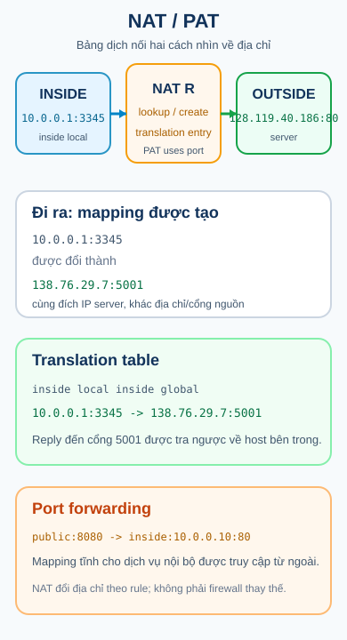

## 1. Map - cần nắm gì?

- NAT đặt một điểm dịch địa chỉ giữa mạng inside và outside.
- Translation table nối tuple trước dịch với tuple sau dịch.
- PAT, còn gọi là NAT overload, cho nhiều host dùng chung một địa chỉ public bằng cách phân biệt port và protocol.
- Port forwarding tạo mapping tĩnh để traffic từ một địa chỉ/cổng public đi tới dịch vụ bên trong.



## 2. Bài toán nó giải quyết

Các host bên trong thường dùng địa chỉ private. Khi đi tới mạng bên ngoài, router biên có thể dịch source address sang một địa chỉ có thể được nhìn thấy ở phía outside. Slide nhấn mạnh rằng một địa chỉ public có thể phục vụ nhiều thiết bị private; điều này giải thích vì sao NAT/PAT được dùng để tiết kiệm IPv4 public.

NAT không phải là một router thay thế routing table, và cũng không tự động là firewall. Routing quyết định packet đi về interface nào; NAT áp dụng mapping nếu packet phù hợp rule; ACL mới là danh sách permit/deny được kiểm tra theo hướng trên interface.

## 3. Từ vựng của một mapping

| Tên            | Cách đọc trong trace                                           | Ví dụ                   |
| -------------- | -------------------------------------------------------------- | ----------------------- |
| inside local   | địa chỉ của host bên trong trước dịch                          | `10.0.0.1:3345`         |
| inside global  | địa chỉ đại diện host bên trong ở phía outside                 | `138.76.29.7:5001`      |
| outside global | địa chỉ server như được nhìn ở outside                         | `128.119.40.186:80`     |
| outside local  | cách thiết bị inside nhìn địa chỉ outside nếu có mapping riêng | phụ thuộc topology/rule |

Hai cột `LAN side addr` và `WAN side addr` trong slide là cách minh họa trực quan cho hai phía của bảng. Tên inside local/global và outside local/global là **SUPPLEMENTARY CISCO/NAT vocabulary** để đọc cấu hình và output chính xác hơn.

## 4. Outbound: tạo và tra translation table

Slide dùng flow sau:

1. Host `10.0.0.1` gửi source port `3345` tới server `128.119.40.186:80`.
2. NAT router đổi source thành `138.76.29.7:5001` và ghi mapping.
3. Server reply gửi về `138.76.29.7:5001`.
4. Router tra table, đổi destination về `10.0.0.1:3345` và chuyển vào LAN.

| Chặng           | Source              | Destination         | State                                     |
| --------------- | ------------------- | ------------------- | ----------------------------------------- |
| trước NAT       | `10.0.0.1:3345`     | `128.119.40.186:80` | inside local chưa được đại diện ở outside |
| sau NAT đi ra   | `138.76.29.7:5001`  | `128.119.40.186:80` | mapping mới hoặc mapping đã tái sử dụng   |
| reply ở outside | `128.119.40.186:80` | `138.76.29.7:5001`  | tìm entry theo inside global/port         |
| sau NAT đi vào  | `128.119.40.186:80` | `10.0.0.1:3345`     | trả về đúng host và flow bên trong        |

Port `5001` trong slide là ví dụ được router chọn; không nên coi mọi thiết bị luôn chọn đúng con số đó. Điều quan trọng là tuple sau dịch phải đủ để router tra ngược đúng flow.

## 5. PAT / NAT overload

PAT cho nhiều inside local address cùng dùng một inside global address. Router phân biệt các flow bằng port transport và protocol, rồi lưu state tương ứng. Nếu một mapping chỉ đổi địa chỉ mà không cần chia sẻ public address, đó là một trường hợp NAT khác; đừng dùng từ PAT cho mọi translation.

Ví dụ bổ trợ Cisco dưới đây minh họa một pool source và interface WAN. Cổng cụ thể chỉ là lab values:

```text
Router# configure terminal
Router(config)# interface gigabitEthernet 0/0
Router(config-if)# ip nat inside
Router(config-if)# exit
Router(config)# interface gigabitEthernet 0/1
Router(config-if)# ip nat outside
Router(config-if)# exit
Router(config)# access-list 10 permit 10.0.0.0 0.0.0.255
Router(config)# ip nat inside source list 10 interface gigabitEthernet 0/1 overload
Router(config)# end

Router# show ip nat translations
Router# show ip nat statistics
```

| Command                    | State change                             | Observable result                                |
| -------------------------- | ---------------------------------------- | ------------------------------------------------ |
| `ip nat inside`            | đánh dấu interface phía mạng private     | packet vào từ interface thuộc inside context     |
| `ip nat outside`           | đánh dấu interface phía ngoài            | packet đi ra được xét ở outside context          |
| ACL source                 | chọn source nào được dịch                | rule match quyết định candidate flow             |
| `overload`                 | cho phép chia sẻ inside global theo port | nhiều entries có cùng public IP nhưng tuple khác |
| `show ip nat translations` | không đổi state; chỉ đọc state           | nhìn thấy mapping hiện tại                       |

Đây là **SUPPLEMENTARY CISCO**. Slide Class B chứng minh ý tưởng translation table và NAT overload; tên lệnh, interface role và output cần đối chiếu platform/version.

## 6. Port forwarding: traffic đi vào dịch vụ

Port forwarding là mapping tĩnh cho một dịch vụ. Ví dụ: public `138.76.29.7:8080` trỏ tới server inside `10.0.0.10:80`. Khi client outside gửi tới public tuple, router đổi destination rồi chuyển packet vào server.

```text
Router# configure terminal
Router(config)# interface gigabitEthernet 0/0
Router(config-if)# ip nat inside
Router(config-if)# exit
Router(config)# interface gigabitEthernet 0/1
Router(config-if)# ip nat outside
Router(config-if)# exit
Router(config)# ip nat inside source static tcp 10.0.0.10 80 138.76.29.7 8080
Router(config)# end

Router# show ip nat translations
```

| Trước dịch ở outside           | Sau dịch ở inside                                | Điều cần verify                    |
| ------------------------------ | ------------------------------------------------ | ---------------------------------- |
| destination `138.76.29.7:8080` | destination `10.0.0.10:80`                       | server có lắng nghe port 80 không  |
| source client outside          | source vẫn là client theo flow                   | route/return path có tồn tại không |
| mapping tĩnh                   | entry không phụ thuộc một lần outbound tạo trước | rule đúng protocol và cổng chưa    |

Slide port-forwarding minh họa một cổng public được định nghĩa trong table để đưa traffic vào server. Cú pháp static PAT ở trên là supplementary; nó không có nghĩa dịch vụ đã được mở an toàn trước Internet.

## 7. Trace trước/sau NAT

Hãy tách hai loại identity:

- **Endpoint identity**: server và client mà ứng dụng muốn giao tiếp.
- **NAT identity**: tuple mà router dùng để đại diện flow ở mỗi phía.

Trong outbound trace, destination server vẫn là `128.119.40.186:80`, còn source nhìn từ outside đã thành `138.76.29.7:5001`. Khi reply quay về, NAT tra mapping để phục hồi destination inside. Nếu không có entry hoặc entry hết hạn, router không biết đẩy reply về host nào.

## 8. Troubleshooting

| Hiện tượng                            | Giả thuyết                                                                 | Kiểm tra                                             |
| ------------------------------------- | -------------------------------------------------------------------------- | ---------------------------------------------------- |
| Host inside không có translation      | source không match ACL, interface role thiếu, hoặc chưa có traffic phù hợp | `show ip nat translations`, ACL và interface config  |
| Translation có nhưng không tới server | route hoặc outside path lỗi                                                | routing table, reachability, outside interface       |
| Reply quay về nhưng sai host          | port/protocol không khớp hoặc entry không còn                              | tuple hai chiều và translation table                 |
| Port forwarding không mở được dịch vụ | server/return route/ACL lỗi, không chỉ NAT                                 | listener server, ACL in/out, route và static mapping |
| Nhiều host tranh cùng một public IP   | thiếu overload hoặc mapping tuple không phân biệt được                     | rule NAT/PAT và các entry hiện tại                   |

NAT table chỉ trả lời câu hỏi “router đang nhớ mapping nào?”. Nó không chứng minh ACL permit, server đang listen, hay route return path đã đúng.

## 9. Recall - đóng tài liệu lại

1. Phân biệt inside local với inside global bằng một câu.
2. Vì sao PAT dùng port trong khi NAT một-một có thể không cần chia sẻ public address?
3. Reply đến địa chỉ/cổng nào để router tra mapping outbound?
4. Port forwarding đổi trường nào của packet khi traffic đi vào server?
5. Vì sao translation table không thay thế routing table hoặc ACL?

## 10. Reasoning - vận dụng

1. Hai host `10.0.0.1:3345` và `10.0.0.2:3345` cùng đi tới một web server. Hãy giải thích vì sao PAT phải tạo hai tuple public khác nhau.
2. Static port forwarding có entry nhưng server không trả lời. Hãy phân loại lỗi thành NAT, ACL, server listener và route quay về.
3. Một reply đến đúng public IP nhưng sai cổng. Hãy chỉ ra vì sao tra IP đơn lẻ không đủ để xác định mapping.

## 11. Nguồn & phạm vi

### A. Nguồn bài giảng chính - Class B, reference only

- `4.1 Network Services.pdf`: NAT overview, private/public addressing, NAT operation, translation table và port forwarding.
- `4.3 NAT overview.pdf`: outbound mapping với `10.0.0.1:3345 -> 138.76.29.7:5001`, reply lookup, inbound port forwarding và cổng dịch vụ.

### B. Tài liệu bổ trợ - Class C

- [Cisco NAT Configuration Guide](https://www.cisco.com/c/en/us/td/docs/switches/lan/c9000/lyr3-fwd/nat/nat-configuration-guide/nat.html): PAT/NAT overload và static port translation.
- [Cisco NAT IP Address Conservation](https://www.cisco.com/c/en/us/td/docs/ios-xml/ios/ipaddr_nat/configuration/xe-2/nat-xe-2-book/iadnat-addr-consv.html): mapping source và cách kiểm tra translation.

### C. Nội dung & sơ đồ do tác giả biên soạn độc lập

- `nat-translation.svg`: sơ đồ original cho outbound mapping, translation table và port forwarding.
- Trace địa chỉ, bảng state và câu hỏi được viết độc lập; PDF không được đưa vào repository hay public output.

## 12. Liên kết

- **Bài trước:** [DHCP](./dhcp/).
- **Bài tiếp theo:** [ACL](./acl/).
- **Bài thực hành:** [Lab Network Services](../../thuc-hanh/network-services/).
