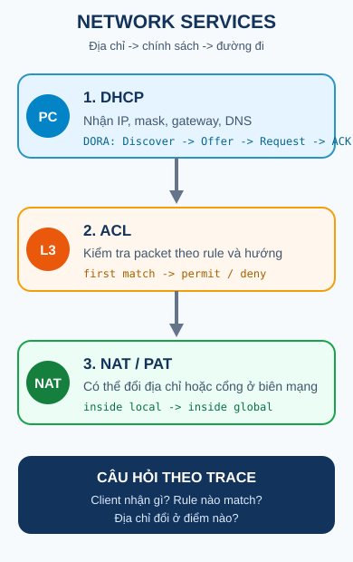

## 1. Map - cần nắm gì?

- **DHCP** giúp client chưa có cấu hình nhận IP và các tham số mạng.
- **NAT/PAT** tạo hoặc tra mapping khi packet đi qua biên giữa mạng inside và outside.
- **ACL** so sánh packet với các rule theo thứ tự, hướng và interface để quyết định permit hoặc deny.
- **Wildcard mask** nói bit nào phải khớp và bit nào được bỏ qua khi ACL so sánh địa chỉ.

Điểm nối của bốn bài không phải là một chuỗi bắt buộc trong mọi packet. Hãy hỏi đúng câu hỏi: client đang cần địa chỉ, packet đang cần translation, hay packet đang bị policy kiểm tra?

## 2. Tư duy theo state

Các slide Class B liên tục quay lại ba loại thay đổi:

| Câu hỏi                                 | Dịch vụ liên quan | Trạng thái quan sát được                  |
| --------------------------------------- | ----------------- | ----------------------------------------- |
| Client lấy cấu hình từ đâu?             | DHCP              | lease, IP, gateway, DNS và thời gian thuê |
| Packet đi ra bằng địa chỉ nào?          | NAT/PAT           | translation entry và cổng transport       |
| Packet có được đi tiếp không?           | ACL               | rule match, hướng in/out và counter       |
| Một địa chỉ đại diện cho nhóm host nào? | Wildcard mask     | các bit match và các bit ignore           |

Vì vậy, khi troubleshooting, đừng bắt đầu bằng việc đoán lệnh. Hãy ghi lại **trước**, **điểm xử lý**, và **sau**.

## 3. DHCP: cấp cấu hình cho client

DHCP dùng mô hình client-server. Client chưa có địa chỉ thường bắt đầu bằng broadcast `DHCP Discover`; server gửi `Offer`, client gửi `Request`, rồi server xác nhận bằng `ACK`. Chuỗi này thường được gọi là **DORA**.

Trong trace của slide, client dùng UDP port 68 và server dùng UDP port 67. Các giá trị `yiaddr`, transaction ID và lifetime giúp nối các message thuộc cùng một lần cấp phát. Đây là thông tin của một ví dụ lớp học; địa chỉ cụ thể và các option thực tế phụ thuộc scope/pool của server.

Nếu server ở cùng broadcast domain, request có thể đến server trên LAN đó. Nếu server ở mạng khác, router không tự chuyển broadcast Layer 3 giữa các interface. Khi đó router có thể đóng vai trò **DHCP relay**, nhận request ở interface client và chuyển tiếp tới địa chỉ server bằng `ip helper-address`.

Chi tiết DORA, server trên modem/AP, router làm DHCP server và relay được trình bày ở [DHCP](./dhcp/).

## 4. ACL: policy nằm trên đường đi

ACL là danh sách điều kiện. Một rule có thể cho phép hoặc từ chối traffic; extended ACL còn có thể xét source, destination, protocol và port. ACL được gắn vào interface theo một hướng:

- **inbound**: kiểm tra khi packet đi vào interface;
- **outbound**: kiểm tra khi packet chuẩn bị rời interface.

Vị trí của ACL là một quyết định thiết kế, không phải nhãn tuyệt đối. Slide dùng quy tắc định hướng: standard ACL thường gần destination vì chỉ biết source, còn extended ACL thường gần source vì có thể lọc cụ thể hơn. Khi đọc một lỗi, hãy kiểm tra cả interface, hướng và thứ tự rule.

Xem toàn bộ quy trình ở [ACL](./acl/), rồi học cách đọc địa chỉ trong rule ở [Wildcard mask](./wildcard-mask/).

## 5. NAT/PAT: mapping tại biên mạng

NAT dịch một địa chỉ hoặc cặp địa chỉ/cổng theo rule. Trong ví dụ outbound của slide, host inside local `10.0.0.1:3345` đi tới server `128.119.40.186:80`; router tạo mapping sang inside global `138.76.29.7:5001`. Reply đến `138.76.29.7:5001` được tra ngược để đưa về host bên trong.

Với PAT (NAT overload), nhiều host có thể dùng một địa chỉ public nếu mỗi flow được phân biệt bằng cổng transport và protocol. Với port forwarding, mapping tĩnh đưa một dịch vụ public, chẳng hạn `public:8080`, về địa chỉ/cổng server bên trong.

NAT có thể thay đổi địa chỉ/cổng, nhưng không nên được mô tả như firewall. ACL mới là nơi thể hiện policy permit/deny trong phạm vi bài học này. Xem trace và cấu hình ở [NAT](./nat/).

## 6. Một packet, nhiều câu hỏi

Giả sử client đã nhận IP bằng DHCP và gửi một request ra ngoài:

| Điểm                  | Câu hỏi                                    | Điều có thể đổi                |
| --------------------- | ------------------------------------------ | ------------------------------ |
| Client/LAN            | Client có IP, mask và gateway hợp lệ chưa? | lease và option DHCP           |
| Interface ACL inbound | Rule đầu tiên nào match packet?            | kết quả permit/deny            |
| NAT boundary          | Có mapping phù hợp không?                  | source IP/port nhìn từ outside |
| Server/reply          | Reply đến tuple nào?                       | NAT tra mapping ngược          |
| ACL outbound          | Hướng kiểm tra có rule khác không?         | kết quả trên interface egress  |

Đây là một khung suy luận, không phải khẳng định mọi thiết bị luôn đặt dịch vụ theo đúng thứ tự vật lý trên. Thiết kế thật có thể đặt ACL ở nhiều interface và NAT có thể không xuất hiện trong flow nội bộ.

## 7. Command -> state change -> observable result

| Command hoặc quan sát             | State change cần nghĩ tới              | Cách verify                               |
| --------------------------------- | -------------------------------------- | ----------------------------------------- | --------------------------------- |
| DHCP Discover/Offer/Request/ACK   | lease được thương lượng cho client     | địa chỉ client, lease và log/server state |
| `ip helper-address <server>`      | relay có đích để chuyển DHCP broadcast | cấu hình interface và DHCP trace          |
| NAT/PAT rule                      | tạo điều kiện cho translation entry    | `show ip nat translations`                |
| `access-list ... permit/deny ...` | thêm điều kiện vào danh sách xét       | `show access-lists` và counter            |
| `ip access-group <id> in          | out`                                   | gắn ACL vào interface và hướng            | `show running-config` / interface |

Tên lệnh `show` có thể khác theo platform/version. Điều cần giữ là quan hệ giữa **lệnh**, **state**, và **bằng chứng quan sát**.

## 8. Sai lầm thường gặp

| Hiện tượng                                   | Hypothesis                                                    | Điểm kiểm tra đầu tiên              |
| -------------------------------------------- | ------------------------------------------------------------- | ----------------------------------- |
| Client có link nhưng không có IP             | DHCP server/scope không trả lời, hoặc broadcast không tới nơi | DORA, VLAN/LAN, relay và lease      |
| Client nhận IP nhưng không đi được mạng khác | gateway/route thiếu hoặc ACL chặn                             | default gateway, route, ACL counter |
| Một host đi Internet được, host khác không   | mapping PAT hoặc rule chọn source không đúng                  | translation table và rule NAT       |
| Rule ACL đúng nhưng traffic vẫn bị deny      | sai thứ tự hoặc implicit deny ở cuối                          | đọc từ trên xuống, xét hướng in/out |
| Một network match quá rộng                   | wildcard có quá nhiều bit `1`                                 | đổi wildcard theo bit cần kiểm tra  |

## 9. Recall - đóng tài liệu lại

1. DHCP giải quyết bài toán nào trước khi client có thể gửi packet theo cấu hình ổn định?
2. ACL khác NAT ở câu hỏi mà nó trả lời là gì?
3. `in` và `out` của ACL được hiểu theo interface nào?
4. Vì sao PAT cần port transport để phân biệt nhiều flow dùng chung một địa chỉ?
5. Wildcard mask dùng bit `0` và `1` khác subnet mask ở cách diễn giải nào?

## 10. Reasoning - vận dụng

1. Một client ở VLAN 10 không nhận được IP từ server ở mạng khác. Hãy tách lỗi thành hai giả thuyết: relay chưa chuyển request hoặc server không có scope phù hợp.
2. Một request bị deny trước khi NAT tạo mapping. Bạn sẽ kiểm tra ACL hay translation table trước? Giải thích bằng vị trí xử lý, không chỉ bằng tên dịch vụ.
3. Một rule standard ACL intended cho một mạng lại match quá nhiều host. Hãy dùng wildcard mask để chỉ ra phần nào đang bị ignore.

## 11. Liên kết

- **Bài trước:** [Switching, VLAN & Inter-VLAN Routing](../03-switching-vlan/).
- **Bài tiếp theo:** [DHCP](./dhcp/).
- **Bài thực hành:** [Lab Network Services](../../thuc-hanh/network-services/).

## 12. Nguồn & phạm vi

### A. Nguồn bài giảng chính - Class B, reference only

- `4.1 Network Services.pdf`: bố cục Network Services, DHCP, NAT, NAT operation, port forwarding và overview ACL.
- `4.2 DHCP Overview.pdf`: DHCP overview, DORA trace, modem/AP, router làm DHCP server và relay, `ip helper-address`.
- `4.3 NAT overview.pdf`: inside/outside addressing, NAT operation, translation table và port forwarding.
- `4.4 ACL Overview.pdf`: ACL operation, inbound/outbound, standard/extended ACL, placement, rule syntax và apply vào interface.
- `4.5 ACL Wildcard mask.pdf`: match/ignore theo bit, host/any, network wildcard và bài tập xác định permit/deny.

### B. Tài liệu bổ trợ - Class C

- [Cisco IOS XE DHCP Server](https://www.cisco.com/c/en/us/td/docs/routers/ios/config/17-x/ip-addressing/b-ip-addressing/m_config-dhcp-server-xe.html): DHCP server và vai trò relay trên IOS XE.
- [Cisco IOS XE DHCP Relay Agent](https://www.cisco.com/c/en/us/td/docs/ios-xml/ios/ipaddr_dhcp/configuration/xe-2/dhcp-xe-2-book/dhcp-relay-agent-xe.html): `ip helper-address` và ngữ cảnh relay.
- [Cisco IP Access List Overview](https://www.cisco.com/c/en/us/td/docs/routers/ios/config/17-x/sec-vpn/b-security-vpn/m_sec-access-list-ov-0.html): wildcard matching và trường lọc của ACL.
- [Cisco NAT Configuration Guide](https://www.cisco.com/c/en/us/td/docs/switches/lan/c9000/lyr3-fwd/nat/nat-configuration-guide/nat.html): PAT và static port translation.

### C. Nội dung & sơ đồ do tác giả biên soạn độc lập

- `network-services-flow.svg`: bản đồ original nối DHCP, ACL và NAT bằng câu hỏi state.
- Các bảng trace, câu hỏi và ví dụ địa chỉ được viết lại độc lập; không sao chép slide screenshot hay đoạn văn dài từ PDF.
