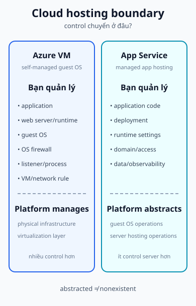

## 1. Course framing

Cloud Server trong slide course được trình bày theo hướng Azure. Hai project objective chính là:

- host web application và configure domain name trên **Azure Virtual Machine**;
- deploy web application và làm cho user Internet truy cập được qua **App Service**.

Đây là cách đặt vấn đề của module, không phải khẳng định mọi cloud workload đều là một literal server. Câu hỏi trung tâm là: **operator còn kiểm soát lớp nào, và platform đã nhận trách nhiệm cho lớp nào?**

Cloud Server không có nghĩa là “không có operating system”. Với VM, guest OS vẫn tồn tại và cần được vận hành. Với managed app platform, cloud abstract phần lớn việc quản lý guest OS/server khỏi application operator, nhưng application, endpoint, domain, runtime setting và access policy vẫn cần được cấu hình.

## 2. VM và managed app platform

| Lựa chọn                  | Operator quản lý                                                                                         | Platform cung cấp/abstract                                                              |
| ------------------------- | -------------------------------------------------------------------------------------------------------- | --------------------------------------------------------------------------------------- |
| **Azure Virtual Machine** | App, web server/runtime, guest OS, OS firewall, service listener, VM configuration và cloud network rule | Physical infrastructure và virtualization layer                                         |
| **Azure App Service**     | Application, deployment, runtime settings trong boundary của service, domain mapping, access và dữ liệu  | Nhiều phần của guest OS và server-platform operations; application không cần tự quản VM |

Đây là mô hình trách nhiệm trong phạm vi bài học, không phải shared-responsibility diagram chính thức của Microsoft. [Azure VM documentation](https://learn.microsoft.com/en-us/azure/virtual-machines/overview) và [App Service overview](https://learn.microsoft.com/en-us/azure/app-service/overview) là nguồn bổ trợ cho các boundary này.

## 3. Web + DNS trên Azure VM

Course objective “webserver + DNS trên Azure Virtual Machine” nên được đọc thành một chuỗi trạng thái:

1. Internet user hỏi DNS cho hostname.
2. DNS trả về public endpoint hoặc địa chỉ được thiết kế cho VM.
3. Cloud network/security rule cho phép traffic cần thiết tới VM.
4. OS firewall cho phép traffic tới port listener.
5. Web process trên guest OS nhận request và trả application response.

Một VM vừa tạo chưa chứng minh website đã public. Khi debug, kiểm tra đủ:

- public IP/FQDN hoặc endpoint có tồn tại và đúng không;
- cloud network security rule có cho phép port không;
- OS firewall có cho phép port không;
- web process có listening và bind đúng interface không;
- DNS record có trỏ đúng endpoint không;
- application có trả response không.

Microsoft hướng dẫn custom domain cho VM từ một resource có public IP bằng DNS record; tài liệu cũng nêu VM cần có web server đang chạy và phải được phép truy cập web. Xem [Create and use a custom domain for Azure VMs](https://learn.microsoft.com/en-us/azure/virtual-machines/custom-domain).

## 4. App Service và custom domain

Với App Service, hãy tách provisioning/configuration khỏi request runtime. Trong giai đoạn chuẩn bị, application được deploy, service endpoint tồn tại, rồi custom domain/DNS binding (nếu dùng) được cấu hình:

<code>application → deploy to App Service → service endpoint exists → optional custom-domain/DNS binding configured</code>

Khi user truy cập sau đó, request path là:

<code>User / Browser → DNS resolution → App Service hostname/custom-domain endpoint → App Service hosting boundary → application → response</code>

App Service là managed application hosting platform. Operator tập trung vào application và các runtime/service settings trong boundary; không cài web server và quản lý guest OS như với một VM. Điều đó không có nghĩa “không có server”: hạ tầng vẫn tồn tại, chỉ là nhiều trách nhiệm server operations được platform abstract khỏi operator.

Custom domain vẫn cần một DNS mapping và quy trình verify/bind phù hợp. [Overview: use custom domain names](https://learn.microsoft.com/en-us/azure/app-service/overview-custom-domains) mô tả custom domain là tên người dùng trỏ tới app thay cho hostname mặc định của dịch vụ. Portal UI có thể thay đổi; trang này chỉ dạy request path và boundary, không sao chép click-by-click screenshot.

## 5. So sánh một workload web

| Câu hỏi                     | Azure VM                                    | Azure App Service                                              |
| --------------------------- | ------------------------------------------- | -------------------------------------------------------------- |
| Ai quản guest OS?           | Operator                                    | Platform abstract ở mức lớn hơn                                |
| Ai chịu web server process? | Operator chọn/cấu hình trong VM             | Operator triển khai app; service boundary quản phần hosting    |
| Domain trỏ tới đâu?         | Public endpoint của VM/resource             | App Service endpoint và custom-domain binding                  |
| Failure cần tách?           | Cloud rule, OS firewall, listener, app, DNS | Domain binding, service endpoint, runtime setting, app, policy |
| Điều được đổi?              | Control cao hơn, vận hành nhiều hơn         | Control server thấp hơn, trách nhiệm app tập trung hơn         |

Không có lựa chọn mặc định luôn đúng. Đánh giá theo control, compatibility, operational responsibility, security boundary, availability và administrative skill.

## 6. Đặt service vào topology chung

Trong scenario:

- Client VLAN 10: <code>192.168.10.0/24</code>.
- Server VLAN 20: Windows Server <code>192.168.20.20</code>, Linux Server <code>192.168.20.30</code>.
- Edge nối ra Internet.
- Public website có thể nằm trên Azure VM hoặc App Service.

Website public không tự động thuộc cùng security boundary với file service hoặc identity nội bộ. Có thể giữ file/identity trong Server VLAN và đặt web workload ở cloud boundary, sau đó thiết kế DNS, ACL, VPN và monitoring theo đường đi cụ thể. Cloud placement là quyết định kiến trúc, không phải một cách bỏ qua routing hoặc policy.

## 7. Bài tập service placement

Một tổ chức cần:

- public website;
- internal shared files;
- centralized identity;
- monitoring;
- remote VPN access.

Hãy đề xuất một hoặc nhiều phương án:

1. Chức năng nào có thể nằm trên Windows Server?
2. Chức năng nào có thể nằm trên Linux Server?
3. Workload nào có thể chuyển sang cloud VM?
4. Workload web nào có thể thay bằng managed app platform?
5. Với mỗi phương án, ai chịu patch, permission, network rule, backup và incident response?

Không có một kiến trúc duy nhất đúng. Một câu trả lời tốt phải nói rõ control, compatibility, responsibility, security boundary, availability và skill thay vì quảng cáo một sản phẩm.

## 8. Troubleshooting theo tầng

Dùng hierarchy chung:

<code>CLIENT → NAME RESOLUTION → NETWORK PATH → PORT / LISTENER → SERVICE PROCESS → AUTHORIZATION / APPLICATION</code>

Ví dụ:

- **VM tồn tại nhưng site không mở:** kiểm tra public endpoint, cloud network/security rule, OS firewall, listener và DNS.
- **DNS đúng nhưng HTTP fail:** DNS đã qua; kiểm tra route, port/listener, process và application.
- **App Service deploy xong nhưng domain fail:** kiểm tra endpoint, DNS record, domain verification/binding và runtime/app response.
- **VPN tới cloud hoặc on-prem connected nhưng file fail:** kiểm tra route, policy, DNS, service reachability và permission.

Đừng dùng sự tồn tại của VM hoặc trạng thái “deployment completed” để suy ra application đang reachable.

## 9. Course project readiness

Bạn nên giải thích được:

- Azure VM là self-managed guest OS boundary;
- App Service là managed application hosting boundary, không phải tuyên bố không có server;
- web + DNS là các bước khác nhau;
- public endpoint, cloud rule, OS firewall, listener và DNS đều có thể là failure point của VM;
- custom domain của App Service là mapping tới app endpoint, không phải portal screenshot;
- một service placement decision phải kèm ownership và security boundary.

## 10. Tự kiểm tra

### Nhớ

1. Hai project objective Azure nào xuất hiện trong slide course?
2. Với Azure VM, operator quản lý những lớp nào?
3. App Service abstract phần nào khỏi application operator?
4. Những state/layer nào cần kiểm tra khi website trên VM không reachable?
5. Custom domain của App Service liên quan đến endpoint và DNS ra sao?

### Suy luận

6. Khi chuyển web workload từ Linux VM sang App Service, control và operational responsibility thay đổi thế nào?
7. Vì sao public website và internal file service không nên được coi là cùng một security boundary chỉ vì cùng tổ chức?
8. Nếu DNS trả đúng endpoint nhưng app vẫn fail, tại sao DNS không còn là giả thuyết đầu tiên?

### Troubleshooting / application

9. Azure VM có public IP nhưng browser timeout. Hãy xếp cloud rule, OS firewall, listener, process và DNS thành một chuỗi kiểm tra.
10. App Service deploy thành công nhưng custom domain trả lỗi. Hãy tách domain mapping, DNS, runtime và application response.

## 11. Nguồn và ownership

### A. Course source - Class B

- 5.3 Cloud Server.pdf: Azure Virtual Machine cho Webserver + DNS và App Service cho web application + domain.
- 5.1 Windows Server.pdf: service/platform project outcomes dùng làm ngữ cảnh so sánh placement.

### B. Supplementary authoritative documentation

- [Azure Virtual Machines overview](https://learn.microsoft.com/en-us/azure/virtual-machines/overview)
- [Create and use a custom domain for Azure VMs](https://learn.microsoft.com/en-us/azure/virtual-machines/custom-domain)
- [Azure App Service overview](https://learn.microsoft.com/en-us/azure/app-service/overview)
- [Overview: use custom domain names](https://learn.microsoft.com/en-us/azure/app-service/overview-custom-domains)

### C. Author-derived

- Scenario VLAN 10/VLAN 20, responsibility matrix, placement exercise, troubleshooting hierarchy và service/platform trace là nội dung nguyên bản.
- [Azure VM vs App Service diagram](../../static/diagrams/azure-vm-vs-app-service.svg) và [Web/DNS request path](../../static/diagrams/web-dns-request-path.svg) là SVG nguyên bản; không dùng screenshot Azure portal.
