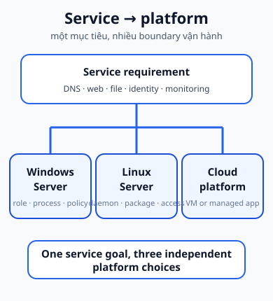

## 1. Server platform là gì?

Một **service** là chức năng mà client cần dùng: DNS phân giải tên, web server trả HTTP response, file service cung cấp dữ liệu, monitoring thu thập trạng thái. Một **server platform** là nơi các process, dữ liệu, network interface và chính sách vận hành của các service đó được tổ chức.

Vì vậy:

- DNS là service; nó có thể chạy trên Windows Server, Linux Server, VM hoặc managed cloud service.
- Web server không đồng nghĩa với Windows Server.
- Linux Server không phải tên của một ứng dụng duy nhất.
- Cloud Server là cách mô tả workload server trên cloud; không có nghĩa là không còn hệ điều hành hay máy chủ.

Mục tiêu của trang này là giúp bạn hỏi đúng câu: **service đang cần gì, platform nào đang host nó, và ai chịu trách nhiệm cho từng lớp?**

## 2. Một topology chung để suy nghĩ

Ta dùng cùng một tình huống trong ba trang:

- Client VLAN 10: <code>192.168.10.0/24</code>.
- Server VLAN 20: <code>192.168.20.0/24</code>.
- Windows Server: <code>192.168.20.20</code>.
- Linux Server: <code>192.168.20.30</code>.
- Edge router nối tới Internet.
- Một workload cloud có thể nằm trên Azure VM hoặc Azure App Service.

VLAN, routing, DHCP, NAT/PAT và ACL quyết định đường đi đến host. Sau đó platform phải có process đang lắng nghe, firewall phù hợp, dữ liệu đúng và quyền truy cập đúng. Đây là cầu nối trực tiếp từ [Network Services](../04-network-services/) sang câu hỏi “dịch vụ thực sự chạy ở đâu?”.

## 3. So sánh theo quyền kiểm soát

| Platform             | Kiểm soát hệ điều hành                                                          | Ví dụ service gắn với course                                | Trách nhiệm thường gặp                                                                | Môi trường triển khai               | Trang đi sâu                        |
| -------------------- | ------------------------------------------------------------------------------- | ----------------------------------------------------------- | ------------------------------------------------------------------------------------- | ----------------------------------- | ----------------------------------- |
| Windows Server       | Tự quản lý guest OS, role, process, policy và network                           | Web + DNS, DHCP/NAT, file service, AD DS, VPN               | Identity, policy, service state, patching, firewall và permissions                    | Server vật lý hoặc VM on-prem/cloud | [Windows Server](./windows-server/) |
| Linux Server         | Tự quản lý guest OS, daemon, package, network và permissions                    | Web + DNS, DHCP/NAT, NFS/SMB/FTP, Nagios/Zabbix, Squid, VPN | Process/daemon, package, logs, access control, firewall và service configuration      | Server vật lý hoặc VM               | [Linux Server](./linux-server/)     |
| Cloud VM             | Tự quản lý guest OS và ứng dụng; cloud quản lý lớp hạ tầng bên dưới             | Web + DNS trên Azure Virtual Machine                        | Guest OS, listener, OS firewall, cloud network rule, public endpoint và DNS           | Azure VM                            | [Cloud Server](./cloud-server/)     |
| Managed app platform | Không quản lý guest OS theo cách của VM; tập trung vào app và boundary cấu hình | Web application trên App Service                            | Code, runtime setting, domain, access policy, dữ liệu và observability trong boundary | Azure App Service                   | [Cloud Server](./cloud-server/)     |

Các ô trong bảng là mô hình trách nhiệm, không phải quy tắc “mỗi platform chỉ chạy được một loại service”. Windows có thể chạy web; Linux có thể chạy DNS; cloud VM vẫn có OS. Điều thay đổi lớn nhất là **ranh giới kiểm soát và việc vận hành**.

## 4. Theo dõi một request

Khi browser truy cập <code>www.example.test</code>, hãy tách trace thành các điểm:

1. DNS trả về endpoint nào?
2. Routing và ACL có cho packet đi tới endpoint không?
3. Host/platform có port listener không?
4. Service process có đang chạy và có đọc được dữ liệu không?
5. Authorization có cho user thực hiện thao tác không?
6. Application có tạo response đúng không?

“Server host tồn tại” không chứng minh “service đang chạy và reachable”. Tương tự, “file server reachable” không chứng minh user đã được cấp quyền đọc file.

## 5. Chọn platform bằng câu hỏi vận hành

Không có một đáp án chung cho mọi kiến trúc. Hãy cân nhắc:

- **Control:** cần tự chỉnh guest OS, process và network đến mức nào?
- **Compatibility:** service và identity model có phù hợp với hệ sinh thái hiện có không?
- **Operational responsibility:** đội ngũ có chịu patch, backup, monitor và incident response không?
- **Security boundary:** quyền admin nằm ở host, cloud control plane hay managed service?
- **Availability:** cần tự thiết kế redundancy hay dùng capability của platform?
- **Administrative skill:** đội ngũ hiểu sâu platform nào và có quy trình kiểm chứng nào?

Một service có thể được chuyển từ Linux server sang cloud VM hoặc App Service, nhưng request path, quyền, listener, DNS và boundary trách nhiệm phải được đánh giá lại.

## 6. Chuẩn bị cho project

Sau khi học ba trang con, bạn cần có thể:

- vẽ service nào nằm trên host/platform nào;
- giải thích DNS và web server là hai bước khác nhau trong một request;
- phân biệt storage, sharing và authorization của file service;
- mô tả trace monitoring từ target đến state/alert;
- nói rõ VM và managed app platform khác nhau ở lớp vận hành;
- tìm lỗi theo thứ tự client → name resolution → network path → port/listener → service process → authorization/application.

## 7. Tự kiểm tra nhanh

### Nhớ

1. Service khác server platform ở điểm nào?
2. Cloud VM và managed app platform khác nhau ở lớp kiểm soát nào?
3. Vì sao DNS và web server không phải cùng một service?

### Suy luận

4. Nếu cùng một web application chuyển từ Linux Server sang App Service, những trách nhiệm nào vẫn thuộc về application operator?
5. Một host Windows có thể cung cấp file service và DNS cùng lúc không? Vì sao không nên suy ra rằng nó phải cung cấp mọi service?

### Troubleshooting

6. DNS đã resolve nhưng website không mở được: bước nào sau DNS cần kiểm tra?
7. User nhìn thấy server trên mạng nhưng không đọc được file: lỗi routing hay authorization?

## 8. Nguồn và phạm vi

### A. Course source - Class B

- 5.1 Windows Server.pdf: các thế hệ Windows Server được dùng làm ví dụ và mục tiêu Web/DNS, DHCP/NAT, file service, AD DS, VPN.
- 5.2 Linux Server.pdf: Linux Server và mục tiêu Web/DNS, DHCP/NAT, NFS/SMB/FTP, monitoring, proxy, VPN.
- 5.3 Cloud Server.pdf: Azure Virtual Machine và App Service cho mục tiêu web application + domain.

### B. Supplementary authoritative documentation

- [Active Directory Domain Services overview](https://learn.microsoft.com/en-us/windows-server/identity/ad-ds/get-started/virtual-dc/active-directory-domain-services-overview)
- [Azure App Service overview](https://learn.microsoft.com/en-us/azure/app-service/overview)
- [Azure Virtual Machines custom domain](https://learn.microsoft.com/en-us/azure/virtual-machines/custom-domain)

### C. Author-derived

- Topology VLAN 10/VLAN 20, bảng so sánh, request trace, câu hỏi và [sơ đồ bản đồ platform](../../static/diagrams/server-platforms-map.svg) là nội dung nguyên bản của bài.
