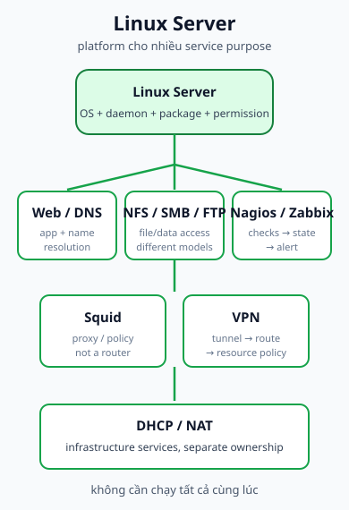
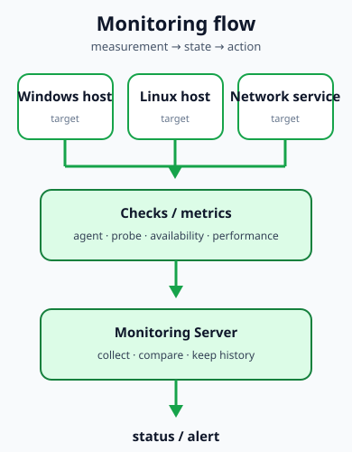

## 1. Phạm vi và cách đọc slide

Course source nêu **Ubuntu Server**, **CentOS** và **Kali Linux** (tùy chọn cho sinh viên Information Security) như các ví dụ Linux Server. Đây là phạm vi minh họa của môn học, không phải bảng xếp hạng distro hay kết luận lifecycle hiện tại. Kali trong slide là ngữ cảnh an toàn thông tin tùy chọn; không nên biến nó thành distro production server mặc định.

Linux Server là một platform general-purpose. Nó có thể host daemon và application service, nhưng “Linux Server” không phải tên của một service. Quyết định đúng bắt đầu từ service purpose, dữ liệu, network path, quyền và trách nhiệm vận hành; không bắt đầu từ danh sách package.

## 2. Gom mục tiêu course theo service purpose

Course source đưa ra các nhóm mục tiêu:

- **Application và name resolution:** Webserver + DNS.
- **Infrastructure networking:** NAT + DHCP.
- **File/data access:** NFS, SMB và FTP.
- **Observability:** Nagios và Zabbix theo dõi Windows/Linux machine hoặc network service.
- **Traffic mediation:** Squid áp dụng access policy cho client.
- **Remote access:** VPN đưa remote user tới file hoặc máy nội bộ qua SSH/remote desktop.

Đây là các ví dụ gắn với project, không phải yêu cầu một Linux Server phải chạy đồng thời mọi service. Tách host, VM hoặc role có thể làm blast radius, permission và ownership rõ hơn.

## 3. Webserver và DNS

Mục tiêu host web application và configure domain name có cùng request path ở các platform:

1. Browser hỏi DNS về hostname.
2. DNS trả địa chỉ hoặc endpoint.
3. Routing, firewall và listener đưa HTTP/HTTPS tới web process.
4. Application trả response.

Web server có thể là Nginx, Apache hoặc một implementation khác; những tên này chỉ là ví dụ supplementary, không phải danh sách package phải cài ở trang này. DNS có thể ở cùng host, host khác hoặc managed service. Nếu DNS resolve đúng mà web request fail, hãy kiểm tra port, listener, process, firewall và application log.

## 4. DHCP/NAT trong boundary của Linux

Linux Server có thể cung cấp hoặc tham gia DHCP/NAT, nhưng cơ chế packet/state vẫn là phần đã học ở [DHCP](../04-network-services/dhcp/) và [NAT](../04-network-services/nat/):

- DHCP phải tạo lease và option đúng subnet.
- NAT phải có mapping và đường reply hợp lệ.
- routing, VLAN và ACL phải cho phép traffic tới đúng interface/host.

Ở mức platform, cần tách operational state của hai cơ chế thay vì gom chúng thành một “listener”:

- **DHCP:** daemon/service process, hành vi dịch vụ UDP, lease/pool/options, interface, logs và ownership của cấu hình/authorization.
- **NAT:** IP forwarding, rule set của NAT/firewall, translation hoặc connection-tracking state khi phù hợp, inside/outside path, return routing và logs.
- **Shared operational state:** firewall/policy, logging và administrator ownership vẫn cần được kiểm tra cho cả hai.

NAT không đòi hỏi application listener; đây chưa phải lab cài đặt từng service.

## 5. NFS, SMB và FTP không tương đương

Slide nhóm ba tên này dưới file service. Cần tách mô hình:

| Cơ chế  | Nó giải quyết                                                                      | Điều không nên suy ra                                   |
| ------- | ---------------------------------------------------------------------------------- | ------------------------------------------------------- |
| **NFS** | Network filesystem model, thường gần với Unix/Linux permissions và mount semantics | Không phải mọi client đều truy cập giống một local disk |
| **SMB** | Network file/share protocol phổ biến trong Windows và mixed environment            | “Có share” không có nghĩa mọi user đều được authorize   |
| **FTP** | File-transfer protocol cho việc trao đổi file qua session                          | Không phải mounted filesystem model                     |

Với cả ba, hãy phân biệt storage, network reachability, sharing/session và authorization. FTP còn cần đánh giá security của deployment theo tài liệu chính thức; trang này không biến nó thành lựa chọn mặc định cho dữ liệu nhạy cảm.

## 6. Monitoring: target → check → state/alert

Course source nêu Nagios/Zabbix để monitor hiệu năng Windows/Linux machine và network service. Mental model tối thiểu:

1. Target system hoặc network service có một state cần quan sát.
2. Check, metric, collector hoặc probe thu thập measurement.
3. Monitoring server lưu state/history và áp dụng điều kiện cảnh báo.
4. Operator nhận status/alert để điều tra.

Zabbix mô tả hai kiểu check: passive (server hỏi, thành phần thu thập trả lời) và active (thành phần thu thập gửi dữ liệu theo cấu hình). Đây là supplementary semantics để đọc trace, không phải hướng dẫn cài Zabbix. Nagios và Zabbix có kiến trúc chi tiết khác nhau; điểm chung ở đây là đường measurement → state → alert. Nội dung NMS mở rộng sẽ thuộc phần quản trị mạng sau này, không trình bày thành một chương mới ở đây.

## 7. Squid: proxy không phải router

Slide course dùng câu “Squid proxy works as a router” cho advanced requirement. Cách diễn đạt đó không an toàn về mặt kỹ thuật. Proxy là application-layer intermediary; router làm forwarding ở lớp network. Hai vai trò có thể xuất hiện cùng một kiến trúc nhưng không phải cùng một process hay cùng một trách nhiệm.

Với **interception/transparent proxy**, client có thể không cần khai báo proxy explicit. Nhưng network device, firewall hoặc NAT/redirection phải đưa traffic tới proxy; Squid vẫn xử lý request như proxy, không tự thay thế routing infrastructure. Tài liệu [Squid Interception Caching](https://wiki.squid-cache.org/SquidFaq/InterceptionProxy) cảnh báo interception cần phối hợp nhiều subsystem và phải thử nghiệm ngoài production. [Squid http_port documentation](https://www.squid-cache.org/Doc/config/http_port/) là nguồn bổ trợ cho các mode như <code>intercept</code> và <code>tproxy</code>.

Để đọc lỗi, tách bốn state:

- client có đi được tới network boundary không;
- rule redirection có đưa traffic tới proxy không;
- Squid có listener và access policy phù hợp không;
- origin/application có trả response không.

Không dùng câu “Squid là router” trong thiết kế hoặc troubleshooting.

## 8. VPN và remote access

Course objective cho remote user truy cập file hoặc máy nội bộ qua SSH/remote desktop sau khi kết nối VPN. Trace platform-neutral:

<code>remote client → tunnel → Linux VPN endpoint → internal routing/access policy → resource</code>

VPN connected chỉ chứng minh tunnel đã có trạng thái kết nối. Vẫn cần kiểm tra route tới Server VLAN 20, ACL/firewall, DNS, service listener và permission của file hoặc remote host. Tunnel không tự cấp full LAN access.

## 9. Trách nhiệm vận hành Linux Server

Khi đặt một service trên Linux Server, hãy ghi rõ:

- process/daemon nào owns service state;
- package và configuration được cập nhật theo quy trình nào;
- log, backup và recovery nằm ở đâu;
- network interface, firewall và listening port do ai quản lý;
- user/group/permission nào được phép đọc dữ liệu hoặc reload service;
- monitoring check nào sẽ phát hiện service down.

“Có package” không đồng nghĩa “service đang chạy”; “port mở” không đồng nghĩa “application trả response”; “share nhìn thấy” không đồng nghĩa “user có quyền”.

## 10. Course project readiness

Bạn nên giải thích được:

- service nào thuộc application/name-resolution, file/data, observability, proxy hay remote access;
- vì sao NFS, SMB và FTP không thể thay tên cho nhau;
- monitoring server nhận measurement thế nào và chuyển thành state/alert ra sao;
- tại sao proxy redirection cần routing/firewall infrastructure riêng;
- vì sao VPN route và authorization vẫn cần kiểm tra sau khi tunnel up.

## 11. Tự kiểm tra

### Nhớ

1. Ba ví dụ Linux Server nào xuất hiện trong slide course?
2. NFS, SMB và FTP lần lượt đại diện cho các mô hình nào?
3. Bốn mắt xích cơ bản của monitoring flow là gì?
4. Vì sao Squid không đồng nghĩa router?
5. VPN connected chứng minh được điều gì và chưa chứng minh được điều gì?

### Suy luận

6. Nếu cùng một web application chuyển từ Linux Server sang managed app platform, phần nào của request path và trách nhiệm vận hành thay đổi?
7. Vì sao một Linux host có thể chạy nhiều service nhưng service purpose và ownership vẫn nên được tách?
8. Khi chọn SMB thay vì NFS, compatibility boundary nào có thể thay đổi trong mixed environment?

### Troubleshooting / application

9. User reach được Linux host nhưng không mở được file: hãy kiểm tra storage, share/session, service và authorization theo thứ tự nào?
10. Client không cấu hình proxy nhưng web traffic được đưa tới Squid rồi fail: hãy tách lỗi redirection, listener, policy và origin.

## 12. Nguồn và ownership

### A. Course source - Class B

- 5.2 Linux Server.pdf: Ubuntu Server, CentOS, Kali tùy chọn; Web/DNS, DHCP/NAT, NFS/SMB/FTP, Nagios/Zabbix, Squid và VPN.
- 4.1 Network Services.pdf: bối cảnh DHCP, NAT/PAT, ACL và request state được liên kết ngược.

### B. Supplementary authoritative documentation

- [Ubuntu Server documentation](https://ubuntu.com/server/docs/) - phạm vi service/networking và cách phân biệt tutorial, how-to, reference.
- [Ubuntu web server overview](https://ubuntu.com/server/docs/about-web-servers/) - request/response và vai trò web server.
- [Squid interception documentation](https://wiki.squid-cache.org/SquidFaq/InterceptionProxy)
- [Squid http_port reference](https://www.squid-cache.org/Doc/config/http_port/)
- [Zabbix concepts documentation](https://www.zabbix.com/documentation/8.0/en/manual/concepts) - passive/active checks.

### C. Author-derived

- Service-purpose grouping, file-protocol comparison, troubleshooting hierarchy và các trace là nội dung nguyên bản.
- [Linux Server service map](../../static/diagrams/linux-server-service-map.svg), [Web/DNS request path](../../static/diagrams/web-dns-request-path.svg) và [monitoring flow](../../static/diagrams/server-monitoring-flow.svg) là SVG nguyên bản.
