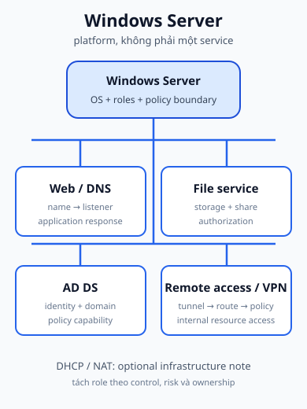
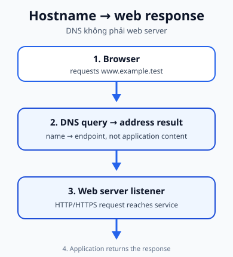

## 1. Phạm vi của trang

Slide môn học dùng **Windows Server 2012, Windows Server 2016 và Windows Server 2022** như các release/generation ví dụ. Đây không phải tuyên bố rằng đó là toàn bộ các phiên bản Windows Server, cũng không phải kết luận rằng chúng hiện có cùng trạng thái hỗ trợ. Khi cần quyết định lifecycle, phải tra bảng hỗ trợ chính thức của Microsoft cho đúng edition và ngày triển khai; trang này không biến ví dụ trên slide thành khuyến nghị phiên bản.

Windows Server là một server platform: nó cung cấp host OS, network stack, process, role/service và policy boundary. Không nên rút gọn nó thành “Windows có GUI”. Một máy Windows Server có thể được quản trị bằng nhiều công cụ và có thể cung cấp nhiều loại service, nhưng mỗi service vẫn có state, listener, data và permission riêng.

## 2. Bản đồ service theo mục tiêu course

Course source đặt các mục tiêu Windows theo nhóm service:

- **Web + DNS:** host web application và cấu hình tên miền cho website.
- **DHCP/NAT:** cấp IP cho client và giúp client đi Internet qua NAT.
- **File service:** lưu trữ, quản lý và cấp quyền truy cập file qua mạng.
- **Active Directory Domain Services:** identity tập trung và policy như password, application control, network access.
- **Remote access/VPN:** remote user vào tunnel rồi truy cập resource nội bộ theo route và policy.

Đây là các service category trong project, không phải lời khuyên dồn mọi role vào một host. Có thể tách DNS, web, file và identity thành các host hoặc role khác nhau để giảm blast radius và làm trách nhiệm rõ hơn.

## 3. Web server và DNS là hai bước khác nhau

Mục tiêu “host web application và configure domain name” có request path:

1. User nhập hostname.
2. DNS trả về địa chỉ hoặc endpoint của web service.
3. Client dùng địa chỉ đó để mở kết nối HTTP/HTTPS.
4. Web server nhận request, chọn application/resource và trả response.

DNS có thể chạy cùng server với web hoặc ở một server/service khác. Web server không “tạo ra domain” chỉ vì nó đang chạy. Domain record, endpoint, listener và application response là những trạng thái khác nhau.

Ví dụ chẩn đoán: nếu <code>www.example.test</code> đã resolve đúng nhưng browser vẫn timeout, hãy kiểm tra route/ACL, firewall, port listener và process web trước khi đổ lỗi cho DNS.

## 4. DHCP/NAT: nối với Network Services

Trong topology học tập, Windows Server có thể là nơi cấp DHCP hoặc tham gia vào mô hình DHCP/NAT. Điều đó không thay đổi cơ chế đã học ở [DHCP](../04-network-services/dhcp/) và [NAT](../04-network-services/nat/):

- DHCP vẫn phải tạo lease và option đúng scope.
- NAT vẫn phải có translation state và đường trả lời.
- VLAN/routing/ACL vẫn quyết định client có đến được host hay Internet không.

Ở đây câu hỏi là **host Windows chịu trách nhiệm cho service state nào**: pool/lease, interface, firewall, log, process và quyền quản trị. Đây không phải trang cài DHCP/NAT từng bước.

## 5. File service: storage, sharing, authorization

File service có ba lớp không được gộp thành một:

1. **Storage:** dữ liệu thật nằm ở volume/path nào, có đủ dung lượng và backup không?
2. **Sharing:** resource có được công bố qua network share và client có tới đúng endpoint không?
3. **Authorization:** identity nào được phép đọc/ghi/xóa, policy nào áp dụng?

Một client có thể reach server và nhìn thấy share nhưng vẫn bị từ chối ở lớp authorization. “Ping được” chỉ trả lời một phần về reachability; nó không kiểm tra permission hay application-level policy.

## 6. AD DS ở mức platform

Course source gọi tên **Active Directory Domain Services** và các policy outcome. Ở mức này, hãy hiểu AD DS như khả năng:

- giữ identity/domain information tập trung;
- cho client và resource dùng một mô hình xác thực chung;
- áp dụng policy ở phạm vi domain thay vì cấu hình từng local machine độc lập.

So sánh ngắn:

| Local identity                                  | Centralized domain identity/policy                               |
| ----------------------------------------------- | ---------------------------------------------------------------- |
| Account và policy nằm trên từng máy             | Directory service cung cấp một miền quản trị chung               |
| Khó giữ cấu hình đồng nhất khi số máy tăng      | Policy/identity có thể được quản lý theo phạm vi tổ chức         |
| Truy cập resource phụ thuộc local configuration | Resource vẫn phải kiểm tra authorization theo identity và policy |

Đây không phải chương AD DS/Group Policy administration: không đi vào forest, OU, object lifecycle hay quy trình cài role. [Microsoft Learn](https://learn.microsoft.com/en-us/windows-server/identity/ad-ds/get-started/virtual-dc/active-directory-domain-services-overview) là nguồn bổ trợ cho các thuật ngữ AD DS.

## 7. VPN không phải vé vào toàn LAN

Course objective mô tả remote client kết nối VPN rồi truy cập file server hoặc Remote Desktop tới máy nội bộ. Mental model an toàn là:

<code>remote endpoint → authenticated/encrypted tunnel → VPN endpoint → routed/access-controlled internal network → resource</code>

Sau khi tunnel up, vẫn phải kiểm tra:

- route tới subnet/resource;
- ACL, firewall và policy;
- identity/authorization;
- service listener ở resource đích.

VPN cung cấp một đường kết nối có bảo vệ; nó không tự cấp unrestricted LAN access.

## 8. Khi nào Windows Server là lựa chọn hợp lý?

Hãy bắt đầu từ service và boundary, không bắt đầu từ hình ảnh “GUI hay CLI”:

- Identity/domain policy cần gắn chặt với hệ sinh thái Microsoft.
- File và remote access cần một mô hình quản trị tập trung.
- Web/DNS có thể chạy cùng hoặc tách khỏi các role khác tùy availability và security boundary.
- DHCP/NAT cần được đặt ở host có route, interface, permissions và monitoring phù hợp.

Một thiết kế tốt ghi rõ ai sở hữu service, ai patch host, ai kiểm tra log và ai phê duyệt access. Platform chỉ là một phần của thiết kế.

## 9. Course project readiness

Bạn nên giải thích được:

- Web request đi qua DNS rồi mới tới web listener.
- DHCP/NAT là service state liên kết với các cơ chế Network Services đã học.
- File reachability, share visibility và authorization là ba kiểm tra khác nhau.
- AD DS cung cấp identity/domain/policy capability, không phải toàn bộ nội dung quản trị Windows.
- VPN có tunnel và route nhưng resource vẫn chịu policy/permission.

## 10. Tự kiểm tra

### Nhớ

1. Ba release Windows Server nào xuất hiện trong slide course?
2. Bốn nhóm service chính trong mục tiêu Windows Server là gì?
3. Ba lớp của file service là gì?
4. AD DS giải quyết vấn đề identity/policy nào?
5. VPN endpoint đứng ở đâu trong request path của remote user?

### Suy luận

6. Vì sao DNS và web service có thể cùng host nhưng vẫn phải kiểm tra như hai failure domain?
7. Nếu chuyển file service sang host khác, những phần nào của request path thay đổi?
8. Vì sao một host Windows có thể chạy nhiều role nhưng không nên mặc định chạy mọi role?

### Troubleshooting / application

9. DNS resolve đúng, ping tới host được, nhưng website timeout. Hãy xếp thứ tự kiểm tra tiếp theo.
10. VPN đã connected nhưng user không mở được file share: hãy phân loại route, policy, DNS, service và permission cần kiểm tra.

## 11. Nguồn và ownership

### A. Course source - Class B

- 5.1 Windows Server.pdf: Webserver + DNS, NAT + DHCP, file service, Active Directory Domain Services và remote access/VPN.
- 4.1 Network Services.pdf: bối cảnh DHCP, NAT/PAT, ACL và DNS-related operational context được liên kết ngược.

### B. Supplementary authoritative documentation

- [Active Directory Domain Services overview](https://learn.microsoft.com/en-us/windows-server/identity/ad-ds/get-started/virtual-dc/active-directory-domain-services-overview)
- [Windows Server 2022 lifecycle](https://learn.microsoft.com/en-us/lifecycle/products/windows-server-2022) - chỉ dùng khi cần tra current support, không dùng để suy diễn từ slide.

### C. Author-derived

- Service map, Web/DNS request path và topology/service-placement reasoning là nội dung nguyên bản.
- [Windows Server service map](../../static/diagrams/windows-server-service-map.svg) và [Web/DNS request path](../../static/diagrams/web-dns-request-path.svg) là SVG nguyên bản, không phải screenshot slide.
