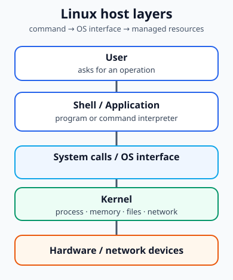
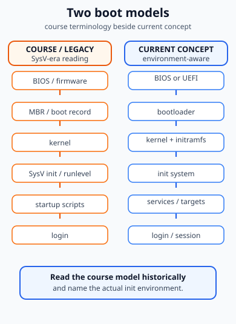
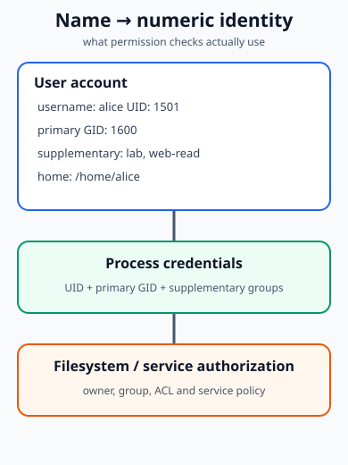
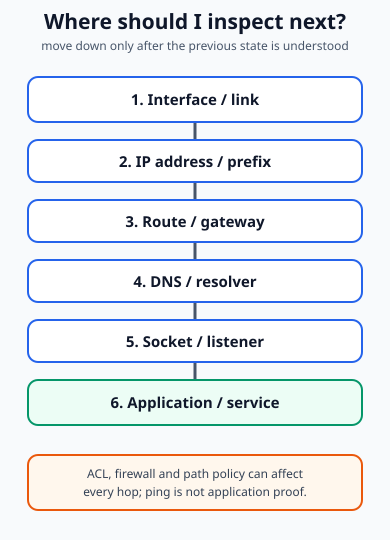
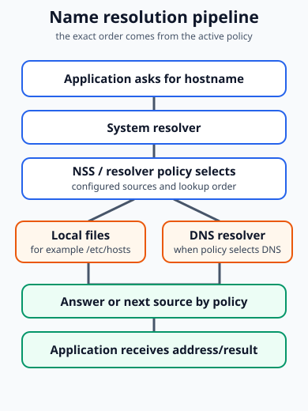
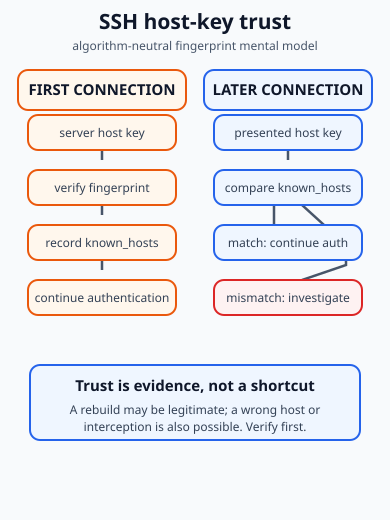
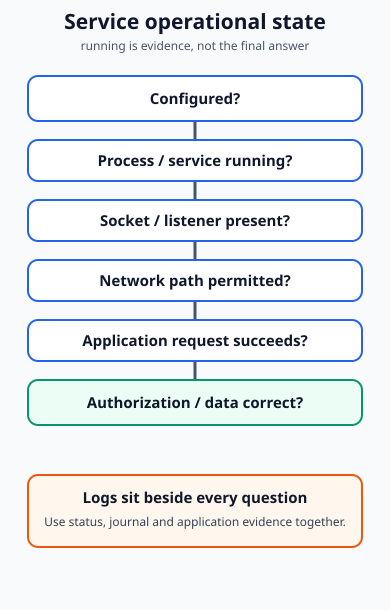

Linux Server là platform có thể host web, DNS, DHCP/NAT, file service, monitoring, proxy hoặc VPN. Trang này không lặp lại service placement; nó tập trung vào cách administrator tìm state, thay đổi đúng lớp và kiểm chứng kết quả.

Nguyên tắc xuyên suốt:

```text
observe → form a hypothesis → change one state → verify
```

## 1. Kiến trúc Linux và phân ranh

### COURSE CONCEPT

Slide mô hình hóa đường đi theo hướng **User → Shell / Application → Kernel → Hardware**. Đây là mô hình nền tảng tốt để bắt đầu:

- **User** tạo yêu cầu thông qua một chương trình hoặc giao diện.
- **Shell** là command interpreter; nó đọc command line, tìm executable hoặc gọi shell builtin rồi tạo process phù hợp.
- **Application / utility** là chương trình ở user space. `ls`, `ip`, `ss`, `dig` và nhiều lệnh khác không phải là “câu lệnh chạy thẳng trong kernel”.
- **Kernel** quản lý process, memory, filesystem, device và network stack; system call là một interface để user-space program yêu cầu kernel thực hiện phần việc được cho phép.
- **Hardware / network device** là lớp vật lý mà kernel driver và network stack sử dụng.

Shell không phải kernel. Application không phải kernel. Một command có thể đọc kernel state, yêu cầu kernel thay đổi state hoặc chỉ xử lý dữ liệu trong user space; vì vậy cùng một câu lệnh cần được đọc theo tác dụng thực tế của nó.



### GNU/Linux, kernel và distribution

- **Linux kernel** là core operating-system kernel.
- **Linux distribution** là kernel cùng user-space software, package system, default configuration và công cụ quản trị của một hệ sinh thái cụ thể.
- **Shell** là một interface để tương tác; bash, zsh và các shell khác không phải toàn bộ Linux.

Phân biệt này giúp tránh câu nói mơ hồ như “Linux có lệnh này”. Câu hỏi đúng hơn là: lệnh đó thuộc shell nào, package/tool nào, và distribution/environment đang quản lý state ra sao?

## 2. Installation và hai cách đọc boot flow

### COURSE CONCEPT

Slide installation chủ yếu minh họa một quy trình CentOS 7. Điều cần giữ lại ở đây là installation tạo ra system state: bootable storage, kernel, user-space và cấu hình ban đầu để administrator quản trị về sau. Đây không phải một tutorial cài đặt hiện đại cho mọi distribution.

### LEGACY EXAMPLE: mô hình course

Slide về boot dùng chuỗi gần với:

```text
BIOS → MBR / boot record → kernel → runlevel / operation level
     → startup scripts → login
```

Chuỗi này hữu ích khi gặp tài liệu SysV-era, nhưng không phải quy tắc current universal. `init 0` và `init 6` được giữ lại như terminology lịch sử của slide, không phải default workflow nên dùng trên hệ thống hiện nay.

### CURRENT MECHANISM: mô hình khái niệm

Một cách đọc hiện đại, vẫn đủ đơn giản cho người mới, là:

```text
firmware (BIOS hoặc UEFI)
→ bootloader
→ Linux kernel + initramfs khi phù hợp
→ init system
→ services / targets
→ login và session
```

systemd là init system phổ biến trên nhiều distribution mainstream hiện nay, nhưng không phải mọi Linux đều dùng systemd. Vì vậy hãy nói rõ environment trước khi dùng `systemctl`, target hoặc unit terminology.



### Shutdown và reboot

- `init 0` và `init 6`: **LEGACY EXAMPLE**, gắn với SysV-style runlevel.
- `shutdown`, `poweroff`, `reboot`: các command có thể xuất hiện trong nhiều environment; cần xem implementation và quyền hiện tại.
- Trong môi trường systemd, `systemctl poweroff` và `systemctl reboot` là ví dụ current mechanism rõ nghĩa hơn.

Shutdown là thay đổi power state của cả host, không phải một lệnh quan sát. Trước khi chạy, xác định đúng host, quyền, thời điểm và tác động tới session/service.

## 3. Shell, command line và help

### Command grammar

Course giữ công thức:

```text
command [options] [arguments]
```

Trace không phá hủy:

```console
$ ls -la /etc
```

- `ls` là command/program.
- `-l` yêu cầu dạng listing chi tiết.
- `-a` bao gồm entry ẩn.
- `/etc` là argument, tức object cần liệt kê.

Options không tự biến command thành an toàn; hãy đọc help và hiểu object trước khi chạy.

### Terminal control

- `Ctrl+C` gửi interrupt tới foreground process trong ngữ cảnh terminal thông thường; process có thể xử lý hoặc từ chối signal đó.
- `Ctrl+D` báo EOF hoặc kết thúc input trong một số context; nó không phải “end command” universal.
- `Ctrl+\\` có thể tạo quit signal trong terminal settings mặc định; chỉ dùng khi hiểu process đang chạy.
- Space, `q` và `/keyword` thường hữu ích khi đọc pager như `less`.

### Help trước khi mutation

```console
$ man command
$ man -k keyword
$ info command
```

`man` là main help model cho command và system interface. `man -k` tìm theo keyword khi bạn chưa biết tên lệnh. Hãy đọc synopsis, options, exit status, files và warnings; đừng chỉ sao chép một dòng ví dụ.

## 4. Root, `su`, `sudo` và privilege

- **root** là traditional administrative identity với UID 0 và quyền rất rộng; đó không phải identity nên dùng cho mọi thao tác hằng ngày.
- **`su`** chuyển sang identity khác hoặc mở shell dưới identity đó tùy invocation và policy.
- **`sudo`** chạy một command dưới policy được cấu hình, thường có audit boundary và least-privilege tốt hơn một root shell kéo dài.

`sudo` và `su` không tương đương. Routine work nên dùng account cá nhân, quan sát trước, chỉ elevate command cần thiết và giữ scope ngắn. Nếu authorization không cho phép, không tìm cách bypass; hãy làm rõ policy/ownership với administrator có trách nhiệm.

Trace an toàn hơn:

```console
$ id
$ sudo systemctl status ssh
```

Lệnh đầu tiên cho biết identity/session hiện tại; lệnh thứ hai chỉ elevate việc đọc service state nếu policy cho phép. Không đưa password thật vào tài liệu hoặc command history.

## 5. User, group và identity

### UID/GID là state thật

Course giới thiệu username, UID, group name, GID, primary group, supplementary groups và home directory. Điểm cần nhớ là name là mapping dễ đọc cho numeric identity:

```text
alice
  ├─ UID 1501
  ├─ primary GID 1600
  ├─ supplementary groups: lab, web-read
  └─ home: /home/alice
          ↓ process credentials
     filesystem / service authorization
```

Filesystem ownership và permission checks cuối cùng dựa trên UID/GID credentials, không dựa riêng vào chuỗi username. Một process con thường thừa hưởng credentials của process cha; session mới cũng giải thích vì sao group membership vừa thay đổi có thể chưa xuất hiện trong process đang mở.



### Account files

| File                   | Vai trò nên nhớ                                                                                                                                                                          |
| ---------------------- | ---------------------------------------------------------------------------------------------------------------------------------------------------------------------------------------- |
| `/etc/passwd`          | Basic account identity fields như name, numeric UID/GID, comment, home và login shell trên hệ thống local. Trên shadow-password system, không coi đây là nơi chứa current password hash. |
| `/etc/shadow`          | Protected password hash và aging-related data trên shadow-based systems; không dump hash hoặc password vào bài học.                                                                      |
| `/etc/group`           | Group definitions và một phần supplementary membership representation. Không dùng grep file này như universal membership oracle.                                                         |
| `/etc/login.defs`      | Policy/default inputs cho shadow tools và account behavior; range không phải một Linux law giống nhau ở mọi distribution.                                                                |
| `/etc/default/useradd` | Default inputs cho `useradd` tùy implementation/tooling.                                                                                                                                 |

Directory service, LDAP, winbind hoặc NSS module có thể làm account state đến từ nguồn khác ngoài local files. `getent` là cách quan sát qua name-service configuration khi cần.

### Primary và supplementary group

- **Primary group** là group được biểu diễn bởi primary GID của account/process.
- **Supplementary groups** là các group credentials bổ sung.
- Việc username xuất hiện trong member list của một dòng `/etc/group` không phải cách duy nhất để biết primary relationship; cũng không phải cách universal để biết toàn bộ membership.

Quan sát:

```console
$ id alice
$ getent passwd alice
$ getent group lab
```

`id` trả về UID, primary GID và supplementary groups mà context hiện tại nhìn thấy. `getent` đi qua NSS policy, nên phù hợp hơn việc chỉ đọc một file khi hệ thống dùng directory service.

## 6. User/group state changes

### Tạo account và verify

Chỉ dùng trace sau khi group đã tồn tại và bạn đã kiểm tra implementation của shadow tools:

```console
$ sudo useradd -m -g students -G lab alice
$ id alice
$ getent passwd alice
```

Ý nghĩa state change:

1. account identity được tạo và một UID được cấp theo policy hiện tại;
2. `-g students` chọn primary group đã có;
3. `-G lab` thêm supplementary membership;
4. `-m` yêu cầu tạo home directory theo default/path phù hợp;
5. `id alice` kiểm chứng UID, primary GID và supplementary groups.

Default của `useradd` có thể khác theo distribution, `/etc/login.defs` và `/etc/default/useradd`; đừng suy ra mọi host đều tạo private group giống nhau.

`passwd` thay đổi authentication credential state. Ví dụ an toàn chỉ cần:

```console
$ sudo passwd alice
```

Password được nhập tương tác theo policy; không publish password mẫu, không dùng password yếu và không đặt credential trên command line.

### Modify, delete và UID ownership

`usermod` thay đổi account state. Khi thêm supplementary group, tùy option mà danh sách cũ có thể bị thay thế; hãy kiểm tra `man usermod` trước khi dùng. Sau thay đổi membership, tạo session mới hoặc dùng cơ chế session phù hợp rồi kiểm chứng lại bằng `id`.

`userdel alice` xóa account entry nhưng numeric ownership của file không tự biến mất. File có thể còn hiển thị một UID không resolve được thành tên. `userdel -r alice` còn tác động tới home directory và mail spool, nên chỉ là destructive operation có scope rõ, backup và xác nhận.

Trace khái niệm:

```text
file owner = UID 1501
→ account alice bị xóa
→ file vẫn có numeric UID 1501
→ một account mới tái sử dụng UID 1501
→ tên mới có thể được diễn giải như owner cũ nếu không audit ownership
```

Khi UID/GID được thay đổi, hãy tìm file liên quan và đối chiếu numeric owner; name mapping thay đổi không tự “chuyển quyền” mọi file theo ý muốn.

### Group changes và range claims

- `groupadd`, `groupmod`, `groupdel` lần lượt tạo, sửa và xóa group definition.
- `groupdel` không nên xóa primary group đang được account hiện hữu sử dụng; cần xử lý relationship trước. Cũng phải kiểm tra file systems còn file thuộc GID đó hay không.
- Tuyên bố “chỉ supplementary group mới xóa được” là không chính xác nếu bỏ qua điều kiện primary group và implementation.
- Câu “GID dưới 1000 luôn reserved” là **LEGACY EXAMPLE / policy example**, không phải universal Linux law. UID/GID ranges phụ thuộc distribution, configuration và tooling.

## 7. Troubleshoot identity

### Case A: user tồn tại nhưng không mở được file

```text
id user
→ UID/GID và supplementary credentials
→ filesystem mode/ACL và numeric owner
→ service/share authorization
→ log của service
```

Đừng nhảy thẳng tới `chmod` hoặc đổi owner nếu chưa biết failure nằm ở mapping, permission hay service policy.

### Case B: vừa thêm group nhưng session vẫn bị từ chối

Account database có thể đã đúng nhưng process credentials của session cũ chưa đổi. Kiểm tra `id`, tạo session mới theo policy và kiểm chứng lại; không kết luận từ dòng `/etc/group` riêng lẻ.

### Case C: account bị xóa, file hiện numeric owner

Đó là dấu hiệu mapping name → UID không còn entry, không phải bằng chứng file đã mất. Tìm UID trên filesystem và xác định ownership policy trước khi sửa.

### Case D: đổi UID/GID làm file có vẻ thuộc người khác

Đối chiếu numeric UID/GID của file với account database trước và sau thay đổi. Identity number là state mà permission engine dùng.

## 8. Network state: runtime và persistent

### Design questions

Course đặt hai câu hỏi thực tế: interface wired hay wireless, và address nhận bằng DHCP hay static. Trước khi mở file cấu hình, hãy mô hình hóa state cần có:

```text
interface → link state → address/prefix → default route → DNS resolver
```

### CURRENT MECHANISM: quan sát runtime

```console
$ ip link
$ ip addr
$ ip route
```

- `ip link`: interface tồn tại, administrative state và link indicators.
- `ip addr`: address/prefix đang gắn trên interface.
- `ip route`: kernel sẽ forward destination theo route nào.

Runtime state là cái kernel đang dùng ngay lúc quan sát. Nó có thể được tạo tạm bằng lệnh, DHCP, NetworkManager, Netplan hoặc network service khác.

### Persistent state

Persistent state là configuration/profile mà environment dùng để dựng lại runtime state sau reboot hoặc network restart. Cơ chế này thay đổi theo distribution và môi trường:

- NetworkManager thường dùng connection profiles, quan sát bằng `nmcli connection show` và kích hoạt bằng profile phù hợp.
- Netplan là một lớp khai báo thường gặp trên Ubuntu; YAML configuration chọn renderer `networkd` hoặc `NetworkManager`, rồi renderer áp dụng network state.
- systemd-networkd dùng model file `.network`/`.netdev` riêng.

Ví dụ NetworkManager ở mức khái niệm:

```console
$ nmcli connection show
$ nmcli connection modify "Wired connection 1" ipv4.method auto
$ nmcli connection up "Wired connection 1"
```

Tên profile, quyền và side effect phụ thuộc host. Không coi ba lệnh này là lab universal; sau mutation phải kiểm tra lại `ip addr`, `ip route` và reachability.

### LEGACY EXAMPLE: CentOS network-scripts

Slide pages 37-38 dùng `/etc/sysconfig/network-scripts/ifcfg-eth0` với các key như `BOOTPROTO`, `IPV6INIT`, `IPV6ADDR` và `IPV6_DEFAULTGW`. Đây là **COURSE / CENTOS-ERA EXAMPLE**. Không dạy nó như “file network config của Linux” nói chung: tài liệu RHEL 8 gắn nhãn legacy network scripts là deprecated và khuyến nghị chuyển sang NetworkManager; distribution hoặc release khác có tooling riêng.

## 9. Tool → diagnostic question

| Tool                             | Câu hỏi state mà nó trả lời                                     | Ghi chú currentness                                                  |
| -------------------------------- | --------------------------------------------------------------- | -------------------------------------------------------------------- |
| `ip link`                        | Interface có tồn tại và link/administrative state ra sao?       | CURRENT PRIMARY MENTAL MODEL                                         |
| `ip addr`                        | Address/prefix nào đang được gắn?                               | CURRENT PRIMARY MENTAL MODEL                                         |
| `ip route`                       | Destination sẽ đi qua route/interface nào?                      | CURRENT PRIMARY MENTAL MODEL                                         |
| `ping`                           | ICMP/reachability path theo policy hiện tại có phản hồi không?  | Không chứng minh application health.                                 |
| `ss`                             | Socket nào đang listen hoặc connected?                          | CURRENT PRIMARY SOCKET TOOL                                          |
| `getent hosts` / `getent ahosts` | Configured NSS hosts lookup trả về gì?                          | CURRENT NSS-AWARE LOOKUP                                             |
| `dig` / `host`                   | DNS tự nó trả về gì cho query này?                              | Không command nào trong hai lệnh này cấu hình DNS.                   |
| `ssh`                            | Có thể mở authenticated remote session tới host đáng tin không? | Kết hợp với host-key verification.                                   |
| `ifconfig`                       | Interface report theo tool lịch sử ra sao?                      | COURSE / LEGACY COMPATIBILITY                                        |
| `route`                          | Routing-table report theo tool lịch sử ra sao?                  | COURSE / LEGACY COMPATIBILITY                                        |
| `netstat`                        | Connection/socket/routing report theo tool lịch sử ra sao?      | COURSE / LEGACY COMPATIBILITY; `ss` thường là lựa chọn hiện đại hơn. |

`ping` thành công chỉ là evidence về ICMP/reachability trên path đã thử. ICMP có thể bị filter; ngược lại web service có thể fail dù ping thành công. Hãy dùng `ss`, application request và log để đi tiếp.



## 10. DNS, name resolution và resolver state

### Vai trò các nguồn

- `/etc/hosts`: local static host mappings.
- `/etc/nsswitch.conf`: lookup policy/order cho các database được hỗ trợ; dòng `hosts` có thể phối hợp `files`, `dns` hoặc nguồn khác tùy cấu hình.
- `/etc/resolv.conf`: thông tin resolver như `nameserver` và `search`; file này có thể được generate hoặc quản lý bởi NetworkManager, systemd-resolved, DHCP/network configuration hoặc environment khác.

Vì vậy không nói “luôn edit `/etc/resolv.conf` bằng tay để cấu hình DNS persistent”. Trước hết xác định component nào sở hữu resolver state.



### `dig` và `host`

```console
$ dig example.com
$ host example.com
$ host 192.0.2.10
```

- `dig` cho detailed DNS query/troubleshooting output, phù hợp khi cần xem record, flags, TTL hoặc server trả lời.
- `host` là lookup utility đơn giản hơn cho forward hoặc reverse-DNS query.
- Cả hai chỉ quan sát/query; chúng không sửa zone hoặc resolver configuration.
- Reverse lookup liên quan PTR record và có thể không tồn tại dù forward A/AAAA record có tồn tại.

## 11. SSH và remote administration

SSH không chỉ là “đăng nhập bằng username/password”. Client cần xây dựng trust cho server host key:

### Lần kết nối đầu tiên

```text
SSH client
→ server presents host key
→ user verifies fingerprint qua trust channel phù hợp
→ accepted key được ghi vào known_hosts
```

Fingerprint trong slide là RSA fingerprint, nhưng current mental model phải là **SSH host key / host-key fingerprint** nói chung. OpenSSH hỗ trợ nhiều host-key algorithms; RSA chỉ là algorithm trong course example.

### Các lần kết nối sau

```text
server presents host key
↔ compare with stored known_hosts key
→ match: tiếp tục xác thực
→ mismatch: STOP và điều tra
```

Mismatch có thể do server rebuild/key rotation hợp lệ, nhưng cũng có thể là nhầm host, DNS/path sai hoặc interception. Không tự động xóa entry `known_hosts` chỉ để làm cảnh báo biến mất; trước hết xác minh identity mới qua kênh tin cậy. `ssh-keygen -F` có thể giúp tìm entry; mọi thao tác sửa file trust cần scope và audit.

```console
$ ssh alice@server.example.test
```

Sau khi host identity được xác minh, mới tiếp tục user authentication và authorization. Host key trust không thay thế password/key policy, permission hay service authorization.



## 12. Service operational state

Trang Server Platforms đã mô tả Linux Server có thể host service nào. Ở đây, hãy kiểm tra một service bằng state chain:

```text
configured?
→ process/service running?
→ socket/listener present?
→ network path permitted?
→ application request succeeds?
→ authorization/data correct?
```

Log chạy song song với mỗi bước; log không phải một bước thay thế cho các bước còn lại.

Process running không đồng nghĩa service healthy. Port listening không đồng nghĩa application trả response đúng. Một service còn có thể fail vì config sai, dependency down, firewall/policy, identity/permission hoặc data corruption.



Trong môi trường systemd, các lệnh quan sát thường gặp là:

```console
$ systemctl status example.service
$ journalctl -u example.service
$ ss -lntp
```

Tên unit, quyền đọc log và cách service được khởi chạy phụ thuộc environment. `ss` trả lời socket/listener; `systemctl` trả lời unit state; `journalctl` cung cấp evidence log. Cần nối chúng với application request thật.

## 13. Một trace tích hợp: web service trong Server VLAN 20

Giả sử Linux Server ở Server VLAN 20 cung cấp web service cho client và hostname là `server.example.test`. Client không mở được HTTPS. Mỗi bước phải trả lời một câu hỏi cụ thể:

1. **Client name resolution:** dùng `getent ahosts server.example.test` để quan sát address qua NSS policy của client. Nếu cần cô lập DNS, dùng `dig` hoặc `host` riêng; DNS answer không thay thế kết quả system lookup.
2. **Resolved address:** ghi lại IP mà client thực sự nhận từ NSS-aware lookup; đừng troubleshoot một address khác với address đó.
3. **Client route:** dùng `ip route` trên client để biết destination đi qua interface/gateway nào.
4. **Server interface/address:** trên server dùng `ip addr` và `ip link`; interface đúng, link up và prefix phù hợp chưa?
5. **Server route:** nếu request cần reply qua gateway khác, dùng `ip route` để kiểm tra đường trả lời.
6. **Socket/listener:** dùng `ss -lntp`; port/service có listen trên address phù hợp hay chỉ listen trên loopback?
7. **Firewall/policy/path:** kiểm tra rule ở host, ACL/security policy và route giữa client với Server VLAN 20. `ping` fail không tự chứng minh host down.
8. **Application response:** gửi request HTTPS phù hợp và xem application/service log; TCP listener có thể tồn tại nhưng TLS/app vẫn fail.
9. **Permission/data:** kiểm tra service identity, file/data permission, certificate và application-level authorization.

Đây là một chuỗi hypothesis → evidence. Không chạy mutation ngẫu nhiên sau mỗi symptom; ghi rõ state nào đã chứng minh, state nào còn chưa biết.

## 14. Command safety

- Xác định host, account, interface, service và file trước khi thay đổi.
- Đọc `man` và dry-run/validation option khi tool hỗ trợ.
- Các lệnh như `userdel -r`, `groupdel`, đổi ownership hoặc reconfigure network có thể làm mất dữ liệu/quyền truy cập; giữ ở mức conceptual nếu không có lab scope rõ.
- Thay đổi một state tại một thời điểm, ghi lại before/after evidence.
- Không dùng root shell kéo dài như workflow mặc định; hạn chế privilege và kiểm tra log/audit.

## 15. Tự kiểm tra

### Nhớ - 10 câu

1. Shell khác kernel như thế nào?
2. Linux distribution chứa những lớp nào ngoài kernel?
3. Công thức `command [options] [arguments]` đọc ra sao?
4. `Ctrl+C` và `Ctrl+D` khác nhau ở điểm nào?
5. `root`, `su` và `sudo` đại diện cho các privilege model nào?
6. UID và GID là gì?
7. Primary group khác supplementary group ra sao?
8. Vai trò cơ bản của `/etc/passwd`, `/etc/shadow` và `/etc/group` là gì?
9. `ip addr`, `ip route` và `ss` lần lượt trả lời câu hỏi nào?
10. `dig` và `host` khác nhau thế nào?

### Suy luận - 6 câu

11. Vì sao username không phải là filesystem identity cuối cùng?
12. Vì sao account bị xóa nhưng file vẫn có thể giữ numeric UID?
13. Vì sao `/etc/resolv.conf` không luôn là nơi cấu hình persistent đúng?
14. Vì sao `ping` thành công không chứng minh web service hoạt động?
15. `ss` trả lời state nào mà `ip route` không trả lời?
16. Vì sao SSH host-key mismatch cần điều tra thay vì xóa entry ngay?

### Troubleshooting / application - 5 câu

17. User tồn tại nhưng không đọc được file share: hãy tách UID/GID, group credentials, filesystem permission và service authorization.
18. User vừa được thêm vào group nhưng command vẫn bị từ chối: evidence nào cho thấy session cũ chưa nhận credentials mới?
19. Client resolve đúng hostname nhưng HTTPS timeout: hãy đi qua route, server address, listener, path policy và application response.
20. `ip addr` có address nhưng sau reboot address mất: hãy phân loại runtime state và persistent configuration owner.
21. SSH cảnh báo host key thay đổi sau khi server rebuild: làm sao phân biệt key rotation hợp lệ với nhầm host/interception trước khi tiếp tục?

## 16. Nguồn và discrepancy handling

### A. Course source - Class B

- `6. Linux Adminstration.pdf`, pages 4-9: Linux overview, open-source framing, architecture, kernel và distribution.
- Pages 12-18: booting, command-line grammar, terminal keys, basic commands, help, login context, shutdown/reboot.
- Pages 20-34: terminology, root/superuser, `su`/`sudo`, user creation/password/modify/delete, groups, group ID/naming, account files.
- Pages 36-40: network-device configuration, CentOS-style `ifcfg-eth0`, DNS.
- Pages 41-49: `ifconfig`, `ip`, `route`, `ping`, `netstat`, `dig`, `host`.
- Pages 50-51: SSH login, host-key fingerprint và `known_hosts` terminology.
- Page 53: network-services list.

### B. Supplementary authoritative documentation

- [systemd bootup](https://www.freedesktop.org/software/systemd/man/latest/bootup.html) và [systemctl](https://www.freedesktop.org/software/systemd/man/latest/systemctl.html) cho boot targets, service state và power actions trong systemd environment.
- [useradd(8)](https://man7.org/linux/man-pages/man8/useradd.8.html), [usermod(8)](https://man7.org/linux/man-pages/man8/usermod.8.html), [groupdel(8)](https://man7.org/linux/man-pages/man8/groupdel.8.html), [credentials(7)](https://man7.org/linux/man-pages/man7/credentials.7.html) cho UID/GID, supplementary groups và state-change caveats.
- [passwd(5)](https://man7.org/linux/man-pages/man5/passwd.5.html), [shadow(5)](https://man7.org/linux/man-pages/man5/shadow.5.html), [group(5)](https://man7.org/linux/man-pages/man5/group.5.html) cho local account-file roles.
- [NetworkManager nm-settings-nmcli](https://www.networkmanager.dev/docs/api/latest/nm-settings-nmcli.html) và [nm-settings-keyfile](https://networkmanager.dev/docs/api/latest/nm-settings-keyfile.html) cho connection profile/persistent-state boundary.
- [Netplan YAML configuration](https://netplan.readthedocs.io/en/latest/netplan-yaml/) cho declarative renderer `networkd`/`NetworkManager`; [systemd.network](https://www.freedesktop.org/software/systemd/man/latest/systemd.network.html) và [systemd.netdev](https://www.freedesktop.org/software/systemd/man/latest/systemd.netdev.html) cho model `.network`/`.netdev` của systemd-networkd.
- [ip(8)](https://man7.org/linux/man-pages/man8/ip.8.html), [ip-route(8)](https://man7.org/linux/man-pages/man8/ip-route.8.html) và [ss(8)](https://man7.org/linux/man-pages/man8/ss.8.html) cho quan sát interface/address/route và socket state.
- [RHEL 8 legacy network scripts](https://docs.redhat.com/en/documentation/red_hat_enterprise_linux/8/html/configuring_and_managing_networking/assembly_legacy-network-scripts-support-in-rhel_configuring-and-managing-networking) cho ngữ cảnh `ifcfg`/network-scripts, deprecation và chuyển sang NetworkManager.
- [nsswitch.conf(5)](https://man7.org/linux/man-pages/man5/nsswitch.conf.5.html), [getent(1)](https://man7.org/linux/man-pages/man1/getent.1.html), [resolv.conf(5)](https://man7.org/linux/man-pages/man5/resolv.conf.5.html) cho NSS-aware lookup, resolver policy và managed resolver state.
- [OpenSSH manual](https://www.openssh.org/manual.html) và [ssh-keygen(1)](https://man.openbsd.org/ssh-keygen) cho algorithm-neutral host keys, fingerprints và `known_hosts` tooling.

### C. Discrepancies handled

| Course framing cần giữ                       | Cách dạy an toàn trong trang                                                                    |
| -------------------------------------------- | ----------------------------------------------------------------------------------------------- |
| BIOS → MBR → runlevel → scripts              | Gắn nhãn LEGACY EXAMPLE và đặt cạnh current conceptual boot model.                              |
| `init 0` / `init 6`                          | Giữ để nhận diện slide; ưu tiên `systemctl poweroff/reboot` khi systemd được giả định.          |
| GID/UID dưới 1000                            | Nêu là policy example phụ thuộc distribution/configuration.                                     |
| `ifcfg-eth0`, `ifconfig`, `route`, `netstat` | Giữ terminology tương thích course, thêm current tools/profile boundary.                        |
| `/etc/resolv.conf`                           | Dạy vai trò resolver input và khả năng được component khác generate/manage.                     |
| RSA fingerprint                              | Đổi mental model thành algorithm-neutral SSH host key/fingerprint; RSA chỉ là ví dụ trên slide. |
| Group deletion                               | Nêu caveat primary-group và file ownership theo shadow-utils behavior.                          |

### D. Author-derived

- Architecture, boot comparison, identity mapping, network troubleshooting ladder, resolver pipeline, SSH trust flow và service-state flow là diagrams nguyên bản.
- Integrated web trace và observe → hypothesis → change → verify model là nội dung nguyên bản để nối các command với operational questions.
