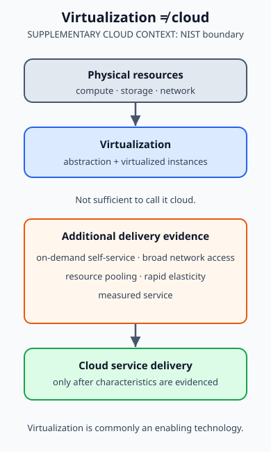

Trang này bắt đầu từ tên file source nhưng theo đúng nội dung của 17 slide: **Virtualization Overview**. Cloud Computing sẽ được đặt đúng sau nền tảng đó, không thay thế nó.

```text
physical resources
→ abstraction / virtualization
→ isolated resource instances
→ pooled and automated delivery
→ cloud service
```

> **Virtualization ≠ cloud.** Virtualization tạo abstraction và các resource instance có thể được cô lập. Cloud là mô hình cung cấp/tiêu thụ tài nguyên có thêm đặc tính delivery. Một VM chạy trên một host không tự động trở thành cloud service.



## 1. Bản đồ học tập

| Câu hỏi                                     | Phần tương ứng                                                                                       | Kết quả mong đợi                                                      |
| ------------------------------------------- | ---------------------------------------------------------------------------------------------------- | --------------------------------------------------------------------- |
| Virtualization là gì?                       | [Khái niệm và abstraction](./virtualization-foundations/#1-virtualization-và-các-tầng-abstraction)   | Nối system, machine, OS và library abstraction với interface phù hợp. |
| Emulation khác virtualization ở đâu?        | [So sánh emulation](./virtualization-foundations/#2-emulation-và-virtualization)                     | Không dùng hai từ như đồng nghĩa.                                     |
| VM, host, guest và VMM liên hệ thế nào?     | [Virtual machine và VMM](./virtualization-foundations/#3-virtual-machine-host-guest-và-vmm)          | Xác định lớp điều phối và các guest instance.                         |
| Type 1/Type 2, full/para khác nhau thế nào? | [Types và approaches](./virtualization-foundations/#4-hypervisor-types-và-virtualization-approaches) | Phân biệt hai cặp phân loại của course.                               |
| Cloud có phải chỉ là VM không?              | [Virtualization không phải cloud](./virtualization-foundations/#6-virtualization-không-phải-cloud)   | Kiểm tra delivery characteristics riêng của cloud.                    |

## 2. Phạm vi source

### COURSE CONCEPT

`8.1 Intro to Cloud computing.pdf` là nguồn Class-B chính, nhưng deck mang tiêu đề học phần **Virtualization Overview**. Nó dạy:

- định nghĩa virtualization và abstraction ở system, machine/ISA, OS/ABI, library/API level;
- emulation so với virtualization;
- virtual machine, host/guest, process VM, system VM và Virtual Machine Monitor;
- Type 1/Type 2, full-virtualization/para-virtualization; Xen và KVM/QEMU như các ví dụ course;
- server, storage và network virtualization.

Vì vậy các phần này được dạy như source course, không bị đổi thành một bài giới thiệu chung về cloud.

### SUPPLEMENTARY CLOUD CONTEXT

Course slides không cung cấp mô hình SaaS/PaaS/IaaS, public/private/community/hybrid deployment model, elasticity hay measured service. Phần cloud của chương chỉ dùng **NIST SP 800-145** để giải thích tại sao virtualization thường là enabling technology, nhưng chưa đủ để kết luận một hệ thống là cloud.

## 3. Cách đọc label

- **COURSE CONCEPT**: khái niệm, terminology và phân loại từ slide.
- **CURRENT MECHANISM**: caveat implementation/version khi cần đọc môi trường hiện tại.
- **LEGACY / OVERSIMPLIFIED COURSE EXAMPLE**: ví dụ course hữu ích để phân loại nhưng không nên biến thành quy tắc phổ quát.
- **SUPPLEMENTARY CLOUD CONTEXT**: cloud delivery model được thêm từ nguồn chuẩn, không phải claim của deck.

## 4. Đích đến

Sau trang [Virtualization Foundations](./virtualization-foundations/), bạn cần có thể mô tả một resource instance đang được abstraction ở lớp nào, xác định host/guest/VMM trong một topology, và giải thích evidence nào còn thiếu trước khi gọi một hệ thống là cloud.

[Tiếp theo trong lộ trình: Windows Administration](../08-windows-administration/)

## 5. Nguồn và ownership

### A. Course source - Class B

- `8.1 Intro to Cloud computing.pdf`, slides 1-17: Virtualization Overview, abstraction levels, VM/VMM, types, approaches, examples và server/storage/network virtualization. PDF là input source, không được sao chép hoặc phát hành trong site.

### B. Supplementary authoritative context

- [NIST SP 800-145](https://csrc.nist.gov/pubs/sp/800/145/final) xác định cloud delivery bằng các essential characteristics, trong đó có on-demand self-service, resource pooling, rapid elasticity và measured service.
- [NIST Cloud Computing Program](https://www.nist.gov/programs-projects/nist-cloud-computing-program-nccp) nêu high-performance virtualization là một enabling technology bên cạnh network và server infrastructure.

### C. Author-derived

- Learning map, distinction checks và sơ đồ journey là giải thích nguyên bản để nối course virtualization với cloud delivery boundary.
