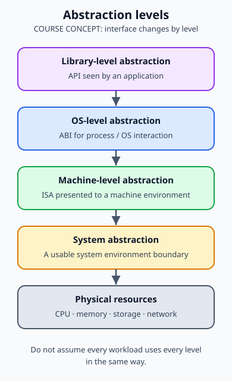
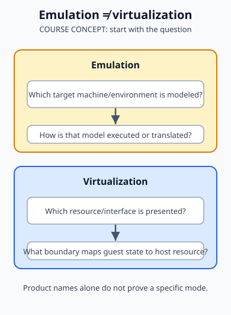
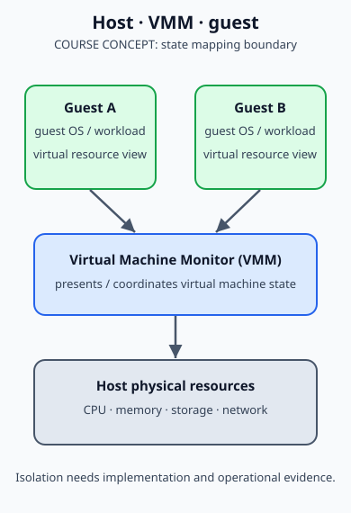
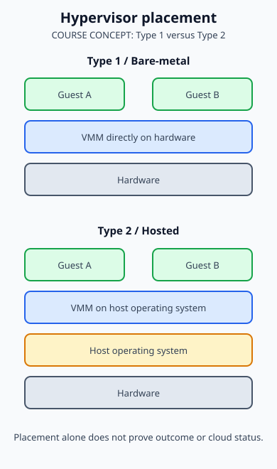

Bài này theo đúng đường đi của course: từ abstraction đến virtual machine, rồi mới hỏi cloud delivery cần gì thêm.

```text
physical resource
→ abstraction boundary
→ virtualized instance
→ host / guest / VMM reasoning
→ pooled automated delivery (nếu có)
→ cloud service (nếu các characteristics phù hợp)
```

## 1. Virtualization và các tầng abstraction

### COURSE CONCEPT

Course định nghĩa virtualization như một cách tạo **abstraction** cho system/resource. Abstraction không xóa physical resource; nó đặt một interface/boundary để consumer của lớp trên không phải thao tác trực tiếp với mọi chi tiết lớp dưới.

Slide phân biệt bốn cách nhìn:

| Tầng course               | Interface terminology                                   | Câu hỏi nên hỏi                                                              |
| ------------------------- | ------------------------------------------------------- | ---------------------------------------------------------------------------- |
| System abstraction        | hệ thống được trình bày như một environment có thể dùng | Consumer nhìn thấy system boundary nào?                                      |
| Machine-level abstraction | ISA                                                     | Một machine instruction model được expose như thế nào?                       |
| OS-level abstraction      | ABI                                                     | Process/OS interaction được trình bày qua binary interface nào?              |
| Library-level abstraction | API                                                     | Application gọi interface library nào thay vì trực tiếp biết implementation? |

Đây là các tầng mô tả khác nhau. Không nên suy ra rằng mọi workload luôn dùng toàn bộ bốn tầng theo cùng một cách.



### General implementation view

Slide 8 đưa ra general virtualization implementation stack. Dùng nó như câu hỏi phân lớp:

```text
application / workload
→ interface or virtualized environment
→ virtualization implementation
→ physical CPU, memory, storage, network
```

Một implementation có thể virtualize compute, storage hoặc network theo phạm vi khác nhau. “Có abstraction” không tự chứng minh resource được pooled, self-service hay metered.

## 2. Emulation và virtualization

### COURSE CONCEPT

Slide 9 đặt emulation cạnh virtualization để tránh gộp hai thuật ngữ. Khi đọc course comparison, hãy hỏi target environment có đang được **mô phỏng** qua một machine model khác hay resource/operation được **virtualize** dưới một abstraction boundary.



Sơ đồ không thay thế test kỹ thuật của một sản phẩm. Nó chỉ buộc người học mô tả: instruction/environment nào được presented, phần nào thực thi/điều phối, và consumer nhìn thấy interface nào.

### CURRENT MECHANISM

Tên sản phẩm không đủ để suy ra behavior. Một tool có thể có nhiều mode hoặc acceleration path tùy host capability và cấu hình. Khi cần quyết định vận hành, kiểm tra documentation/version của chính environment thay vì chỉ gắn nhãn theo tên tool.

## 3. Virtual machine, host, guest và VMM

### COURSE CONCEPT

Slide 10 giới thiệu **virtual machine** cùng host/guest và ý tưởng isomorphism/state mapping. Trong mental model học tập:

- **Host** là environment cung cấp hoặc giữ physical resources.
- **Guest** là environment/resource instance được trình bày cho workload.
- **VM** là instance có virtualized view của tài nguyên theo implementation.
- **State mapping** nhắc rằng state nhìn thấy ở guest cần được implementation liên hệ với state/resources ở phía host.

Đừng diễn giải “isolated” thành “không bao giờ ảnh hưởng lẫn nhau”. Isolation là boundary/goal của implementation; capacity contention, policy, configuration và failure domain vẫn là câu hỏi phải kiểm chứng.

### Process VM và system VM

Slides 11-12 tách:

| Course term             | Phạm vi                                                | Câu hỏi đúng                                        |
| ----------------------- | ------------------------------------------------------ | --------------------------------------------------- |
| Process Virtual Machine | phục vụ một process/application execution environment  | Process nào đang dùng virtualized runtime/boundary? |
| System Virtual Machine  | trình bày một system environment cho guest OS/workload | Guest system dùng resource instance nào?            |

Không thay “process VM” bằng “mọi application chạy trong cloud”, và cũng không gọi mọi system VM là cloud.

### Virtual Machine Monitor / Hypervisor

Slide 13 dùng **Virtual Machine Monitor (VMM)**, còn gọi là hypervisor, cho lớp điều phối VM. Nó là điểm cần định vị khi bạn phân tích resource presentation, guest isolation và mapping giữa guest state với host resources.



## 4. Hypervisor types và virtualization approaches

### COURSE CONCEPT: Type 1 và Type 2

Slide 14 phân biệt:

- **Type 1 / Bare-metal**: VMM được đặt trực tiếp trên lớp hardware trong course diagram.
- **Type 2 / Hosted**: VMM chạy trên host operating system trong course diagram.

Đây là phân loại placement. Nó không tự chấm performance, security hoặc cloud suitability cho một deployment cụ thể.



### COURSE CONCEPT: full-virtualization và para-virtualization

Slide 15 tách hai approach:

| Approach            | Framing trên slide                                                                                 |
| ------------------- | -------------------------------------------------------------------------------------------------- |
| Para-virtualization | Lightweight/high performance là ưu điểm được nêu; guest OS phải được modify là trade-off được nêu. |
| Full-virtualization | Không cần modify guest OS là ưu điểm được nêu; significant performance hit là trade-off được nêu.  |

Giữ các ưu/nhược điểm trên như **course framing**, không biến thành benchmark hiện đại hoặc định luật bất biến. Performance và guest compatibility phụ thuộc architecture, hypervisor, driver, workload, hardware support và version.

### LEGACY / OVERSIMPLIFIED COURSE EXAMPLE

Slide 16 đưa Xen và KVM/QEMU làm virtualization examples. Những tên này giúp nhận diện vocabulary course, nhưng không đủ để suy ra một configuration cụ thể đang full/para, emulating hay accelerating ở mode nào. Hãy kiểm tra implementation documentation và host configuration trước khi troubleshoot hoặc design.

## 5. Server, storage và network virtualization

### COURSE CONCEPT

Slide 17 mở rộng phạm vi từ VM sang ba nhóm kỹ thuật:

- **Server virtualization**: trình bày compute/server resource qua virtualized instance.
- **Storage virtualization**: trình bày/ghép abstraction cho storage resource.
- **Network virtualization**: trình bày network resource/boundary theo lớp virtualized.

Ba nhóm này không phải cùng một object. Một topology có VM không tự động chứng minh storage và network đã virtualized; ngược lại, network virtualization cũng không tự động chứng minh workload đang chạy trên a system VM.

Trace đọc kiến trúc:

```text
request needs compute?  → inspect server/VM boundary
request needs data?     → inspect storage presentation and access path
request needs reachability? → inspect network boundary and policy
```

## 6. Virtualization không phải cloud

### SUPPLEMENTARY CLOUD CONTEXT

**Virtualization ≠ cloud.** Course deck dạy virtualization, không dạy cloud service model. Để nối đúng taxonomy, dùng NIST SP 800-145 như một context tách biệt: cloud là cách cung cấp resource/service có additional delivery characteristics. NIST nêu on-demand self-service, broad network access, resource pooling, rapid elasticity và measured service.

Vì vậy, hãy kiểm tra theo evidence thay vì theo marketing label:

| Bạn quan sát thấy                        | Điều có thể kết luận                 | Điều chưa được kết luận                      |
| ---------------------------------------- | ------------------------------------ | -------------------------------------------- |
| Một host chạy nhiều guest VM             | virtualization có thể đang được dùng | đó là cloud service                          |
| Một portal tạo VM                        | provisioning có thể automated        | pooling, elasticity và metering đều tồn tại  |
| Resource được shared/pool                | pooling có thể là một capability     | consumer có self-service hoặc measured usage |
| Một workload chạy ngoài datacenter local | vị trí triển khai khác               | deployment đó đáp ứng cloud characteristics  |


NIST cũng xem high-performance virtualization là một enabling technology; nó không nói virtualization một mình là định nghĩa cloud. Đây là lý do mental model của chương kết thúc bằng “cloud service” chỉ khi delivery model đã được chứng minh.

## 7. Trace thiết kế: từ physical server đến service delivery

Giả sử một team cần cung cấp một application environment.

1. **Physical resources:** xác định CPU, memory, storage và network capacity/failure boundary.
2. **Abstraction choice:** workload cần system VM, process VM hay một abstraction khác? Đây là câu hỏi virtualization source-derived.
3. **Instance boundary:** xác định host, guest, VMM và resource mapping. Kiểm tra isolation/capacity bằng evidence vận hành, không bằng tên gọi.
4. **Pooled delivery:** có provider pool và reassign resource cho nhiều consumer không? Đây đã là cloud-context question.
5. **Automation:** consumer có tự provision/release resource theo on-demand self-service không?
6. **Elasticity và measurement:** capability có scale/release theo demand và usage có được meter/report không?

Nếu chỉ hoàn thành bước 1-3, bạn có một virtualization design discussion. Bước 4-6 là evidence cần thêm để thảo luận cloud service delivery.

## 8. Tự kiểm tra

### Nhớ

1. ISA, ABI và API xuất hiện ở các tầng abstraction nào của course?
2. Host, guest và VMM khác vai trò ra sao?
3. Process VM khác system VM ở phạm vi nào?
4. Type 1/Type 2 đang phân loại điều gì?
5. Full-virtualization/para-virtualization đang phân loại điều gì?
6. Server, storage và network virtualization khác object nào?

### Suy luận

7. Vì sao “chạy nhiều VM trên một host” chưa đủ để kết luận cloud?
8. Một portal tạo VM nhanh đã cho evidence của cloud characteristic nào, và còn thiếu evidence nào?
9. Một workload có guest OS nhưng storage ở external service: hãy tách system VM boundary với storage virtualization boundary.
10. Vì sao không thể chấm performance của full/para virtualization chỉ từ bảng course?

### Troubleshooting / design

11. Guest hết memory: evidence nào giúp tách guest policy, VMM mapping và host capacity contention?
12. Application reachable trong một guest nhưng không tới được consumer khác: vì sao phải kiểm tra network virtualization boundary/policy thay vì chỉ reboot VM?
13. Team gọi một environment là cloud chỉ vì nó dùng Type 1 hypervisor: hãy nêu các delivery characteristics còn cần kiểm chứng.

## 9. Nguồn, currentness và ownership

### A. Course source - Class B

- `8.1 Intro to Cloud computing.pdf`, slides 1-2: Virtualization Overview và outline.
- Slides 3-8: definition, system/machine/OS/library abstraction và general implementation level.
- Slide 9: emulation versus virtualization.
- Slides 10-13: virtual machine, host/guest, isomorphism/state mapping, process/system VM, VMM/hypervisor.
- Slides 14-15: Type 1/Type 2 và full/para virtualization.
- Slide 16: Xen, KVM/QEMU examples as presented by the course.
- Slide 17: server, storage và network virtualization techniques.

### B. Supplementary authoritative cloud context

- [NIST SP 800-145](https://csrc.nist.gov/pubs/sp/800/145/final) cho cloud delivery model và essential characteristics. Đây không phải nguồn cho các slide virtualization.
- [NIST Cloud Computing Program](https://www.nist.gov/programs-projects/nist-cloud-computing-program-nccp) cho statement rằng high-performance virtualization là một enabling technology của cloud computing.

### C. Currentness and discrepancy handling

| Course framing                            | Cách giữ source fidelity                                                                                      |
| ----------------------------------------- | ------------------------------------------------------------------------------------------------------------- |
| Title file nói “Intro to Cloud computing” | Nội dung student-facing nói rõ 17 slide thực tế là Virtualization Overview.                                   |
| Type 1/Type 2, full/para tables           | Giữ như two distinct course classifications; không suy ra absolute performance/security outcome.              |
| Xen và KVM/QEMU examples                  | Giữ vocabulary course; gắn nhãn implementation/version dependent trước khi dùng để kết luận current behavior. |
| Virtualization → cloud transition         | Không quy cho source; tách riêng SUPPLEMENTARY CLOUD CONTEXT dựa trên NIST.                                   |

### D. Author-derived

- Journey, evidence tables, design trace, self-check prompts và các SVG của trang là giải thích/bản vẽ nguyên bản. Chúng không phải screenshot hay bản sao slide.
